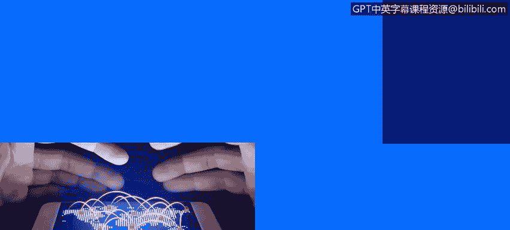
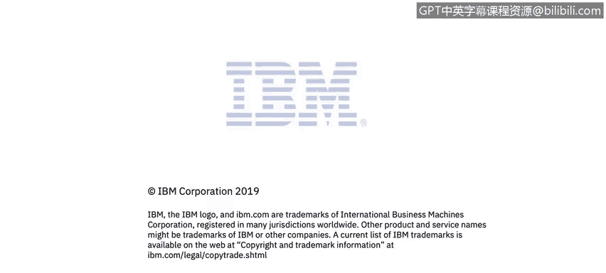

# IBM网络安全分析师专业证书课程4：《网络安全与数据库漏洞》｜network-security-database-vulnerabilities｜ - P111：52_03_os-command-injection-part-1.en_subtitled - GPT中英字幕课程资源 - BV1RN411q7PY

Yes。In this video， you will learn to describe OS command injection attacks and the operating system flaws that allow them to occur。

Explain why your applications should not execute OS commands， but use library functions instead。

Explain why it is important for applications to run under the least possible privilege level。

So let's start with the OS command injection。Oscom injection is abuse of vulnerable application functionality that causes execution of。

O commands that are specified by the attacker。 No one operating system is immune to it。

 It can really happen on any operating system a Linux Windows Mac because the vulnerability is really not in the operating system per se it's the vulnerable application that makes it happen。

 and these types of vulnerabilities are made possible by lack of input sanitization and also by unsafe way in which developers often execute OS commands。

 Let's look at the concrete example let's say you have an application where you as one of the types of functionality that you support。

 you manage log files log files are stored as real files on the operating system and let's say we have。

An interface here where we list log files and give users ability to view by clicking on the log file and to delete there is a little delete icon next to them。

To each individual log file sounds like a fairly common scenario。

 let's assume that delete command is sent as a post request when you click on it and of course we need parameters to send to the server and in this particular case we send action。

 which is delete and we send the file name。And assuming the job is the implementation language。

 it's very likely what's happening on the back end is the exact function from the runtime class gets executed。

And we sent。The file that that was specified with a full path to a remove command to the shell interpreter。

 Those of you who are familiar with Linux should recognize this pattern， those who are not。

This is basically calling a shell interpreter and passing an operating system command line command to it。

 which R M is the command to delete the file。 So in the end， what gets。

Executed by the operating system is this line at the bottom。

The sha interpreter with a parameter and a command in double quotes。

So what's the worst that could happen in this scenario？

Because location user essentially specifies the file name。And we assume that in our application。

 we have no。Defensive code to verify that that file parameter is correct。

 Aer really can pass anything as that parameter。 And in this example here。

Attackcker could specify a simple as a system library。 For example。

 you notice the dot dot convention。 So in this case， we're actually attacker。

Tells the system to travel up。3 folders and then down the lip folder and then delete a system library。

If there are no protections in place， this command that was originally intended to delete log files will actually delete an important operating system library causing denial of service。

 Your server will not be operational after that point。 That's， that's pretty bad。

 regular user of your application just。Basically， crash the server。

 but something else can also happen。 The a attacker can actually use。

Linux command syntax to inject another operating system command， which is much， much worse。

 So in this particular case， the text in red is the text that's supplied by by the user or the attacker and they say that let's say the file name is X。

 It's not really relevant what the file name what the actual file name is because there's a semicolon there。

 and that notation means that。When we're done executing the remove command。

Go ahead and execute something else， whatever comes after the semi。

 semiconons in Linux use to separate or chain together multiple e commands。And in this case。

 the RF slash command actually on many systems would cause deletion of the entire file system。

 which is as bad as it gets， operating system commands。

 a command injection can lead to all kinds of bad outcomes， you could have full system takeover。

 you could have denial of service。Atackcker could leak sensitive information， passwords。

 cryptographic keys， user personal information， confidential business data。Attackers could move to。

Other systems they could use your system once they've taken over it。

They can move to other computers on the network。 They can use it as a launching pad。 And as we know。

 now， the botnets and cryp mining are very popular forms of abuse。 that could happen as well。

 as soon as you。Give an attacker a way to execute an operating system command。

 They could do pretty much anything they want on that machine。 So it's it's as best it gets。

 It's a game over type of event。How do we prevent this？

So the first recommendation is not execute as commable， which it sounds funny。

 I'm not trying to make a joke here。Executing or asks is a tool that。In most cases。

 it's too heavy for the job。 There are more lightweight ways of doing things。

 And by adding and execution into your application， you are adding this。

Very wide attack surface that if you' are not careful can easily be abused Often Ess are introduced as a quick fix。

 so let's say you want to delete the file， but you don't want to you know figure out how to properly do it in the language that you're writing in so you think。

 well， let's just run an e itll be quick and easy。essentially you let the operating system do the heavy lifting。

 but as we saw in the example before， if you were not careful。

 a destructive OS command may slip in and cause a lot of damage。

 so we recommend that when you're faced with a case like this。

 it's best to resist the temptation to run OS commands and instead use the functionality built in to your language youre using or use third party libraries。

And here's some examples。If you want to remove a file， there is a function for that in Java built in。

If you want to copy a file， same story and there are examples of that in Java and in other languages。

 in most cases you can avoid running an OS command and by using the library functions。

 the big benefit of that is that you significantly reduce the tag surface if you run an OS command。

 somebody can specify any command they want， but if you are using a library function to remove a file。

 your text surface narrows dramatically and you can only be abused to delete a single file elsewhere in the system and we will show later on how to protect against that。

 but you can see that it's now far less dangerous。So the second recommendation we would give is to run at the least possible privilege level。

 we often see applications。Run as super user as root user and in vast majority of cases that is not necessary。

 and the problem with that is that if attacker does abuse your application of functionality。

 if that application runs at a very very high level of privileges。

 the attack can do a lot of damage so。If let's say if you are allowing it to delete a particular file。

 if an application runs as a root user， it can delete all kinds of important operating system files。

 but when it runs as Tomcat user， for example， that set of files that can be deleted narrow significantly and far less damage could be done and this actually this recommendation running at the least possible privilege level helps in case of many other vulnerabilities。

 not just in。

