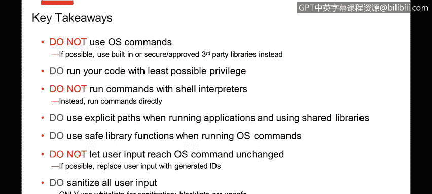
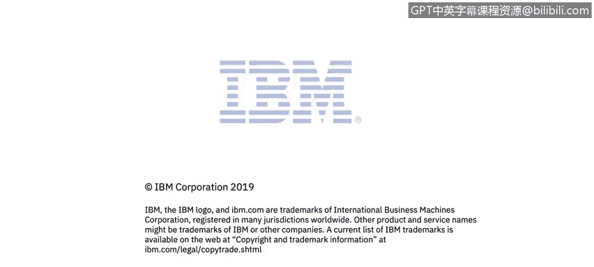

# IBM网络安全分析师专业证书课程4：《网络安全与数据库漏洞》｜network-security-database-vulnerabilities｜ - P113：54_05_os-command-injection-part-3.en_subtitled - GPT中英字幕课程资源 - BV1RN411q7PY

Yes。In this video， you will learn to describe additional OS command injection attacks。

Explain why it is safer to use some functions over others。

Explain why it is safer to modify user input before execution。

Explain why it is safer to sanitize user input using whitelist and not blacklist。

The next recommendation is to use proper functionality when running US system commands。

 So we started with， you know， not running us commands at all。

 And we sort of going down the line now， assuming that you have a real business need to run US commands and trying to tell you how to better。

Write your code and execute those if you still have to execute those canals。

 but execute them correctly。So in Java， for example。

 there are different ways of running an a command。And one way that's very common is to just build a full string。

Of your the executable and the parameters and execute things like that with that。

Injection is more likely than with another。Type of function， the one that takes a string array。

 And the reason for that is that the second variant。

Already kind of gives the operating system the command and the parameters pre parsed as individual strings。

 so Tchcker has control of in this case IP address parameter and tries to jam more stuff into it。

 go from one parameter into many with the second variant of the function call。

 they won't be able to do that they will not succeed but with the first variant they might。So。

When you rather ask commands， please evaluate what's available and use the safest functionality that's available。

The next recommendation is if possible， do not let user input reach the place where you execute the command unchanged。

 and what I mean by that is you could deal with different entities that the OS command will be operating on in the UI as symbolic IDs。

 so instead of letting users specify a particular file to delete。

You could have an America ID that corresponds to that file。 And when the parameters come in。

That ID is passed in and inside your code， you could use a translation table to convert that number to a real file name and then delete the file。

And this is much safer because now attacker can really specify anything malicious as that parameter value if they specify something that does not exist in that internal mapping table。

 then we can just reject that request with an error they won't be able to sneak any operating system commands or any malicious parameter in because that parameter will not be recognized it's another good recommendation to follow sanitization that's kind of a universal advice that we give the users communicate with your application through parameters most often。

So carefully sanitizing them with strict whitelists and not blacklists when we if you saw our previous talk we talked about the importance of whitelists。

 I'll quickly mention it with blacklists we mean a list of input that's known to be dangerous and in your logic you may look at it and see well does the parameter。

That was passed and， does it match any of the bad stuff on this list， If it doesn't let it through。

 the problem with that is that it's incredibly hard to build a successful blacklist。

 and I'll give you some examples shortly。Atters are usually very inventive and there is a link in the slides if you click on it。

 there are lots of examples there of what at first seems like a good blacklist can be easily bypassed by an inventive attacker so instead of using blacklists。

 please use whitelists and by whitelists we mean a very tight very controlled list of what's allowed and all other input should be rejected that way you're dealing with a known entity that's fairly small you can analyze it and you can really come up with all the use cases that the user could specify and see if theyre dangerous or not。

So just some examples here， these are actually real life examples that we saw in the applications that we tested。

 so let's say we have in our application code a blacklist of you know we reject things that contain semicolonons andperss and pipes。

 that attacker could still sneak in an internal OSS command that surrounded bypecttics that's a valid Linux syntax。

Let's say you add apecttics to the blacklist。 There is another syntax， with a dollar sign。

You could blacklist spaces， let's say you say my file name should not contain any spaces because that that's an indication of something malicious going on。

 there is a way in the operating system command syntax to replace spaces with a value from a known system variable that contains a space so with tuition here x as your space。

So they could still sneak something in you could say that， well。

 I'll enclose the value in double quotes and then also escape。Double quotes in the value。

 That should be secure。 Unfortunately， there is a way around it as well。 It's。

 it's a bit of a more complicated example。 But if you look closely， it's this last line in the table。

The red input is what the attacker would send， so they would actually send in the double quote already escaped with a backslash。

And because your application would escape the double quote anyway。

The single backslash turns into double backslash that's one real backslash and the double quote goes unesscaped and that allows the attacker to chain in additional set of commands as you can see attackers can get really really creative and you usually don't have time and you know cycles to think about all these very complicated cases so it's best to use a whitelist and at the regular expression whitelist at the bottom would have taken care of all of these cases easily you just accept file names that are you know alphaamomeric there's a possible dot in there and that's it so none of those cases would work if you were to use this whitelist。

So what are the key takeaways， try not to use OS commands。

 there are much safer ways of executing functionality that's usually done in the context of OS command。

 so only use OS commands if absolutely necessary if it's dictated by your business logic。

 try to run your code with least possible privilege。

 do not run OS commands with through shell interpreters， try to run them directly。

Use explicit paths when running applications and shared libraries。

 try to use safe library functional， there are usually multiple variants， some safer than the others。

Try not to let user input reach the point where OS Kaman executed unchanged。

 it's better to try and use generated IDs and try to sanitize all user input with whitelists。

