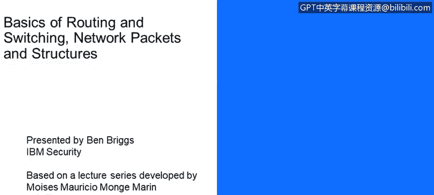
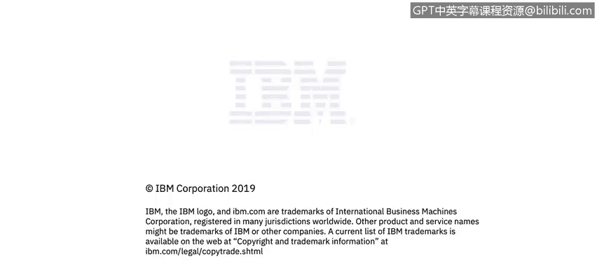

# IBM网络安全分析师专业证书课程4：《网络安全与数据库漏洞》｜network-security-database-vulnerabilities｜ - P11：10_基本网络路由简介.zh - GPT中英字幕课程资源 - BV1RN411q7PY

Today we're going to discuss the basics of network routing。

This lesson is being presented by Ben Briggs and is based upon a lecture series developed by Moisesmong。

Now， we're going to talk a little bit more about the very basics of routing。

 how a packet is passed from one computer to another within your local network or to anywhere in the world。

The learning objectives for this lesson are。Understand layer 2 and layer 3 addressing。

Understand the interconnection of broadcast domains using the layer 3 devices。

 that is routers and firewall。Describe the address resolution or ARP protocol。

 understand packet forwarding through different broadcast domains。

