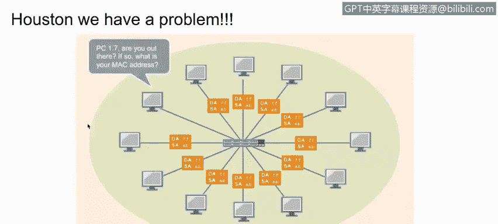
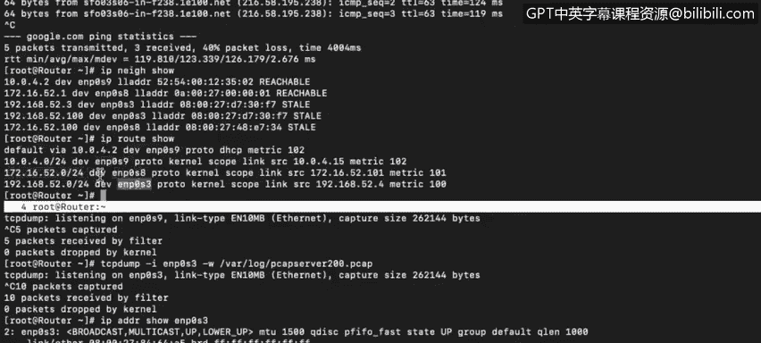

# IBM网络安全分析师专业证书课程4：《网络安全与数据库漏洞》｜network-security-database-vulnerabilities｜ - P14：13_路由器和路由表 第1部分.zh - GPT中英字幕课程资源 - BV1RN411q7PY

Yeah。In this video， you will learn to。Describe the use of routing tables in network routing。

Our next goal in mastering network basics is to gain a better understanding of routing and the use of routing tables。

When we think of routing tables， it's natural to assume that they are just for routers。 In reality。

 though， each and every computer connected to any network。

 whether it's an endpoint or a server will have its own routing table。 So let's take a closer look。

 This is a virtual machine that is working as a router for this demonstration。

You can view your routing table by issuing the Nettt dash N R command。 This works on Mac。

 O S X or Windows systems from a terminal window。 The router is running Sanos。

 so I will enter an I P route show command。This is all we have in the table at this time。

 If we want to send a packet to an I P address that is not listed here。

 then we will send it to our default gateway， and the default gateway will make sure the packet is delivered to the next hop。

 But if we want to send a packet within this network。

 The E NP 0 S 9 interface will take care of anything that exists within this broadcast domain。

 We also have interface E NP at 0 S 8 and E NP 0 S 3 with their respective broadcast domains connected to this router。

 One of these is just another endpoint。 But the other is our default gateway。 In this example。

 this device is just a switch connecting all these computers。

Recall that switches use Mac tables。 So when a switch has to deliver a packet to a computer。

 it does not even look at the layer 3 information， but just looks up the layer 2 Mac address in the packet header to see if there is a corresponding entry in its own Mac table。

 If the Mac address exists。 the packet is delivered to the corresponding interface。

