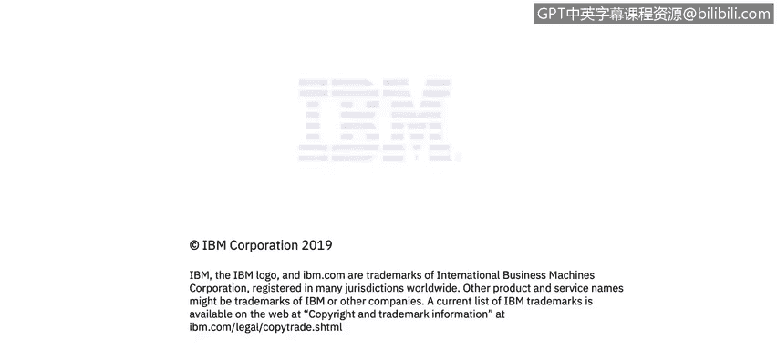

# IBM网络安全分析师专业证书课程4：《网络安全与数据库漏洞》｜network-security-database-vulnerabilities｜ - P15：14_路由器和路由表 第2部分.zh - GPT中英字幕课程资源 - BV1RN411q7PY

Yeah。In this video， you will learn to。Describe how routing tables and default gateways are used to forward packets between broadcast domains。

Okay， so a little more on routing tables。Here we have a broadcast domain called network 1。

 which is connected to a layer 3 device。 In this case， a router。

 but it could be a firewall or a switch。 This router is also connected to network 2。

 which is also broadcast domain 2， a network 2 is connected by a second router to network 3， which。

 of course， is a third broadcast domain。 So if a computer in network 1 wants to send a packet to a device in network 3。

It only needs to have a default route configured， pointing to its default gateway。

Which is port1 of the first router。 This router will check if the device 1 do 8 wants to send a packet to device 3 do 6 in network 3。

 for example， and the first router is not directly attached to device 3 do 6。

 It will send the packet to its own default gateway。

 which in this case is port1 of the second router。 The second router will know that device 3 do 6 is directly connected to its port 2 and will deliver the packet。

 this router must have its a table populated with device 3 do 6 is Mac address to keep it simple。

 let's call that Mac address A D for device 3。 6 to be able to respond。

 the second router will have to know the path back to the device 1 do8 via the first router。

 So if device 1 do 8 pings device 3 do 6。 The path forward and the path back will both have to exist in order to for device 1 do 8 to receive a reply。

