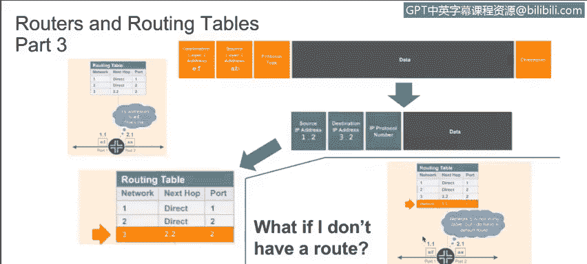
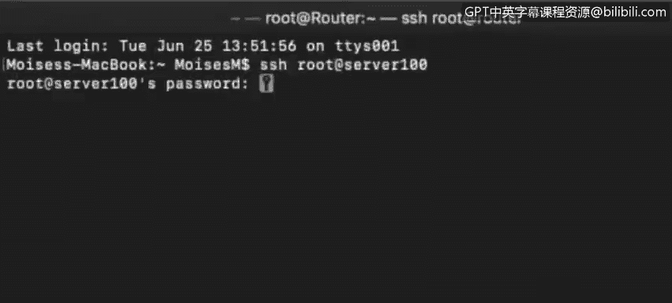
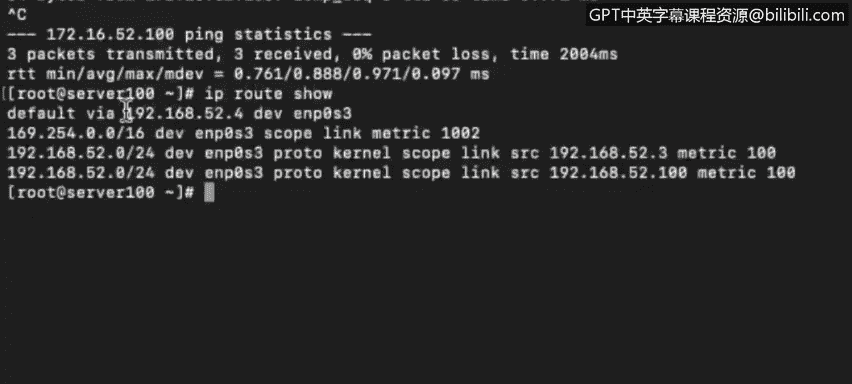

# IBM网络安全分析师专业证书课程4：《网络安全与数据库漏洞》｜network-security-database-vulnerabilities｜ - P16：15_路由器和路由表 第3部分.zh - GPT中英字幕课程资源 - BV1RN411q7PY

Yeah。In this video， you will learn to。Describe the different types of routes defined in a routing table。

Describe how Mac addresses show up in a systems A table。

Describe in detail how a network knows exactly where to forward packets successfully。 Welcome back。

 Now， let's talk a little more about routers and routing tables。😊。

There are different types of routes defined in a routing table。 In the last video。

 we saw three different route types on a single terminal and router。

 So let's check again on these routes。There are three routes。

The default route is used to send packets to addresses we have no other information about。

For example， if we send a packet to IP address 4。2。2。2， we don't know anything about this network。

 so the packet will be sent to the default gateway。

The default gateway for this subnet is 10 do0 dot 4 do 2。Send the packet there。

 and the default gateway will take care of routing it to another network。

The default gateway is doing a good job， as we can see。

 since we're getting a successful reply to our ping， we also have three more routes shown。

 which are directly connected to our server。 So this is saying that this network exists connected to this interface。

😊，And the same for these other two。 So these are two different types of routes。

 routes to systems that are directly connected to our local network and routes through our default gateway。

 Of course， there are more than two types of routes。 There are dynamic routing protocols like OPF。

 R version 1 and Rip version 2， E A R G P， which is a Cisco proprietary protocol。

 Looking again at our example of some trying to send data from network 1 to network 3。

This is a small network that's about as simple as a network can be containing only a router and server 100 and Ser 200。

 We use SS S H to log in as route to server 100 at I P address 192 dot 1，68 dot 52t 100。

From Ser 100， we want to ping Ser 200。

Service， not known， means we don't have the DN S translation enabled。

 but we know the I P address of Server 200。 It's 1，72 dot 16t 52 100。 so we can ping that。

You can see the ping is successful。Now， let's check the routing table to see how the router is making sure that this packet is delivered to Server 200。

We can see now what the router is doing。There isn't a route that points directly to 1。

72 dot 16 do 0 dot 0。That's where we're trying to ping。

 But we have our default gateway connected to the interface， E， N P 0 S 3。

So all that's happening is the packets being sent to our default gateway。

 and the default gateway is making sure this packet is delivered。

The default gateway is also going to make sure the reply is routed back to us。

 We can run a trace to see exactly how this packet is routed from the local host through the gateway。

 and the gateway is making sure that the packet is delivered to its destination endpoint。

You can see here that 1，72 dot 16 dot 52 do 0 is not directly connected to our interface。

 In this case， we only have one interface。We have the loop back， which is a logical interface。

And we have EN P 0 S3， which is the physical interface for this device。

There are two I P addresses assigned to the same interface， which is perfectly valid。

And here is our Mac address。If we check the a table。

We'll see that the Ap table is only populated with devices that are directly connected to our interfaces。

 meaning from the same broadcast domain。In this case。

 the only interface we have within this network segment of 192 do 168 do 52 do 3 slash 24。

So our a table is populated with only that address。Even though we're pinging 172 16 dot 52 100。

 and the ping is successful， the 172 address will not be added to this ap table。 Again。

 the ap table will only translate addresses within our local broadcast domain。

 What we need to know in sending data to a remote I P address is the Mac address of our default gateway。

 In this case， when we check the routing table。 our default gateways Ip address is 192 do 168 do 52 dot 4。

And we could look up that address translation in the a table。

The entry for this IP address is the physical address。0，8，0，0，27，84，64， a 5。

 As should be obvious by this point， each I P address will have a different Mac address because the Mac address is the physical or burned in address with that interface。

So that's how we can send packets across the different network segments。

Our default gateway will make sure that the packets are delivered to the closest layer 3 device until it finds a layer 3 device that has the destination system directly connected to one of its interfaces。

