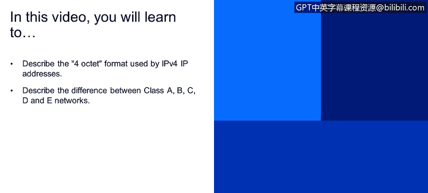
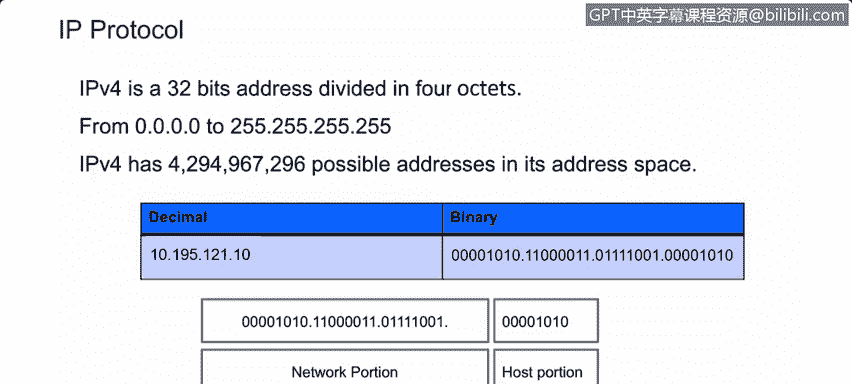
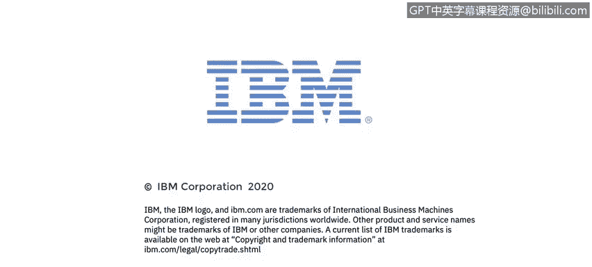

# IBM网络安全分析师专业证书课程4：《网络安全与数据库漏洞》｜network-security-database-vulnerabilities｜ - P19：18_IP地址结构和网络类.zh - GPT中英字幕课程资源 - BV1RN411q7PY

In this video， you will learn to。Describe the4ocCTE format used by IPV4 IP addresses。

Describe the difference between class A， B， C， D， and E networks。

Let's begin by talking about Internet protocol version 4。

 IPV4 uses a 32 B addressing schema that is divided into 4octs of 8 B each。 Now。

 you should remember from the previous video that8 digits of base 21s and zeros can have values ranging from 0 to 255 in decimal notation which is two raised to the 8 power。

 expressed in decimal format。 This gives IPV4 addresses arranged from 0。 0。0。

0 with all bits off to 255。 255。255。 255， with all bits on。

Since the value of any of the fouroctes can range between 0 and 255。

 this gives IPV4 a very large number of possible addresses。4294967296 to be exact。

This seems like a very big number， but we're already getting short of IP PV 4 addresses。

 If we convert this IP P address to binary， the way the computer sees it。

 this will be its representation using the same method we used in the last video。

 we can convert eachocte from deimal to binary。For the decimal number 10。

 we check the 16 placeholder。16 is greater than 10， so we put a zero there。

So the next placeholder is 8， and we can subtract8 from 10 so that placeholder gets a1。

And we have two left over。 You cannot subtract4 from2， so the four placeholder gets a0。

You can subtract two from2 so the two placeholder gets a 1 and we have zero left over。

With zero left over we're done， so any remaining placeholders get a zero。

You can see eachoctet contains eight bits， which is why it is called anoctet。

An IP address is divided into a network portion and a host portion。

 which is something that you can configure on your own computer。But most of the time。

 computers are set up now to allow DHCP or dynamic host configuration protocol to dynamically configure IP addresses for you。

So let's take a look at this in action by logging into our server， Ser 100。

 Let's take a look at the interface I P address。My I P address is 1，92 dot 168 dot 52 dot 3，4octets。

 And we have this slash 24。This whole number is called the cider range。

The/ 24 defines how many bits of the IP address are dedicated to the network portion of the address。

So each IPV4 address has a network portion and a host portion。

 The size of the host portion defines how many hosts or endpoints this network segment can hold。

 In this example， the network portion uses 24 Bs of the 32 B address。

 which leaves 8 Bs for the host portion，2 raised to the eighth power is 256。

 So that's the largest number of hosts that this network segment can support0 through 255。

In the early days of IPV 4， networks used the Class addressing schema。

Which allowed for only five different address ranges。 Class A goes from 0 dot 0 dot 0 dot 0 to 1。

27 dot 255 dot 2，55 dot 255。This is for special use and UniIcast。The default subnet mask is 2。

55 dot 0 dot 0 dot 0， which we will explore more later on。This is the Class B。The class C。

The class D。And class E。Use these address ranges。Class D is reserved for multicast groups。

 so you will see protocols like that bios using addresses in this range to communicate。And finally。

 Class E， which is reserved for research， development and future uses。

So this is Class addressing in class A networks。 The firstoctet is used for the network portion。

 and the last threeoctetets are used for the host portion。In class B networks。

 the first twooctetets are dedicated to the network， and the last two to the host。

Class C networks have the first threeocteets dedicated to the network。

 and only the lastoctet is dedicated to the host。

