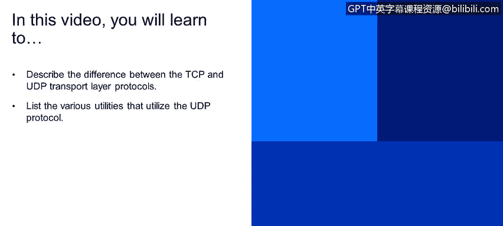
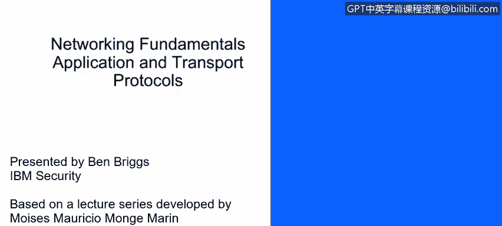
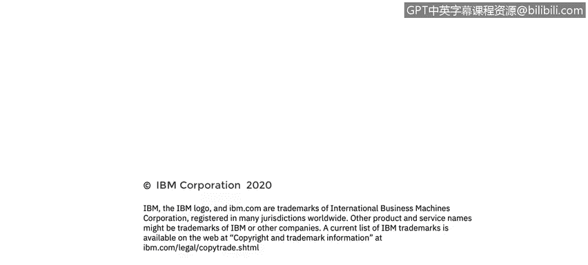

# IBM网络安全分析师专业证书课程4：《网络安全与数据库漏洞》｜network-security-database-vulnerabilities｜ - P22：21_应用层和传输层协议 UDP和TCP 第1部分.zh - GPT中英字幕课程资源 - BV1RN411q7PY

Yeah。In this video， you will learn to。Describe the difference between the TCP and UDP transport layer protocols。

This the various utilities that use the UDP protocol。

This lesson is being presented by Ben Briggs and is based upon the lecture series developed by Moises Mong。

 Today， we're going to talk about the two major transport protocols。 TCP。

 the transport control protocol and UDP， the user datagram protocol。

 We'll see how they differ in the services they provide。

 Transport protocols are sort of like the envelope that you put a letter into。

 The front face of the envelope is like the packet header。

 This is where we write the sender's address and the destination address and so forth。

To extend this analogy。TCP is sort of like sending a letter using priority mail where you get a tracking number and the signature of the receiver。

 so you can be sure that the letter got to its intended recipient。

While UDP is more like using bulk mail， it's fast and cheap and the vast majority of letters will get to their intended destination。

 but you never really know for sure， some applications like to use TCP， while others like to use UDP。

Some applications can be configured to use either TCP or UDP。

 and a few applications use both but for different functions。TCP sets up a connection。

So the sending and receiving computers know which packets have been sent and received and which is the correct order。

 the assurance that no packet is lost without being resent and that all packets are in the right order is critical for many applications。

But all that hand shaking requires a lot of overhead， so it's not very fast。UDP， on the other hand。

 does not set up a connection the same way TCP does。

 The sender does not know if each packet has been received。

 and the receiver can only reassemble the data stream in the order。

 the packets arrive even if some are not in the order they were sent。

 This requires very little overhead。 So it's a very fast protocol and great for streaming videos in music。

 where it doesn't matter much of a few packets or lost or or out of order at layer 4 or transport layer。

 The data is broken into chunks and a header is at it。

The source port number identifies the process that's making the call to the network。

 so the source port number is added to the packet header。

 The destination port number represents the remote service we're trying to connect to。

 so that will also be added to the header。In this example， the source port is 25。

 which means that we're trying to communicate with an STMP server that simple mail transport protocol；

 these are the fields that a UDP packet gra encapsulates。

 you can see the source and destination ports which are often the same number for protocols using UDP。

Then there is the UDP message length and its checkup common protocols that use UDP， are TFTP。

 the trivial file transport protocol using port 69。

 this is very similar to FTP but uses UDP instead of TCP to avoid all of the overhead of establishing and maintaining a connection just to transfer very small files。

DNS， the domain name system， uses port 53。DNS uses UDP for its name queries。

 but it can use TCP for less common tasks。DNS is commonly used to translate domain names into IP addresses SNmp。

 the simple network management protocol， uses ports 161 and 162。 It is uncommon。

 but SNmpP can also use TCP SNmpP is used to monitor and manage network devices DHCP。

 the dynamic host configuration protocol uses ports 67。

DHCP automatically assigns and manages a pool of IP addresses to the systems that are subscribed to it。

VIP or Voiceover IP uses Port 5060。It can also be implemented using TCP and is used for sending voice over the internet and is growing in popularity with internet based phone services。

IP TV or Internet protocol television streams TV signals IPT uses both UDP and TP as well as ports 80。

5004 and 12000 depending upon which service is being used and whether the traffic is inbound or outbound All of these protocols take advantage of UDP because it's so fast and a dropped packet here there is not a showstopper。

