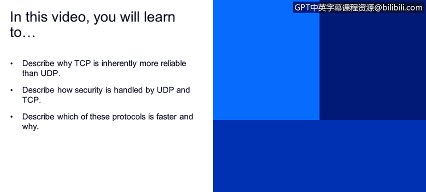
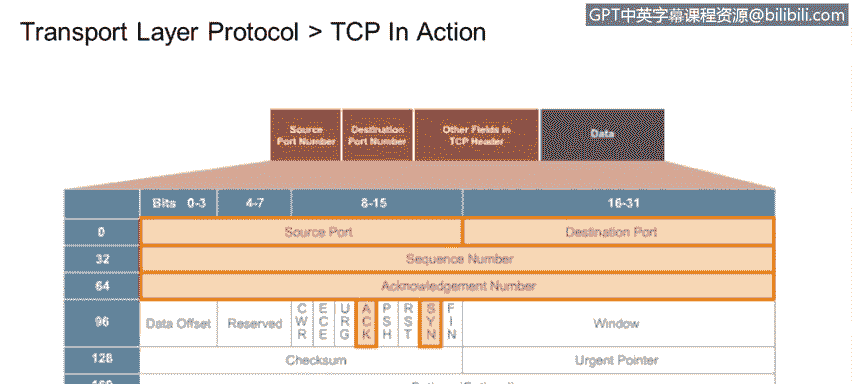
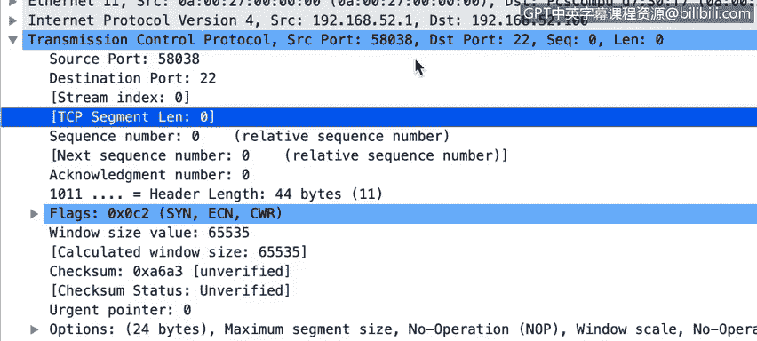
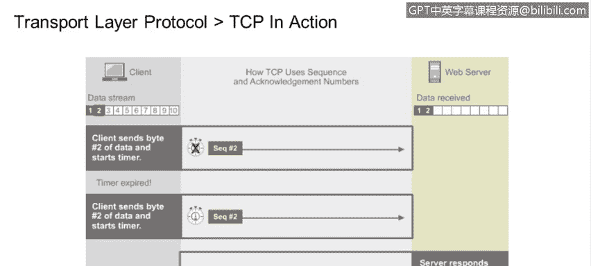
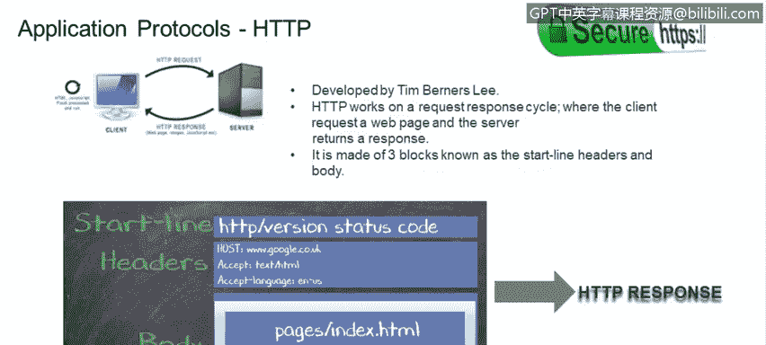

# IBM网络安全分析师专业证书课程4：《网络安全与数据库漏洞》｜network-security-database-vulnerabilities｜ - P23：22_应用层和传输层协议 UDP和TCP 第2部分.zh - GPT中英字幕课程资源 - BV1RN411q7PY

Yeah。In this video， you will learn to。Describe why TCP is inherently more reliable than UDP。

Describe how security is handled by UDP and TCP。Describe which of these protocols is faster and why。

Going back to a traditional mail analogy for UDP， the sender puts a destination address on a letter。

 drops it in the mail， and that's that。The letter either arrived or it didn't。

 The sender will never know TC P， on the other hand。

 requires an acknowledgment from the destination that the letter was received。

 Unlike traditional mail， TC P only waits about three seconds for the acknowledgment before automatically rescinending the packet when a TC P connection is established。

 The first thing that's done is a three way handshake。

 The sender whos trying to establish the connection， sends a sin。

That synchronized sequence number request to the recipient system。

 The recipient system responds with a S plus a signal。

 That is the S plus an acknowledgment to indicate the sequence number the communication will start with。

 So let's take a look at a few captured packets here。 In this case。

 we're trying to establish an SS H or secure shell connection。

 from our system at 192 do 168 dot 52 do 1 to the server at 1，92 do 168 dot 52 dot 100。

 Here are the first three packets。 This is the S。And you can see the flags here。

 The S flag is set to one。 Each flag can take on only two possible values， a 0 or a 1。

So in this case， the flag is on。 We expect the next packet to contain the S act。We see。

 the sin is on。And also that the a is on。 and the last packet just contains a simple a。

 Once the three way handshake is successful， A TCP connection is established。

 and we can start transmitting data。You can see here what follows the handshake is the actual SSH information being sent from the client to the server。

 a quick overview of the transport layer protocols。Both UDP and TCP multiplex data using ports。

This means that the data stream is broken down into small chunks of data put into separate packets and addressed and sent。

In our traditional mail analogy， that would be like taking a long letter and putting it into envelopes  one page at a time and mailing each separately。

 We know that U DP is a connectionless protocol， so it sends off its packets and does not ask or receive any acknowledgment from the destination that we hope is receiving those packets。

On the other hand， TCP is a connection oriented protocol。

 So the first thing it does is use the threeway handshake to establish a connection with a recipient before it starts transmitting any data。

 not only that， but it receives an acknowledgecknowgment that each and every packet has been received or it will send it again。

 UDP is considered unreliable because it doesn't care whether the destination received the packet or not。

 TCP on the other hand， is considered reliable because it will continue to retransmit a packet until it receives an acledgment from the destination that the packet has been received。

 UDP sends datagrams in the order。 the transport layer gets them from the requesting application。

 but they are reassembled by the receiving system only in the order they are received and only those packets that are actually received。

 Obviously this works perfectly well for many applications， but not so well for others。

 a bundle of data and headers。In UDP is known as a datagram in TCP that bundle is called a segment TCP has flow control。

 which means the sender will not send packets faster than the receiving system can process them。

 UDP does not have flow control， so there's always the risk of the recipient being overwhelmed under some conditions。

We saw the UDP header earlier。This is the TCP packet header。

You should recognize from the packet capture we just saw features like the source port。

 the destination port， the S and a flags， along with a number of others。

Let's take another look at the transmission control protocol on layerer 4。

 we can see for this packet the source port is 58038， and the destination port is 22。

Port 22 is used for SS S H。 So this packet header tells us an attempt is being made to connect to a remote SS SH server by a process using the local port 58038。

 The packet header contains the sequence number and an acknowledgment number。

A number of flags you can easily look up with a Google search if you want to dig a little deeper。

And the check sum。Applications that use TCP include H T TP。

 the hypertext transport protocol that connects the World Web。 H T Tps or secure H TTP。

 which adds encryption， STP， the simple mail transport protocol and F TP。

 the file transfer protocol as mentioned before in TCP。

 the segment that is sent must be acknowledged by the destination so we can keep sending packets。

 In reality， TCP often sends data in a series instead of waiting for an acknowledgement for each and every packet。

 The receiving computer can look at the sequence number to tell if a packet is missing from a series and can let the sender know to resend only the missing packet。

 TCP uses sequence numbers and acknowledgement numbers。 Once a packet is received。

 The receiving system sends an act or acknowledge number。

 that act number is going to be the sequence number for。

The next datagram segment that is sent HTTP works in a request response cycle。

 The client requests a web page and the server returns that requested page as a response。

 The HtT packet is made up of three blocks。 The start line， the header and the body。By now。

 everyone aspiring to be a cybersecurity analyst should know that HTTP protocol is not at all secure HTPS or secure HTTP was developed to address the need for privacy and security on the internet。

H T TPS S incorporates the use of SSL certificates。

 so your data is encrypted and travel securely across the network to be more precise。

 SSL acts as the outermost protocol layer， so nothing after its initial handshake is exposed or sent unencrypted。

