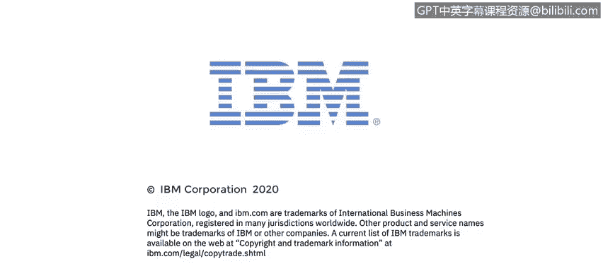

# IBM网络安全分析师专业证书课程4：《网络安全与数据库漏洞》｜network-security-database-vulnerabilities｜ - P24：23_DNS和DHCP.zh - GPT中英字幕课程资源 - BV1RN411q7PY

Yeah。In this video， you will learn to。Describe DNS， the domain name system。

 and the service it provides。Describe DHCP。The dynamic host configuration protocol and the service it provides。

This lesson is being presented by Ben Briggs and is based upon a lecture series developed by Moisees Mong。

 Today's lesson will cover two very important application protocols。 DNS。

 the domain name service that translates domain names into I P addresses and DHCP。

 the dynamic host configuration protocol that automatically configures and manages the I P addresses on endpoints from a pool of available I P addresses will begin with DNS。

 The DNS service is running on our local machine。

The DNS service translates the domain names in URLs to I P addresses。 It's as simple as that。

So when you go to Google。 co。DNS will resolve that name to the actual address of Google's web server。

When I try to ping Google co， D NSS is going to get the actual IP address of this server to use in the Ping request。

We can see where the DNS server is hosted。 In this case， it's our default gateway 192 do 168 do 0。 1。

 that's running the DNS service。

Now let's talk about DHCP， the dynamic host configuration protocol。

DHCP will allow a computer to automatically obtain an IP address。

Whenever it connects to its local network from a pool of available I P addresses that the DHCP server has been configured to manage。

 the DHcP Handshake will consist of four packets that go between the requesting system and the DHCP server。

 They are known as Disc， offer， request and acknowledgement messages。

 when an endpoint connects to a network。 If it's configured for DHCP。

 The system will immediately try to discover the DHCP server。

 So it will send a broadcast message to all the endpoints on the network segment。You remember。

 we learned about sending broadcast messages in the first week of this course。

 If the endpoint had an Ip address from a previous boot up。

 it may ask in the request to be allowed to renew a lease on that address rather than be issued a new address。

 If there is a DHCP server on the network segment。 and there should be if there are endpoints that are configured for DHcP。

 The DHcP server will send an offer message back to the requesting endpoint。

 The offer message will contain the Mac address of the requesting endpoint。

 The Ip address that's being offered。 The subnet mask。

 the lease duration and the Ip address of the DHCP server that's making the offer。

 It's very possible that a network is configured with more than one DHcP server。

 So the requesting endpoint might receive multiple offers。 After receiving offers。

 the endpoint will reply with a request message that indicates which offer it's accepted。

 The winning DHcP server sends a final a or acknowledgeledment。Message to the endpoint。

 confirming that it can have the offered IP address。

 and then it marks that IP address as least to the Mac address of the endpoint。

 the other DHCP service will return their offered addresses to their pools of available addresses。

 This is a wiresha capture of a DHCP discover packet。

Initially your computer doesn't know the I address or the Mac address of the DHCP server。

 So you can see at layer 2， the requesting computer is using the broadcast Mac address So all devices in its broadcast domain will receive the frame here at layer 3 we see that there is a broadcast I address being used。

 and at layer 4， we see we're using boot PC which is DHcP， which is using UDp。

 and is running on sourceport 68 destination port 67。 The DHcP server will be listening on port 67。

 Once it receives a DHcP request， it will check its pool of IP addresses to see if one is available。

 If it is one to lease， it will reply back to the requesting endpoint with a DHcP offer containing the proposed IP address and related information like the DHCP server's address The address of the default gateway sub。

Net mask and the lease duration。Even though the endpoint now knows the address of the DHP server。

 it will reply to the offer it is accepted with a request message that is broadcast rather than sent directly。

 This is to let any other responding DHcP servers。 Know that an offer has been accepted。

 and they can return their offered I P addresses to their address pools。

 Here is the DHCP request packet。 You can see it repeats the same I P data that was sent to the endpoint in the offer message。

 Finally， the DHCP server sends the acknowledment message to the endpoint。

 confirming that it is least at the previously sent I P address。

