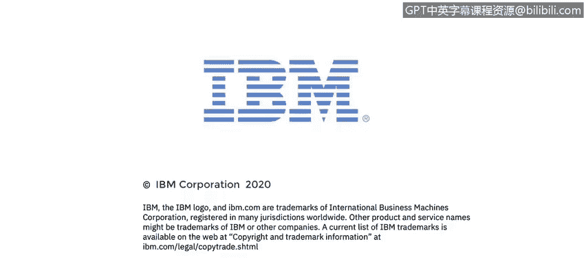

# IBM网络安全分析师专业证书课程4：《网络安全与数据库漏洞》｜network-security-database-vulnerabilities｜ - P26：25_流量和网络分析.zh - GPT中英字幕课程资源 - BV1RN411q7PY

Yes。In this video， you will learn to。Describe how flow utilities like netflow allow you to collect and visualize network traffic flow statistics on your routing devices。

😊。

So what type of usage data will we see in flows， Neflowlow takes samples of the flows traversing an interface If we inspect one sample record。

 we will see how many packets have been used in this flow， how many bytes were sent。

A timest recording of when the flow started， when the sample was taken。

 the identity of the incoming and outgoing interface we'll also see Q O or quality of service information。

 like the type of service。 and we will see what I protocolcol was used。 For example。

 Procol 1 is ICMP17 is UDP and 6 is TCP。 and， of course。

 we will see the source and destination I addresses。

 as well as all the source and destination port numbers for TCP and UDP。

 These are charts taken from a netflow server。 It's up to the netflow server to display all of the collected data in a way that can be easily understood。

Once netflow data has been collected， it's easy to see what protocols are used most at this interface。

 In this case， more than 84% of the traffic is TCP or worldwide Web traffic。

 Remember that this data is collected and displayed for one interface at a time。

 It's also easy to see the traffic by the application that's using the interface。

 No surprise that H TTP is number one。 We can see how many bytes are ingress or coming into the interface and how many are egress or leaving the interface。

And of course， we can see the number of packets that are being sent across the interface in each direction。

