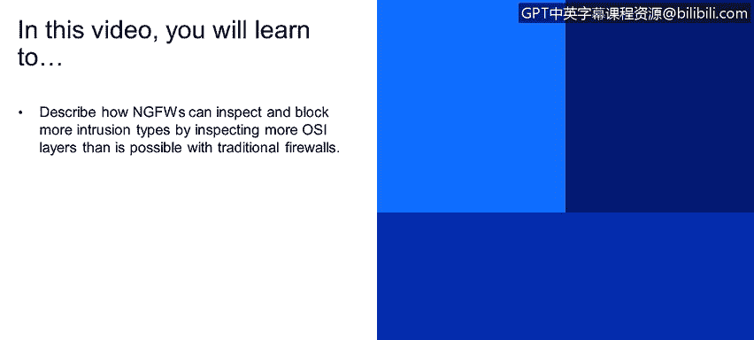
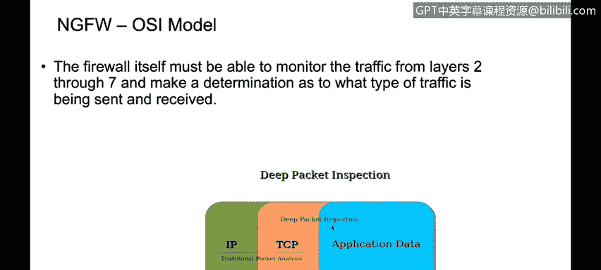
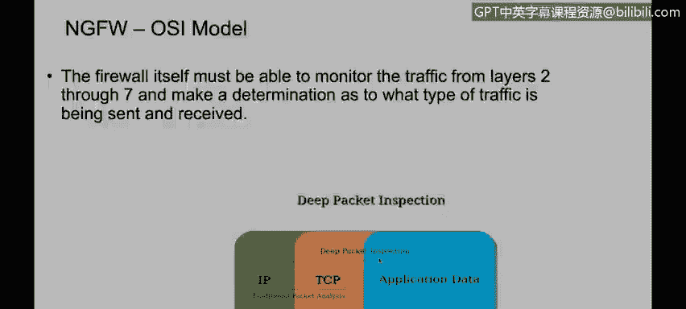

# IBM网络安全分析师专业证书课程4：《网络安全与数据库漏洞》｜network-security-database-vulnerabilities｜ - P29：28_NGFW和OSI模型.zh - GPT中英字幕课程资源 - BV1RN411q7PY

Yes。In this video， you will learn to describe how NGFWs can inspect and block more intrusion types by inspecting more OSI layers than is possible with traditional firewalls。

As you can see here， traditional viral inspects。Or uses layer 3 and layer four to perform the decisions。

 the block in decisions， the deep packet inspection fire is able to use up to the application layer。

 is able to inspect up to the application layer。So for example。

 if we have a traditional par allowing traffic HTTP traffic from my PC to web server。

 if we have another application such as， I don't know。

 something like Skype or on any other application that is using HTTP， like to transport the traffic。

If we have a traditional firewall rule with a rule configured to allow HTTP traffic and we want to block specifically that application that it's using HTTP traffic to transport the packet。

 we're not going to be able to do that because we cannot be that granular when confiuring traditional firewall with the next generation firewall。

 we are able to inspect up to the application layer and we're going to be able to determine if the real application is HTTP or it's another application。

So as you can see here， with a next generation firewall or a deep packing inspection firewall。

We're going to be able to permit and block specific applications， so this is not the case。

 but assuming that you have， for example， applications such as Facebook and YouTube that they both uses HtTP if you have a traditional fargo allowing HtTP traffic you're not going to be able to block specifically YouTube or Facebook because they will be using HtTP traffic and we have a rural configure to allow that traffic that' the next generation power we're going to inspect the traffic forger then just destination transport port which is 80 for HtTP if we're going to able to identify the real application so for example you can。

Permit HTTP traffic。 But at the same time， you can be blocking YouTube， and at the same time。

 you can be allowing Facebook， for example。So a next generation firewall allows you to be that granular when configuring the rules block to permit or block traffic。

