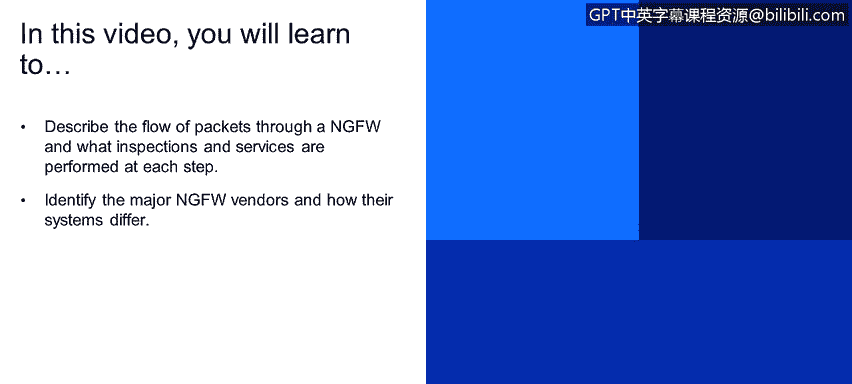
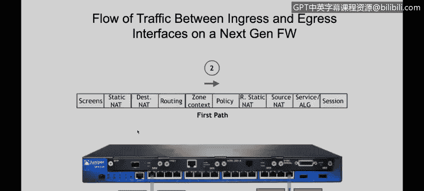
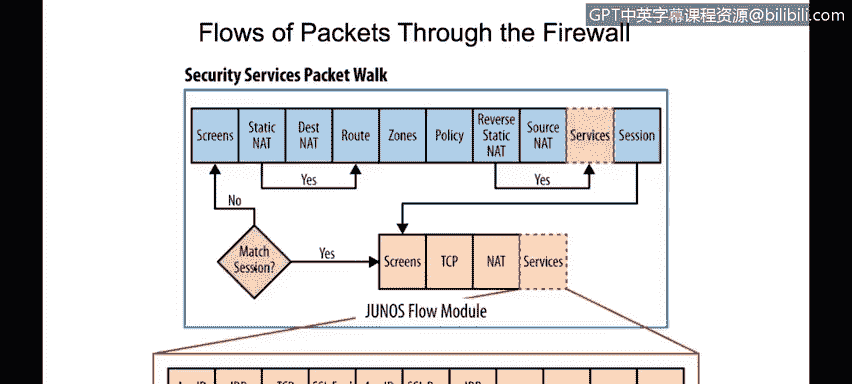
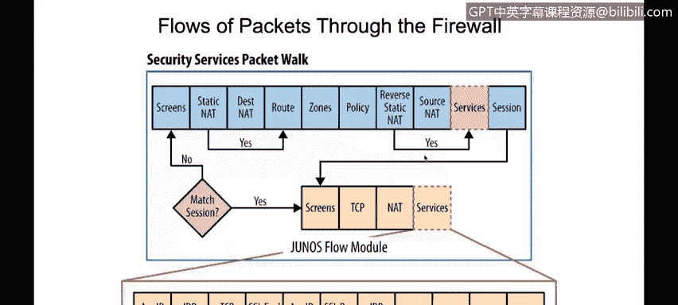
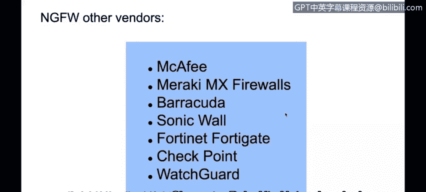

# IBM网络安全分析师专业证书课程4：《网络安全与数据库漏洞》｜network-security-database-vulnerabilities｜ - P30：29_NGFW数据包流示例和NGFW比较.zh - GPT中英字幕课程资源 - BV1RN411q7PY

Yeah。In this video， you will learn to describe the flow of packets through a NGFW and what inspections and services are performed at each step。

😊，Identify the major NGFW vendors and how their systems differ。

This is just an example and just to illustrate how a next generation firework works。

 we're going to use our Juniper SRX 240 firewall。So assuming that our traffic is going to ingress Saaro on interface number one and the E interface is going to be interface number three。

Basically the way this works is that we're going to be receiving the traffic on interface number one here we can configure at the interface level。

 we can configure traditional firewall rules that will basically inspect layer3 and layer four of the OSI model the firewall then have flow D module。

 which is able to provide next generation firewall capabilities。

We're going to describe how each of these modules or each of these steps work a different on the same course。

 but a little bit later。Then after determining if determining if the traffic is able to go through the fire。

 we're going to send it out of the egress interface and we're going to see how that works in this section。

So。

Assuming that。Our ingress interface is interface number one we're going to check if we have a session already established for that traffic or if we don't have a session。

 we're going to be processing the packet using this module here。

So the first thing that we're going to check is the screen。

 this is simply a protection for the most common attacks， such as denial of service attacks。After。

Determining that this is not like a classified as an attack on the screen section。

 we're going to basically change the destination IP address using either the static na rules or destination nad rules we have any nad rules that should translate the destination IP of the packet we need to do that before doing the routing decision because we're going to use the destination IP address to do our routing decision so when we perform the destination map translation or we translate the destination IP。

If there is a rule to do that。We're going to check our routing table and we're going to determine what our egress interface will be once we have that we now know the Ingress interface which is number one in the egress interface which is number three in this case on our next generation viral and specifically on this Juniper each interface should be on a security zone。

So assuming that interface number one is on the zone trust and interface number Z number three is on the zone on trust。

We now have our ingress and ingressgress zone， and that's going to be used。

When when checking our security policies， the security policies will have a context and the context could be from zone trust to zone on trust。

 for example。So once we have our zones， in and egress。

And we know what policy rules should be processing the traffic we're going to determine if the traffic is able to go through the firewall or not because the policy will basically have the matching conditions and the actions to be taken on that packet so for example it will say if the packet is coming from zone trust to zoneone and trust from source IP1。

1。1 to the source to destination IP22。2 then the firewall will permit the traffic or will block the traffic。

 assuming that our traffic is permitted and is able to go through the firewall we're going to translate our sourceNe using either spreadNe or a sourceNe rule if there is a rule to do that but assuming that we're not translating any source IP we're going to inspect that our next generation firewall is able to provide and those additional services could be app to identify the real application。

Such as Facebook， Scott， for example， YouTube。We will have IDP which is nutrition detection prevention。

 basically it will be analyzing the traffic against signature to be able to find virus or other threats and we will have additional services here if there if the problem is configured to provide any of those services it will be done here on the services section once everything is ready and the package is set to be sent。

Then we're going to create a session and we're going to write our session on a session table。

When they return traffic coming from interface or the response from the server to my PC。

 it's coming from interface three as my English interface。

And one as my eagergress enph。The next generation firewall will be able to understand that this is part of an existing session and all this processing is not going to be done because it knows that it's part of a response。

That's the main difference between。A next generation firewall。And traditional firewall。

As I mentioned， some of the comparisons against the next generation between a next generation parwall and a traditional parwall is that they are able to inspect up to the application layer。

 they are able to provide further services。And they are also able to be more granular when making the blocklocking decisions。

Some examples of next generation followerslows， we have this CcoA A devices。

We have the A Palllo Al networks， Juniper Network， Sx， which is the one we illustrated before。

And we have water vendors such as Mccafe， Meraki， for example， Barracuda， Sonic wall。

 48 checkpoints and watch parts。

And we also have some options here if we want to use an open source Next generation filewall。

 we can configure PF S， for example， and we have some other options such as the clear OS and the IP cup。

 for example， which is a Linux。An open source Linux spiralwall。

