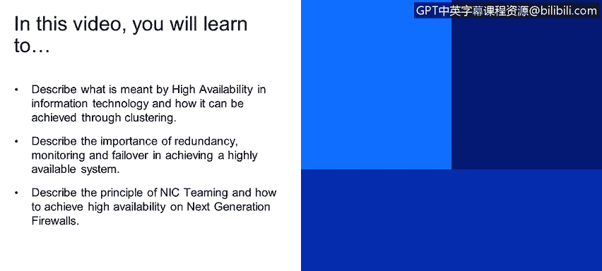
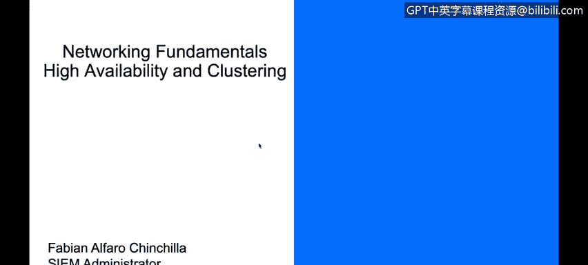
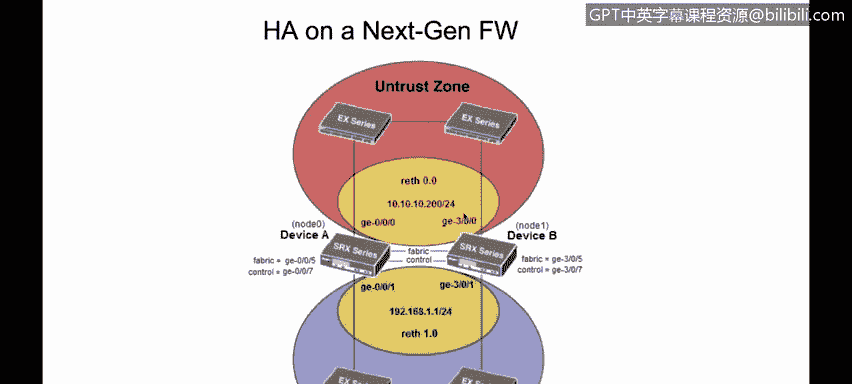

# IBM网络安全分析师专业证书课程4：《网络安全与数据库漏洞》｜network-security-database-vulnerabilities｜ - P32：31_高可用性和集群.zh - GPT中英字幕课程资源 - BV1RN411q7PY

Yes。In this video you will learn to describe what is meant by high availability in information technology and how it can be achieved through clustering。

Describe the importance of redundancy， monitoring and failover in achieving a highly available system。

Describe the principle of Nick teaming and how to achieve high availability on next generation firewalls。

Hello， thank you for being in this。 today we're going to talk about high availability in clustering。

 specifically on an next generation farwall。

Basically。The information security basis should be that our information。Is confidential。

 and it remains confidential for us。 In other words。

 this means that the information should not be readable or viewed by other people that is not authorized to do that。

The other important point of information security is integrity。

Which is basically that the information should not be manipulated in unauthorized ways。

And the third point， which is one of the most important points of information security。

 is the availability。 And this means that our information should always be available If we need to access our information。

 it should be ready to be accessible and it should be ready for us to use it。 that's basically。

Where the need of H and clustering appear here， Basically。

 in order for us to always have the information available。

 we have deployed several technologies such as high availability and Chelseaea cluster。

 High availability is basically。System or a component that is continuously operational100% of the time。

 Basically， if we have， for example， a next generation firewall that it's processing traffic and its or a router that it's processing traffic and it's forwarding traffic back and forth basically we'll have two devices working together it could be they could be working together or we can have an active device and standby device and in case the primary or the active device goes down the secondary device or the standby device will take over and we'll basically continue forwarding traffic or blocking and allowing traffic if it's an next generation firewall。

 that's the key of high availability。The most important thing for us is that our data。

 our network should always be up and running。 Our data should always be accessible。

 So that's basically the main reason why a chatssis cluster in high availabilityil appeared on the market。

 Basically， the requirements， if we're going to create a chatty cluster is that they host in the virtual server。

 if we have， for example， a chatsis cluster or two servers or more servers working together。

 they should be able to access the same shared storage。

 they should have an identical network configurations， for example。

 their DNS should be configured properly and both devices， if it's not set correctly。

 you won't be able to configure Ha settings at all。

They should have the same operating system version in some technologies such as Chassis clusterluster。

 for example， when talking about next generation firewalls， sometimes they should be。

 or they should have the same hardware in the same software level。

And usually you should have a connection between them。

 You should have a connection between the primary and the secondary node。

So how high availability works to create a timing available system or an HA device。

 three characteristics should be present， You should have them in mind。

The first one is redundancy and also monitoring and failover redundancy basically means that multiple components that can you have multiple components that can do the same thing。

So for example， I mentioned before the mu can have， for example。

 an active device and a secondary device， and if the active device goes down。

 the secondary could take over， that's redundancy。You don't have a single point of failure and monitoring and failover it's basically that your secondary device。

 for example， should always be monitoring your primary device because if your active device goes down it should be able to take over it should be able to identify that the primary device is no longer working and should be able to take the role of the primary device and the failover is simply when you take the primary role from the active I mean if the active device goes down there will be a failover group to have your secondary device working as the primary here we're just。

Including an image， so you can see basically how high availability works。You have， for example。

 of the Internet， and then you have two different paths。To go to your servers， if one path goes down。

 you should be able to use an alternate path and at the end you can even have rate technology so you can have a copy of your data on more than one disk so if one hard disk fail you have the data on another hard drive for example。

 but we're not going to talk about rate technology on this lesson。

Nick teaming is basically technology that allows me to have more than one ni operating at the same time。

 So in this way， you eliminate a single point of failure risk。So with Nick Timing。

 you can have two mix working at the same time and in this way。

 if one network adapter goes down or if it fails， you still have a second network adapter working。

 And here we can see an example of chassis cluster of a next generation par in this case。

 we can see that we have SRX devices here。And we have an active or a primary device and a secondary device。

The primary device has connections against the secondary device。And basically。

 we have a fabric link and a control link。The control link will be able to synchronize configuration data and some other important data for the secondary to be up to date。

 So， for example， if the primary device， if you have a device that it's connecting to the Internet。

 your primary device will probably create a session， if it allows the traffic to go through。

Once that session is created， it will be synchronized using the control link against the secondary device。

 So in the case your secondary device needs to take over the primary role。

 It should have a session table which is or is the same than the one you had on the primary device and the fabric control link is just able to forward traffic when you have an active active is an error。

 I will explain what an active active versus an active passive H deployment is。A little bit later。

 Basically， in this case， you can have interface gigabit 0，0，1 and interface Giabit 30。

1 on your secondary device connecting to two switches， or it could even be the same switch。

So basically those interface are going to work together as a single interface and you will have a RE interface that's just like your virtual interface if your primary interface which is GeE001 fails。

 your secondary interface， which is GeE301 could still forward that traffic， however， each RE。

Inter fees， you have to assign it to a redundancy group。 So， for example。

 let's say that you have a redundancy group 1 here in read 1，0。So if your primary interface。

 which is GiabB001 goes down， your redundancy group1 will fail over to the secondary and the secondary could then use GiabB01 to forward that traffic。

 that's basically how it works and that's basically the monitoring that we talked before that the secondary device should be able to monitor the status of the primary device for it to take over the primary role。

And basically here on the on zone， we have the same concept。

 we have another re interface assigned probably to a different redundancy group。

And two interfaces working together as a virtual interface， which is RE 0，0。

 So this is an example of how an HA or high availability setup will be working on an next generation5wall。

 And this is all for this lesson。 Thank you so much for attending。

