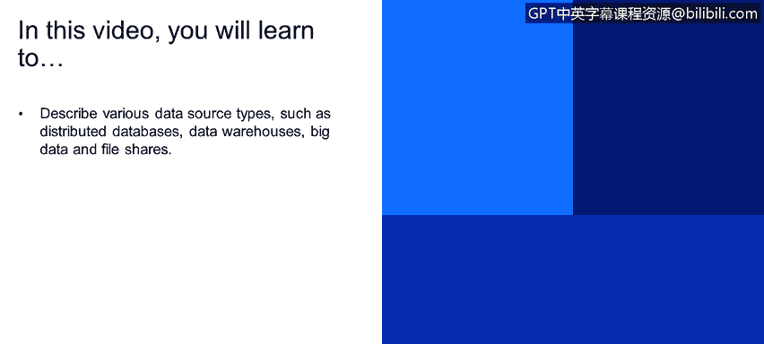
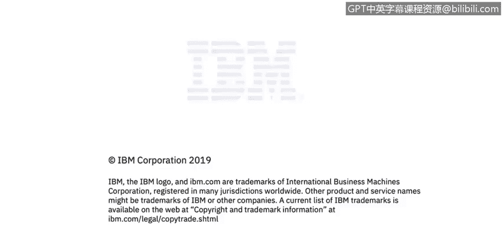

# IBM网络安全分析师专业证书课程4：《网络安全与数据库漏洞》｜network-security-database-vulnerabilities｜ - P34：33_数据源类型 第1部分.zh - GPT中英字幕课程资源 - BV1RN411q7PY

Yes。In this video， you will learn to describe various data source types such as distributed databases。

 data warehouses， big data， and file shares。

Hello， this is Chris Wy。 I'm a cybercur specialist with IBM。

Also known as a security technical specialist。In this video。

 we will be covering key concepts of databases and database security。

We will also be giving an overview of data models such as structured。

 semistructured and unstructured data。While we will be covering unstructured data。

Such as file shares of network attached storage。The deeper dive into unstructured data。

 such as file shares is going to be covered in a separate video。

 This video will only cover them enough to explain what they are so you have understanding of the different types of data models。

Every organization， whether it's a public or private entity。

Has many different types of data sources such as distributed databases。Microsoft SQL Server， Oracle。

 MysQL， SQL Lite， Postgress。The list goes on and on and on。

 It's probably the most common database type in the world。Also。

 data warehouses such as Amazon's Redshift or Hadoop's Hve or Naisa or Exudta。

very purpose built environments， and we'll talk a bit about those later。Finally for databases。

 big data， no SQO。We will cover those in a bit， but those you might be familiar with such as Google's Big T or a Duke or MongoDD。

Fal shares。 So f shares are everything from。Amazon S3， Google Drive， Dropbox，box。com。

 even your download folder on your laptop， that would be a file share， that would be a directory。

 but well。Cover those in a bit。So one thing every organization has。

And common is they're all using a lot of data in a variety of combinations of these things。

 They might be using all or only a couple of these also。

Organizations have many different locations oftentimes。

 regardless if it's a public or private entity， it could be around the city， around the state。

 around the world， and that's true， regardless if it's a retail store， a bank， a hospital。

 even a public building， even think of all the different。Locationations， Amazon， IviM。

 Google have around the world。One thing in common with all these different entities。

 public and private。Is they have a lot of infrastructure in the back end that help them do what they do day in and day out。

 regardless that if it's as simple as providing email for the organization。

 providing chat clients for the organization， even simply all the different projects going on in an organization。

 the project folders， what they're working on， the way teams integrate together。

 all the different backend systems。Being worked on our commonality in。

All organizations and all of us that background infrastructure is stored in data centers。Now。

 it used to be in let's say。Early 2000s， people still thought mainly of security as a perimeter defense。

 and by perimeter defense， I really mean firewalls and VPNs and stopping people from ever getting into your organization。

And it's been proven time and time again that that's just not adequate anymore。

 even not in the current day and age。Because regardless of people trying to come into your organization。

There's just so many different ways into an organization they're not just trying to come through your firewall。

 they're not just trying to come through your VPN they're trying to come with your employees credentials they're trying to come through your business partners through other entities that you work with that have access into your data center。

 all of those different means of entering your data center all potential threat vectors or。

Ways into your organization that you have to think of and walk， it's essentially a safe with many。

 many different windows and doors that each of them need some sort of controls around security controls around。

That's why so much focus has been given in the last 10 years to data security and all of the different breaches that you hear again and again and again were all somebody compromising an organizations data security。

Controls or。Simply accessing it because of lack of controls。Assessing the data。

