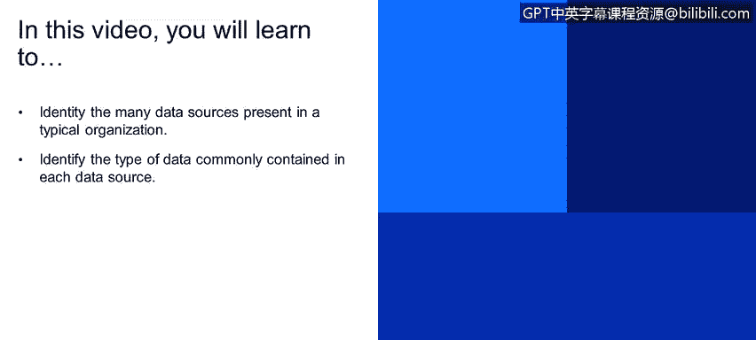
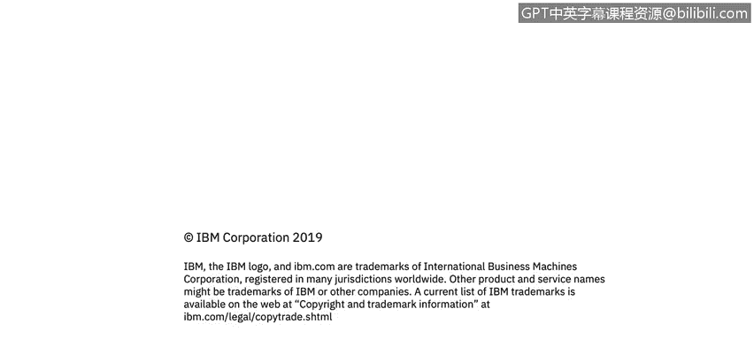

# IBM网络安全分析师专业证书课程4：《网络安全与数据库漏洞》｜network-security-database-vulnerabilities｜ - P35：34_数据源类型 第2部分.zh - GPT中英字幕课程资源 - BV1RN411q7PY

Yes。In this video， you will learn to。Identify the many data sources present in a typical organization。

Identify the type of data commonly contained in each data source。

Here is just an example of a couple of different things you would see in a typical organization this list is in no way shape or form exhaustive of the different types of applications。

 databases， data warehouses， big data environments， files， content managers。

 database tools and cloud environments， but this is an example of all the different things that have to do with data。

 in your organization， all the different avenues， for people to access the data。

Typically an organization。You won't just have a database that DBAs connect to。

 you'll really have applications that connect to a backend database such as your HR system when people are onboarded and offboarded。

 say even SAP Peopleof does， shipping logistics for your clients that make orders。

 logistics of shipping it around the world to your clients， just in time，For their deadlines。

 et cetera。 All of that would be in databases that applications and your really entire workforce is logging in do their job day in and day out day warehouses are typically used for crunching numbers。

 They are oftentimes incredibly vast amounts of data。

 such as Hadoop's hive or Amazon's Redshift or even Metia and Exadata。

 Per built incredibly fast processors to do nothing。But crunched data。

Incredibly efficiently and fast。 So exudate is really for crunching numbers。

 If you wanted to think of it that way。 Big data environments， oftentimes。

 you'll see an organization。It is a massive， massive amount of data。 A lot of times。

 people don't quite know what's in the data or what they're going to do with it。

 So a lot of times you'll have legacy databases that have been sunset and such shut down。

 Some archive the information and put it somewhere。They don't quite know what to do with it。

 says someone decides to throw it in a do。 maybe we'll start gaining more information about our customers。

 our clients， our products， how we do business， how we can do business better。

 how we can interact with all of them better。 So all that information just kind of gets thrown into big data。

 and the ideas oftentimes to simply start gaining value out of it later as you start slicing and dicing it and looking into it。

 Cloud environments simply different places to。Host your data versus on prem on prem being。

Data center that you have set up control and have complete ownership of。Database tools。

 simply different ways to interact with databases oftentimes used by DBAs。

 but it can be a variety of different things they're used for content manager， SharePoint。

 Class one and there's a lot of different types though and that could really be just about anything if you're thinking of enterprise content manager could be a project management tool or something like that。

Like base camp。 So files， certainly files。You're probably more familiar with this than you might think of or realize。

 so even your download folder would be a file share so Linux Uni Windows。

 all the different files stored inside them would be in file share onstructured data when you connect to different FTP sites。

 all of those would be unstructured data or well it can be unstructured data。So data source types。

 distributed databases， data warehouses， big data， file shares so distributed database examples are Oracle。

 DV2， Microsoft SQL Server， MyQL， Postgres， list goes on。Digated examples， Haduc Mogodidi。B table。

Data warehouse examples with Tsa， Xadata。Amazon Redshift and Apache hive file share examples， NAs。

 network attached storage， network file share such as EMC or Ne app and cloudshares。

 such as Google Drive， Dropbox Fox do com and Amazon S 3 storage Think of the different。Datase types。

 If I was to look at distributed databases and data warehouses。Both of those are often。

Considered structured data， and we'll get into what that means in a minute。

Big data database examples are oftentimes semi structured data。

Mostly because oftentimes it's a lot of different structured data sources。

That don't have a means to look at all of the different types of data that was thrown into it holistically。

 and I'll explain more about that in a minute。And we go over structured semistructured data。

And foster your example simply unstructured data， so think of your download folder。

 you had a reason to download it， but that's really it。

 it could have been for all the different projects you work on with work。

 it could be your kids's project here you know。Wonderful video and know walking for the first time or something like that。

 here's just all the different things you might download。But no real structure to it whatsoever。

 other than that。

