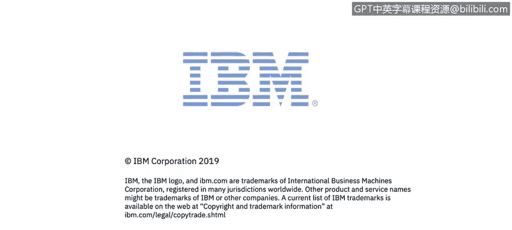

# IBM网络安全分析师专业证书课程4：《网络安全与数据库漏洞》｜network-security-database-vulnerabilities｜ - P39：38_利用安全行业最佳实践.zh - GPT中英字幕课程资源 - BV1RN411q7PY

Yes。In this video， you will learn to identify where you can find best practice guidance for data security。

😊。

So here are some industry best practices， so Center for Information Security also known as the CIS benchmarkchmarks。

 CDE， so common vulnerabilities and exposures， and then sts which are released by the Department of Defense。

 So all of those are different privileges， configuration setting， security patches。

 password policies， OS level file permission， so password policy， an example there is not having a。

Set number of failed login attempts for someone like so I could just keep trying and keep trying until I finally guessed the right password for a user account。

 obviously a big no no。So established baseline where all the organization industries applications。

 and it's kind of on and on， also all of these different things are simply vulnerabilities for databases and operating systems。

