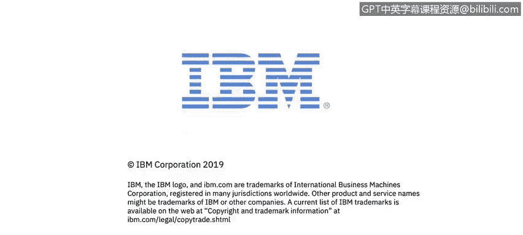

# IBM网络安全分析师专业证书课程4：《网络安全与数据库漏洞》｜network-security-database-vulnerabilities｜ - P3：2_无状态检查.zh - GPT中英字幕课程资源 - BV1RN411q7PY

Yes。In this video， you will learn to describe how a packet is inspected by a stateless firewall Today。

 we're going to discuss networking fundamentals and some of the basic concepts of network security。

 This lecture was developed by Moises Mong and is being presented by Ben Briggs。

Let's review some of the differences between stateful and stateless inspection。First。

 we will focus on how firewalls and routes work in modern enterprises。

Then we're going to talk a little about the differences between an intrusion detection system or IDS and an intrusion prevention system or IPS。

Finally， we will cover some of the basics of network address translation routers or NAtS。

Regular routers in some firewall utilize the stateless way of filtering packets。

Stateless means that each packet is inspected one at a time with no knowledge of previous packets。

No session table is maintained， so each packet is inspected independently of all other packets。

So what is inspected in the packet？The source I P address is examined to see if it's allowed。

 We may have an A C L rule， an access control list rule that will determine if that source I P address is allowed into our network。

Or if the destination address is allowed to be accessed。

 A check is made to see if the destination port or the service is allowed into the network。Basically。

 this proceeds packet by packet。 Stateateless inspection doesn't know anything about session。

 We will discuss sessions later。 There is no database with details of the packets that have already been inspected。

Here is an example of a stateless inspection event。We will have our source computer。

The client system bring up its web browser。The web browsers operate in the network application layer。

 The browser can create TCP or UDP traffic， but TCP is the most common traffic we will see traversing our network。

 Since our packet is using TCP on network layerer 4， it is going to have an I address。

The packet header will contain the source IP P address of our client machine。

And the destination IP P address of our receiving computer or web server。

Then the layer 2 information will be added to the packet header。

This is information about our local network segment， added by the network。

Such as the physical or Mac address of the source and destination computers and the Mac address of our gateway。

 Then the encapsulated packet will be sent to the physical layer。

 which could be wired or wireless ethernet， the packet will go to the router and the router will evaluate the packet。

 if the source IP P address， In this case， our client machine is allowed to access our server and TCP or UDP are allowed。

 And if the destination port is allowed。 In other words。

 if our server is listening to that specific service for traffic from outside or even within our company's network。

Then the packet will be forwarded to the server。What are some of the benefits of a stateless inspection For starters。

 Stateateless inspections are faster than stateful inspections。

A stateless inspection gives us a degree of control over what's going on and what is going to be allowed within our network。

 Stateateless inspections are great for troubleshooting purposes when we want to classify packets。

 Also， they are helpful when we have a router that support virtualization。

 we can tell if we have a flow of traffic coming from a specific source trying to go to a specific destination。

 Then we can send it to a specific virtual instance within our router。 Also， we can perform some Q。

 R S or quality of service switches， which will prioritize traffic。

