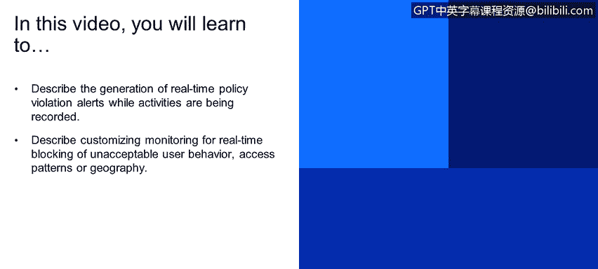
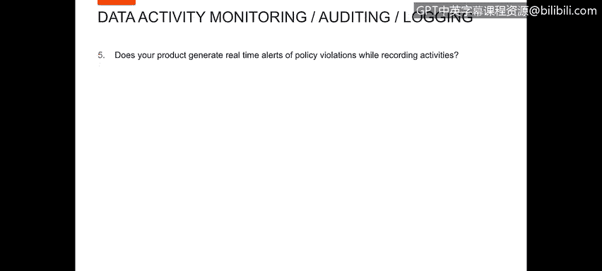
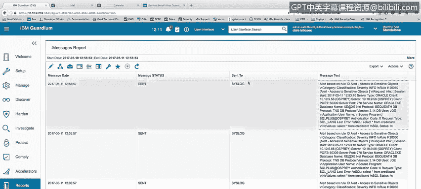
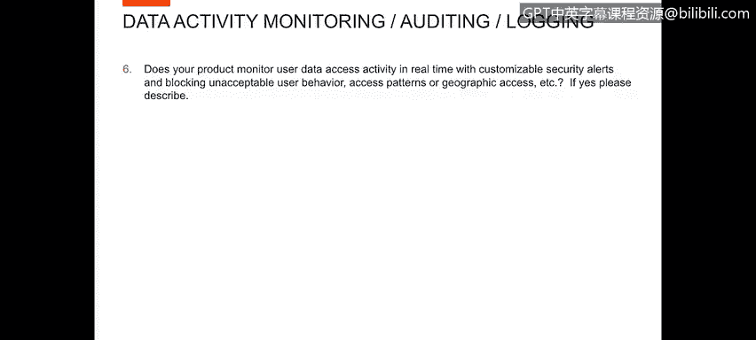
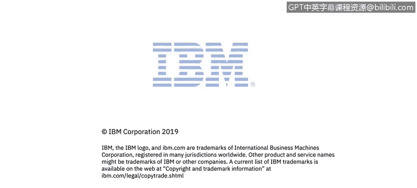

# IBM网络安全分析师专业证书课程4：《网络安全与数据库漏洞》｜network-security-database-vulnerabilities｜ - P45：44_数据警报.zh - GPT中英字幕课程资源 - BV1RN411q7PY

Yes。In this video， you will learn to。Describe the generation of real time policy violation alerts while activities are being recorded。

😊，Describe customizing monitoring for real time blocking of unacceptable user behavior。

 access patterns or geography。

Now let's look at the question， does your product generate real time alerts of policy violations while recording activities。

 demonstrate this functionality， I'll do a select star from credit card。

And in doing this， we will generate a policy alert。

If I go into my policy violation details report under my investigation screen。

 I can see that the most recent alert I did an access to sensitive objects from user Joe。

 and I did select style from credit card， so we generated an alert based upon that information。

I can also go into a report that I've created。caled Me report to show the message the alert message was actually sent out to my cis log when that activity occurred and it's alert based on real I alert access to sense of objects。

 and it was a select star from credit card。And somewhere in here， I should see the user Joe。

 so if you can see that we do generate a loop。

Next let's look at the question， does your product monitor user data access activity in real time？

Customizable security alerts and blocking unacceptable user behavior。

Access patterns or geographic access， etc， If yes， please describe the answer of course is yes。

 and to show this to you in a demonstration I' going to go into the Guardian environment and run Ka4。

So within the Guardian environment。I've got we've already showed you the alert process。

 and so now I'm going to actually go in in real time log in with the user system and perform a query that will get blocked by guarding because I'm querying with system the Social Security number data。

So you can see here that I've logged in to SQL+ with the user system and now I'm going to perform a query。

Slect。From Joeda SN。And then I'm expecting guardian to block access to this table。And indeed。

 when I run the query， I get a。In the file on communication channel。

 the user was terminated if I were to try to do some other activity here but failed。

 so the only option is to reconnect or quit。

Now let me go back into Guardium and show you in the investigation center the policy violation details。

 we'll see that we have a terminate on SSN access by system。

So when I did that， select star fromjo。ssN。Generating alert access to sensitive objects also terminated the user system and did not allow me to see any information on SSN。

Next， the question， does your product generate alerts？

We've already seen this in a couple of cases， here's the policy violation detailstail report。Also。

 again， I can show you in the。Messages report of the verse sent out， here's the alert。

Format that has been sent out on that last alert where we did a select star fromjo。ssN。

