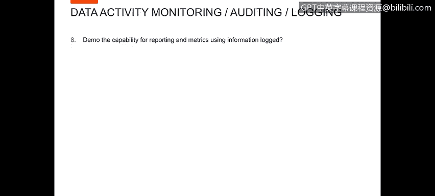
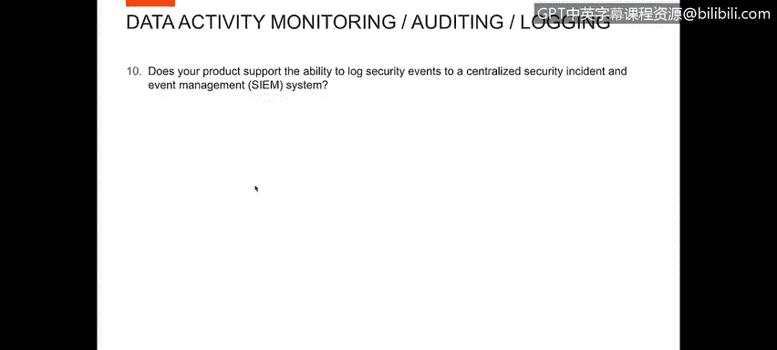
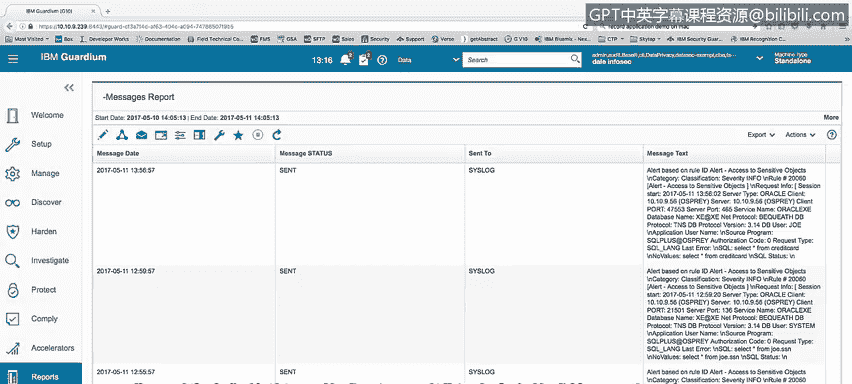
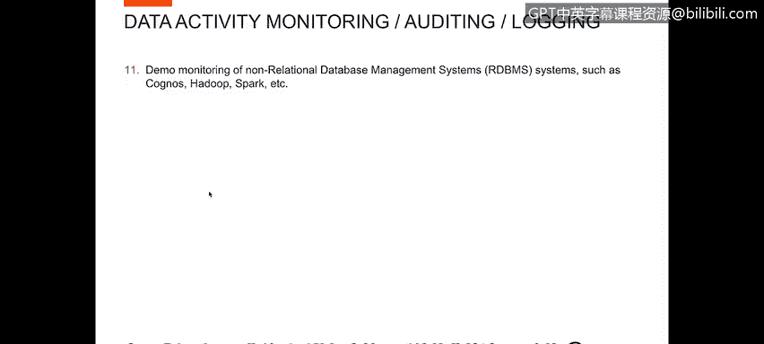

# IBM网络安全分析师专业证书课程4：《网络安全与数据库漏洞》｜network-security-database-vulnerabilities｜ - P46：45_数据活动报告.zh - GPT中英字幕课程资源 - BV1RN411q7PY

Yes。In this video， you will learn to。Describe the generation of metrics for logging and audit reporting。

Describe logging events to a centralized security incident and event management system。

Now， let's look at。Question the demo the capability for reporting and metrics using information logged。

We've already showed you several reports。 A lot of the aquaium。

Standard reports are visible through the investigation panel。Within the Guardian product。For example。

 under database activities。There are things like access to s objects， Cl activity， database servers。

DV server， throughput， et cetera， some of the metrics you can see the total accesses by different periods and so forth for different servers。

You can look at things like log real time alerts。And see a chart of those， et cetera。

 So there are a number of standard reports that are built into the product that you can。

Used through the investigation center。Identify activity that you're looking for Additionally。

 we have。A search capability of the data。 So for example。

 I can click on data in the dropdown under search search for。

你就知。And then when I run that quick search capability。

 it goes out and finds the activity that we have for user Joe。

 it shows this activity in a number of charts。Whether be activities per database and database user。

 activities per hour， et cetera， and then finally a listing of the activity。

So you can see that there's a wide variety of reporting and research capabilities provided with the Guardian product。

Now we want to look at the question， does your product create audible reports of data access and security events with customizable details that can address defined regulations or standard audit process requirements？

In order to demonstrate this， I want to show you the audit process builder。

Which is a automation of the reporting capabilities of Guardian within the audit process builder。

 you can define a user activity。You can define audit tasks。And in this case。

 I've defined a report activity report you run。You can then determine define who is supposed to see this task and what they're supposed to do it it so I've defined an action for Dale and Edmin to sign off on this audit task。

Finally， you can schedule， report or run automatically on a scheduled basis。And lastly。

 you can run the report interactively with a run once now button。Once we've run the report。

With the wrong one now button。And it's finished， we can go in and view the results of that。

 that activity， that report。Within viewing the results。

 I can see the report was run the activity report， I can see all the activity that was generated I ran this for of one day period。

And you see all the activity generated over the past day。

Look through the report and then also I can take action on that so if I was required to sign off on that report。

 I can sign the results， I can escalate it， send it down to someone else。

 ask them to sign off on it I can add comments to the report that would be。

Addtitude report unreable by any other viewer of the report。Now we want to look at the question。

 does your product support the ability to lock security events for a centralized security incident and event management system？

Of course， the answer to this is yes， sir we integrate bi directionally with few radar so that would be an excellent choice for a SIim system。

coordinate with crowduting activity， but additionally。

 we would integrate or send information to any SM environment and we send that information via entry into cis log that that SIM is going to be able to read and sending that to that remote cis log。

To demonstrate this capability， I'm going to run a query select star from credit card。

 which is going to。Generate an alert in the system I've got two。Remote cislog。

 two cislogs that I'm looking at the top one is a remote cislog on my Osprey system。

 and the bottom screen here is the cislog on my gaian collector。Once that alert gets generated。

 you'll see that it showed up in my cis log on my garden collector alert based on rule I D access to sensitive objects。

And then you'll also see that same alert got sent to my remote cis log where my SIim product。

 whether it be Q radar or any other SIim， is going to pick up that alert and。

That alert then is available for the Sim to pick up and report on。Also。

 we can go into the Guardian system， look in our messages report。

 Anything that's been sent for the cis log when we have remote ciss logging because of the remote cis logging is sent to our SIim device。

 So all of these messages that have been sent to assist cis log with remote cis log on have been sent to our Sim device and the format of the message text is variable。

 you can set the format yourself。 We have formats， for example， Q radar。

Standard format that Q radar accepts we have formats that different SIims except for example Splunk or any of the other S SM monitors that you have。

 we can set a format specifically for them you can build to custom formats， etc ce。

 so it's a very flexible interface。Interfacing， sending information to any Sim system solves your issue for sending items to a Sim。

Now I like to look at。Demo monitoring of non relational database management systems。Such as Cadgnos。

 Hadoop， Spark， etc。

To perform this demo， I would like to look at the。Various Hadoop type reporting。

Mchanisms that we have reports that we have。For example， we have a map Red report from big Ins。

 we have a HOop exception report。AHoop full message details report， HVase。

 So we monitor HVase in Hadoo HDFS file system report， Q and Bs Flax exception report。

A standard map produceuce report， which is different than the big insights map produceuce。

Unauthorized map produced jobs， another report， and then another view。He's last report。

So you can see we have a number of different different reports for Hadoop environment。

 I do not have a Hadoop。Database that I can run activity against to show you the actual activity。

 but you can see that we do have the various reports for the hood activity。Also in the。

Environment under managed。Under activity monitoring。

 I just wanted to show in our ScapAP control module。We do have。Inspection engines for。other。

Non relational databases such as Cassandverse over if we had a Cassangra database。

 you could show that activity， couchDb， which is another NosQL database you can show that Mongo Db。

ThereThere's Mongo to be another No SQL database， so we collect information from all those databases as well。

