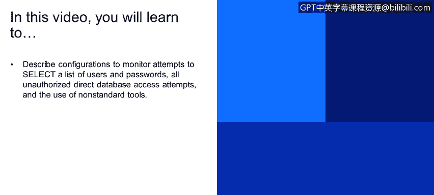
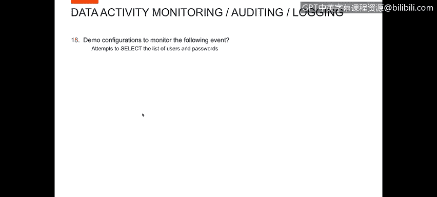
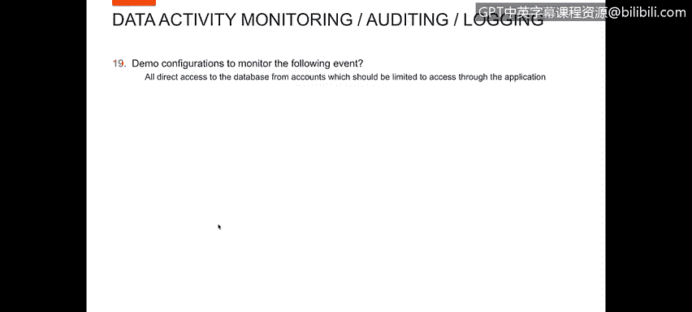
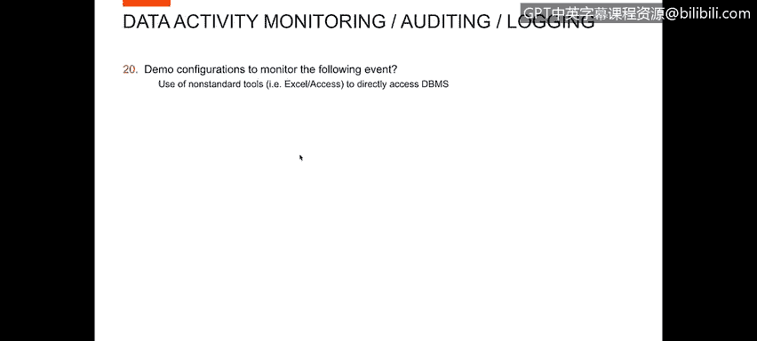
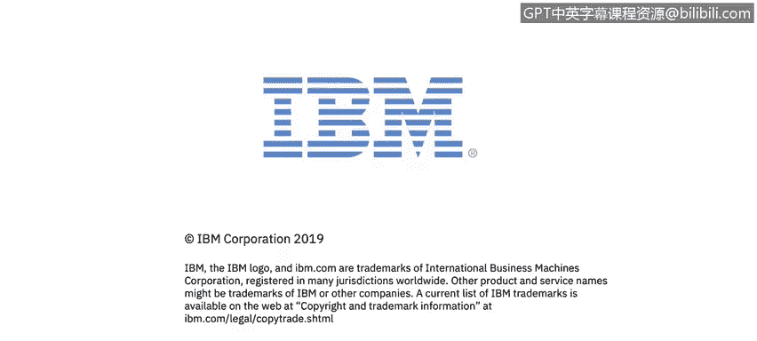

# IBM网络安全分析师专业证书课程4：《网络安全与数据库漏洞》｜network-security-database-vulnerabilities｜ - P49：48_可疑的访问事件 第1部分.zh - GPT中英字幕课程资源 - BV1RN411q7PY

Yes。In this video， you will learn to describe configurations to monitor attempts to select the list of users and passwords。

😊，All unauthorized direct database access attempts and the use of nonstand tools。

That we want to show。Attempts to select a list of users and passwords。

For this， I created a report that shows anytime to select information from users。The classrooms。

So we're selecting from DBA users。If we look down through the select here。

 we're selecting from DDA on users。Here， et。 So you can see who the user was system。

 who the OS user was。Service name we're going against and then the full sQel of what they were。

 So anytime。Something。Whether it's an application program or an individual user is selecting。Some。

User list that's going to show up on this report。

Hence， we want to show all direct access to the database from accounts which should be limited to access through the application。

For this demo， I created a report。Unauthorized use of application ID。My application ID。

For the STEM of purpose， is app user。And whenever app user runs a source program other than one in a list of authorized application source programs。

They would show up on this report， so app user logged in。

Was the OS user Oracle ran SQL+ and was often tables。Configuring， creating tables， et cetera。

 doing activity。On the database directly logged in。

 let me show you the report and how I actually set that up。So in my report。

 obviously at the top is all my columns that are on the report， my sort order。

 but on the bottom is where I set up the parameters for determining what went on the report。

 So what I said was anywhere where the database username is in a group of users that I've called my application database users。

And that activity is performed by a source program that's not in the group of application source programs。

 I want that to show up on this report。So now I'm reporting on all direct access through the database from an application account。

That's not using the application program。

And I want to look at the use of non standard tools to directly access the DBms。

In this particular case， I don't have。An Excel or access that I can access mine。Database group。

 and I'm going to show you how I would create this report。

I'm going to start with a report that I know has the type of activity。

 the columns of information that I'm interested in seeing。

When someone uses a non standard application。And what I'm going to do is I'm going to edit this report。

And I'm going to create a clone。By creating clone， I got the same report。

 but now I can call this for non standard。Nonstand application usage report。

 I'm not going to change anything that goes on the report。

 but I am going to change my conditions of the report。 So in my conditions。

 I'm going to go to the client server。And I have that as a condition。

 so I've got the source program for my condition。Now， within that condition， I'm going to say。

With a source program， that's。な。Im going use a nodding group on this。

And then the group I'm going to use is。Authorized source problem。

So anytime the sourcece program is not in a group of authorized source programs。

 I want it to show up on my report。

Can you save that report？Definition， create a report with that definition。

Once that report is created。

I'm going to add to my。Do一首。Access it。And so now。Within my reports。我听啊。

A non standard application usage report。And小点 for没上手。

This source program is not in my list of authorized applications。

