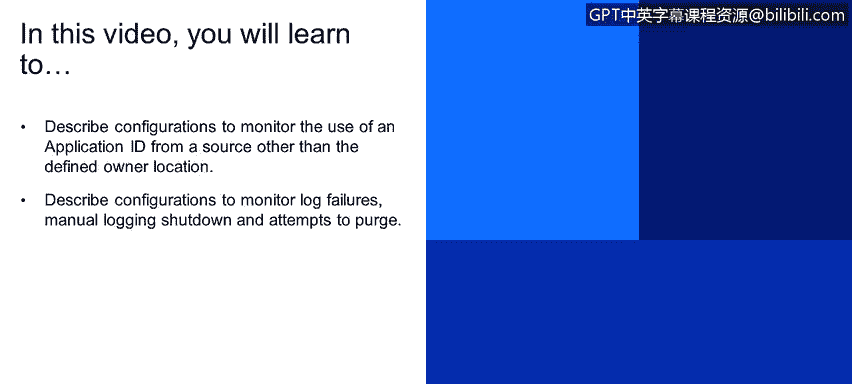
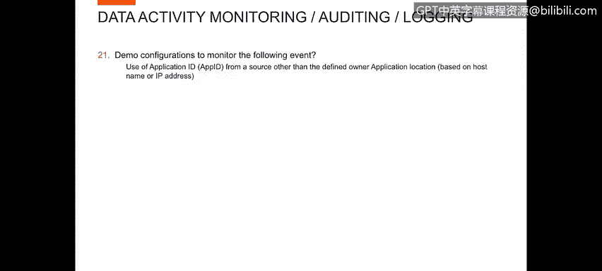

# IBM网络安全分析师专业证书课程4：《网络安全与数据库漏洞》｜network-security-database-vulnerabilities｜ - P50：49_可疑的访问事件 第2部分.zh - GPT中英字幕课程资源 - BV1RN411q7PY

Yes。In this video， you will learn to describe configurations to monitor the use of an application ID from a source other than the defined owner location。

😊，Describe configurations to monitor log failures， manual logging shutdown， and attempts to purge。

Now I want to look at the use of the application ID from a source other than defined owner application location based on host name or IP address。

To demonstrate this， I've created a report called application ID these unauthorized IPs Again。

 this report is very similar to a report that we did earlier where we showed application user not using the application source program。

So in this report， I go into the report definition。

You can see where the conditions online reports say where the client ID is not in a group of application IDs and the database user is in a group of the application user ID。

Very similar to the report that we did for the application user not using the application source program。

 we also did the same report definition， but with the different condition of not using the application IP address for its final IP。

Only I want to review or look at。The demo configurations for log failures。

 manualging shutdown and intensive courage。Essentially。

 all of the type of things that are contained within the gu self monitoring capabilities。

First， I'd like to look at。For this demo to look at the S control。诶。10。0。Within the SAP control。

 we can see the status of the various agents that are set up to monitor activity。

In this particular case， an Asian。Server 10109128 is in Red Sc he inact。

Whether their communication is broken the servers down。Whatever。

 we're not monitoring data from that survey。Then farther down， the server 1010956 is in greentch。

 we are monitoring activity from that server， we can also look at the inspection engines to see what activity were configured to monitor monitoring activity from Cassandra。

 couch Db and D2。哦。Green one informs。Mongo D B， Oracle， etc cetera。Obviously， for the。

Ds that we've been doing today we've been looking at oracle activity。

So that's one place that you can see the status of log failures。Anytime the agent is down。

 we're not able to log so that would be considered a log failure anytime the agent is up。

We are riding in。You would not have log failures， we also have。Reports。

Within the reporting the environment。Let me just go to Ri。Valium operational reports。

Showing us things that are going on with the vacuum。Environment。Bered usage monitor。

Shows us the status of percentage of CPU usage， buffer space， how much of a database we've used up。

A large number of。Tals of better。Around the buffer you to enjoy the usage of the guardian environment。

 But again， for logging what's going on with the Guardian environment。Additionally， we have。

An SAP status report very similar to the。嗯。Report that we saw。Earlier。

 but this includes last response。P host name， various components that are installed within each of the bestAP agents and which of the databases we marked。

So it gives us a status of which ones are up and monitoring。

 which one's active and which ones are inactive。Yeah。😊。

And we had real time Guardium operational reports。We have things like connection profiling list。

Where we can look at I've had to configure this report go back a little bit five I haven't run any the activity recently。

We go back and look at all the activity over the past three days and get a connection profile for every user。

So the app user logged in to orFC from 1 956。Using SQL Fl， et cetera。

 you can get all of that information。And get a crime。Fction profile for their information。

More importantly， I wanted to look at this monitoring guardian system in monitoring guardian system。

You can look at a user activity audit for， but you can see when users have lo in Guard into thebuoy that I'm in now and performed activity and you can see that user bill is log in and done in delete and you can look at record details on that。

And see exactly what delete。Took place to got a cast the the group definition。We may not fast。

So a audit trail of the activity。That are targeting using performance Now additionally， we have。我靠。

Correlation of。Inter monitoring。Some of these are。Just in definition。

 active Ss changed so we can set this up to run and it's going to look for any time S has been changed and generate an alert on that。

Data source changes sometimes someone changes the data source。A running low on disk space。

 you can alert on that。Anytime you have no traffic over the enterprise， alert alert there。

Faaiil logs to Guardian。 we can generate alerts on that， interactactive with managed units。

 So as one of our。Collectors are inactive working。Report on that。

 So there are alerts for all of the type of things that you would want to monitor to ensure that your database logging and。

He doesn't manage the mistake taking place。With that。

 we wrap up our demonstration of our data activity monitoring， Po and logging section。And。

We're ready to move on to the next segment。

