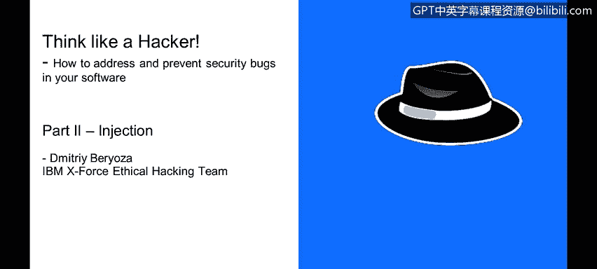
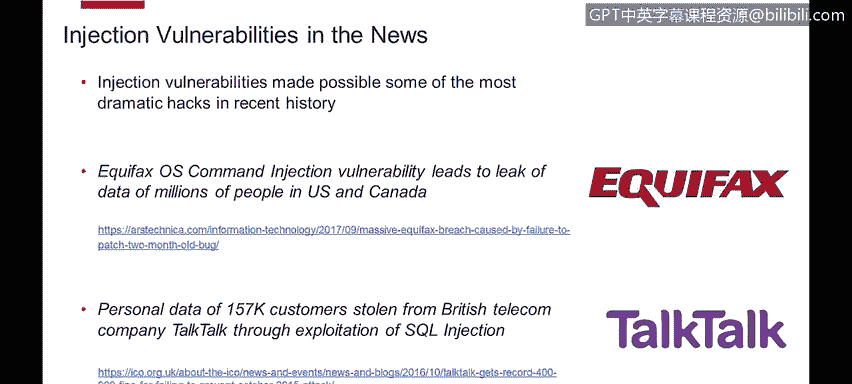

# IBM网络安全分析师专业证书课程4：《网络安全与数据库漏洞》｜network-security-database-vulnerabilities｜ - P52：51_注入缺陷简介.zh - GPT中英字幕课程资源 - BV1RN411q7PY

Yes。In this video， you will learn to describe the nature of various injection attacks and their prevalence on the threat landscape。

 My name is Dimitri Boza。 I am member of Ex Force ethical hacking team。😊。

And a little bit about what we do， we do penetration testing of security products with test products before they are released to customers and for those who don't know。

 penetration testing is the type of security testing where tester or QA person acts as an attacker as a hacker。

 so we use very same techniques and tools as the bad guys out there use to attack customers and products and that helps us find security holes and we report them to development。

And they get fixed before the products are released。And in these presentations that we do。

 we show you a lot of examples that we see in real real case scenarios out there and hopefully with the recommendations that we give。

 you would be able to both address and prevent security bugs in your software， so let's get started。

Injection flaws， if we give a definition， they usually allow attackers reallylay malicious code through the vulnerable application to another system。

 could be operating system could be a database server。

 LDap server and just pretty much any component that accepts scripting as input。

 as you can see from this chart they're fairly common。

 but what makes them special is that usually they are rated as high issues。

 top issues and they're extremely dangerous and in the worst case scenario。

 they may allow full takeover of the vulnerable system。You may be familiar with OSas。Top 10 list。

 it open web application security project and gives you a list of most common security vulnerabilities that afflict web applications and as you can see from year to year from previous version in 2013 to the current version in 2017 of the list。

 injection vulnerabilities are at the very top of the list。

 they're considered as the most dangerous type of vulnerability out there。There's also Stop 25。

 a list that you may be familiar with。Here you can see it's the same picture。

 positions one and two are taken by SQL injection and OS command injection。

 pretty much there is agreement throughout the industry that these are the most dangerous types of vulnerabilities out there。

Injection vulnerabilities we hear about them in the news constantly。

 they made possible some of the most dramatic hacks in recent history。

 the one they probably heard of last year was Equifax hack where hacks use this type of vulnerability to leak data of I think 150 million U and Canadian citizens。

 that was truly massive， probably even the fact that people on this call。

 another example is a hack of Talk talk which is a British telecom company， records of 157。

000 customers were exposed through SQL injection。And if you read through news。

 you see these types of vulnerabilities come up very often and the end result of these types of leaks are lots of customer data being leaked。

 personal user information being leaked， they're really， really dangerous。

