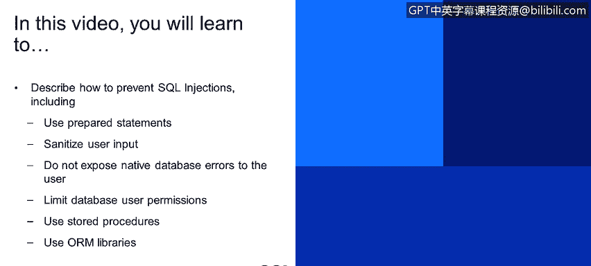

# IBM网络安全分析师专业证书课程4：《网络安全与数据库漏洞》｜network-security-database-vulnerabilities｜ - P57：56_SQL注入 第2部分.zh - GPT中英字幕课程资源 - BV1RN411q7PY

Yes。This video， you will learn to describe how to prevent SQL injections。

 including use prepared statements。Sanitize user input。

Do not expose native database errors to the user。Limit database user permissions。

Use stored procedures。 Use OM libraries。

How do we prevent it。 So the the number one recommendation for prevention is using prepared statements。

 So you can see two different patterns here。 The first one is the original one that we saw。

 and it's easy for the attacker to。Inject something that they want to。You know。

 to play with the structure of the screen， however。

 if you use prepared statements and you'll notice that parameters are now replaced with question marks。

What prepared statement is really like a compilation process， so the logic takes this screen。

 compiles it into internal representation。And now its structures sort of set in stone and no matter what parameters are passed in。

 they're not going to be interpreted as part of the query。

 they'll always be interpreted just as parameter values so nobody would be able to come in and s in another where clause or sn in a union query because once the statement is prepared it's set in stone and cannot be modified so now we by using that we've mitigated the sL injection risk。

There is something to keep in mind here， however， that we do see people sometimes using prepared statements and yet I guess not fully understanding how they work because we see a pattern at the bottom here。

 so there's a prepared statement and yet append at the end there's still something that came from the user so you're essentially you're compiling the statement。

 but you're sort of baking possible malicious input into your prepared statement so please don't do that if your prepared statement should be a constant thing it should not be controlled by any user input or at least no user input should be。

Inserted at the preparation stage。Just as with os injection and many other。Types of vulnerabilities。

 sanitize user input。 Exp all input to be malicious。 That should be your mod operaing。

And only use restrictive whitelists， not blacklists。And again。

 it's also a good idea not to maybe let the input reach the database directly and maybe use mapping tables to kind of have that extra layer of protection。

Another recommendation is to expose as little information as possible in your error reporting to the user。

 very often attackers would look for error messages because they give them all kinds of clues about what's working on the back end。

 So let's say I start you know trying testing the application and I don't know what database system it goes against and now I see this error。

 So let's say I sent a whole bunch of input I see。An error that's very helpful to me。 first of all。

 it tells me it's using My SQL， so that dramatically reduces the type of things rather than reduces and narrows down the type of things that I could try against this particular application and also it gives me hints about the query structure So I now start thinking about what was the best way to inject things in this particular case。

 So please do。Do give as little information as possible about the underlying database technology to the end user。

 detailed error messages belong in internal log files that could be reviewed by engineers。

 but the end user really shouldn't care about these types where do not make a attacker's job easy this way。

Recommen ST recommendation as for ask and injection。

 limiting database user permissions is a good idea。If I'm a high privilege user。

 I could do a lot of damage to the database， whereas if it executes。

As a low privilege user and only has access to certain tables or better yet has a read only access。

 if your business logic allows that， please try to do that。

Using store procedures is also a good idea they're also sort of kind of compiled and stored in the database engine。

 it's harder to abuse store procedures with SQL injection。

There was also a question asked about OM libraries in the previous presentation。

 object relational mapping libraries， they help mitigate SQL injection。

 they sort of create an hidden memory set of objects that kind of map to your database structure。

So it's harder for an attacker to come in with malicious syntax and modify that and an example that is a persististence API and implemented in many different products。

 one example， one popular example is hibernate， so it does help reduce the need for direct SQL composition does help reduce SQL injection。

 however， with any tool if you're not careful with what you're doing with it。

 you could still be vulnerable in RM tools there are ways to hand piece SQL statement。

Together and if you use that and use that insecurely。

 then we're back to know the original examples that we saw where an attacker can control the query that you're building and do damage So if you're using orRMs。

 please use them correctly so key takeaways use prepared statements and do it correctly sanitize user input。

Do not expose native database errors to the user or expose as little information as possible to the end user。

 please limit database user permissions and it's a good idea to use stored procedures。

