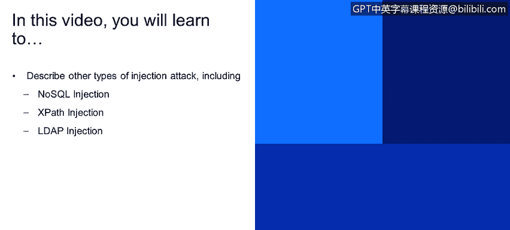
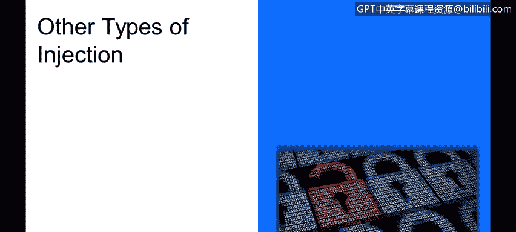
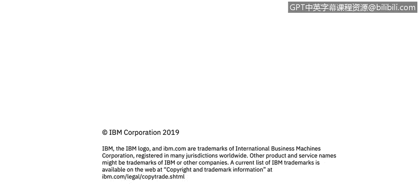

# IBM网络安全分析师专业证书课程4：《网络安全与数据库漏洞》｜network-security-database-vulnerabilities｜ - P58：57_其他类型的注入.zh - GPT中英字幕课程资源 - BV1RN411q7PY

Yes。In this video， you will learn to describe other types of injection attack， including。

No SQL injection。Expath injection。

Ldap injection。

We will have a little bit of time left。 so there are other types of injections。 unfortunately。

 it doesn't stop with Oaskiman injections and sQL injections。

 although those are the most popular ones。 A lot of applications now use no SQL technology。

And you may think that the likelihood of injection is reduced there and it is， however。

 even in No SQL databases， there are places where you have expressions or little pieces of script that can be used if you allow user input to reach that functionality unchecked。

Then injection can happen so in this particular case in Mongo Di Bea。

 there is a particular expression， this user type equals 3。

 which I've seen examples of something like this in real applications。

 you know application authors specify this type of expression as a parameter that's submitted from the UI。

But that gives meek as an attacker control over the expression and I could。

Instead of using a simple expression like this， I could inject something more dangerous。

 So at the bottom here， there's a piece of jascript。That Mongo Mongod does you know。

 interpret javascript or a variant of jascript where I could do a denial of service attack。 So here。

It doesn't loop for a very long time delaying the execution of the query。

 so the user of your application could essentially hang your application if no checks are in place。

So be careful there and do not assume that if you're using no sQL injection that you are safe。

 please review all the functionality that you're using and think about how it can be used X path。

 X path is a popular technology， X path expressions operate on XMM on XL trees。

There are sometimes examples of。AnX path using Greece to search for login credentials in an Xl document。

And if it's not done carefully， then it could expose you to injection so in this case we have a search statement looking for particular username and particular password if the input is like that。

 it is fine there is no issue， however， if a attacker can inject another pattern that you are already familiar with from SQL injection。

 they could cause this query to find any user with any password and basically log you in。

So be careful of that and sanitize your input in order to let something like this happen。LDAP。

 LDAP we use LDAP a lot in many of our products， and LDAP also has a syntax。

 so I think you can see the pattern developing pretty much anything with a syntax where you can specify an expression or a little script could be abused。

So in this particular case， we have an Ldap expression that finds a user and password。

 and Emerson says that。You know， it has to be both that user and that password in the Ld directory。

 And again， if the input is benign， it'll work just fine。 However。

 if an attacker sneaks in a malicious syntax that matches any user and plays with the expression so that。

The password doesn't really matter。 So as you can see in red here。

 then if you rely on this expression to log in your users and you don't。Look at your input。

 Do not protect it。 You could let someone log in without username and password， just by using this。

And there are other types of injection， or applications use all kinds of tempemplating engines。

 those are sometimes vulnerable and there are many other technologies and the recommendations for avoiding injection is pretty much similar across the board。

So overall， just to kind of recap。Try to use functionality with reduced scope。

use the best tool for the job， execute with least privilege。Use safe functionality。

 that prevents injection。Do not let user input reach the critical resource unchanged as much as possible。

And sanitize your input with whitelists， not blacklists。

