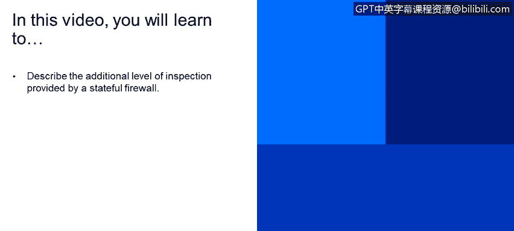

# IBM网络安全分析师专业证书课程4：《网络安全与数据库漏洞》｜network-security-database-vulnerabilities｜ - P62：3_06_stateful-inspection.en_subtitled - GPT中英字幕课程资源 - BV1RN411q7PY

Yes。In this video， you will learn to describe the additional level of inspection provided by a stateful firewall。

O， now let's talk about stateful inspection。 Basically。

 a stateful inspection means that each packet is inspected with knowledge of all the other packets that have been sent or received from the same session。

A session consists of all the packets exchanged between parties during an exchange。

 Sessions have a number of elements like the source IP address， the destination IP address。

 the source port， the destination port， and in some cases， there's an identifier for the instance。

 if， for example， your router supports virtualization。So those five things define a session。

If we see traffic coming in from the same IPp address and going to the same destination address and coming in from the same source port and going to the same destination port。

 whether TCP or UDP， the firewall will know that these are from the same session and can automatically allow or discard the packet。

 you can see in this example that a session ID has been assigned。

This means that our firewall maintains a database of the session。

And keeps track of all the packets in the session。And you can see some of the information associated with the session like the session ID and the policy name。

We can configure a time out value so the session won't remain open forever。

 You can see the incoming interface， the source IP address， the destination I address。

What V La or interface the packet is coming from。How many packets and how many bytes have been used in the session。

 if there is any network address translation， we will see that information as well。

We will also see the outgoing interface。 This output is specific to a junior per fire wall。

 So what happens if we have both a stateless and a stateful inspection。

The stateless inspection is going to be performed first。And then the stateful data will be evaluated。

 What we have here is a diagram that is specific to a juniper firewall。

This is the flow that the packet will follow。If we have an incoming packet that matches the session。

 the fire well will evaluate the screens。It will see the type of traffic。

 and it will match it against a session。 Then nett or other services that are required will be applied。

 Some of the services shown are appt， app D S， app， Q O S。AppFW and IDP。

Which are some of the more advanced security services。

 If the incoming packet doesn't match an existing session， then a different flow will be followed。

First， screens will be applied。Scrreens are basically just filters that will protect against flow or denial of service attacks。

 Then static net will be applied if that is required， then the destination net， if it is configured。

Then the routing and the policy evaluation will be conducted。

So depending on the incoming and outgoing interfaces that are defined after we know what the route should be。

The zones will be defined。And then we'll see if there is a policy that will allow or discard the traffic。

 In some cases， we might see a reverse static nat。The source net is gone after the policy evaluation。

 When you're a network administrator， this type of flow is really good to have in mind。

 Then services will be applied and the session will be built。

 So you can see when an incoming packet doesn't match an existing session。

 The path through the firewall is longer。 if the packet matches an existing session。

 its path is shorter because the firewall already knows what this packet is doing。

