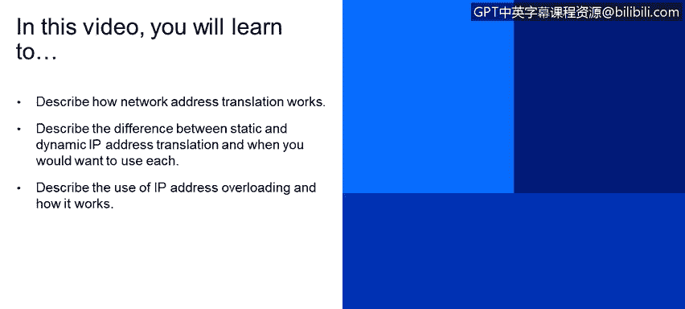

# IBM网络安全分析师专业证书课程4：《网络安全与数据库漏洞》｜network-security-database-vulnerabilities｜ - P65：6_09_network-address-translation.en_subtitled - GPT中英字幕课程资源 - BV1RN411q7PY

Yeah。In this video， you will learn to describe how network address translation works。

 describe the difference between static and dynamic IP addresses and when to use each。

And describe the use of IP address overloading and how it works。

Now， let's take a look at network address， translation or Na。

This is very common in both home and enterprise level networks。Basically。

 network address translation masquerades the real IP address。

 the IP address that's configured on a system with a different IP address for use on another network。

The most common example is when IP addresses from an internal network are translated from the private IP address that is on the computer to an external or public IP address that is routeutable across the internet。

Of course， the reverse operation is performed for traffic coming from the internet that needs to go to a computer on the internal network。

This is not always the case。 Sometimes we want to translate from a private I P address to another private I P address。

Or from a public I address to another public I address。 So in a nutshell。

 network address translation does exactly what its name implies。

Network address translation is a method of remapping the I P address space by modifying the network address information in the Internet protocol I Datagram packet headers while they're passing through a out router。

Basically， the router will read the layer 3 information。 and if there is any Nat procedure。

 it will modify the source or destination I P address。

 Nat gives us an additional layer of security by preventing the real I P addresses of the systems in our network from being exposed to the world across the Internet。

Each of an organization's computers could be represented by a different IP address outside the network than is used inside the network。

 or the entire organization could be represented by a single public I P address。

Exposing only the Ip address of the firewall publicly。

That is something that is really common in global networking。

 I P address mapping by a app can be performed in a few ways。

 Here are the most common configurations。Static map provides a simple one to one mapping between one IP address and another。

This is typically one private or internal address mapped to one public or external address。

Every time the Nazi's one address， it substitutes the other address that it mapped to and forwards it on to its destination。

Dynamicnet uses a pool of I addresses and dynamically maps one of these to the incoming packet。

 For example， an organization with 100 computers in its network。

Each with its own private or internal IP P address could share a much smaller pool of public addresses that are used only for packet that get routed outside the firewall to the Internet。

 Finally， we have what's called static net overloading。In this configuration。

 the net will map all of the internal IP addresses to a single external or public IP address。

 so hundreds or even thousands of users will have their local IP addresses converted to a single public I address when leaving their local network。

This can work because the net also assigns a unique layer4 source or destination port number to each IP address it maps。

 so it can properly differentiate between all of the local users who are now sharing the single public I address。

 This process is also known as port address translation or Pat。 Obviously。

 this means that the net must maintain a database to keep track of all the addresses and port mapping that it is assigned。

 so returning packets can be properly translated back to local I and port information so they can be properly routed once back inside the local network。

