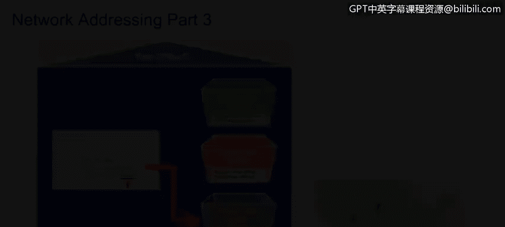
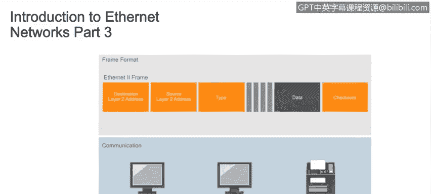
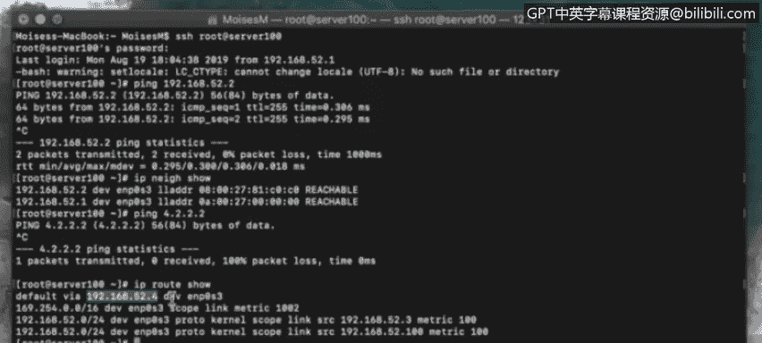

# IBM网络安全分析师专业证书课程4：《网络安全与数据库漏洞》｜network-security-database-vulnerabilities｜ - P66：7_01_an-introduction-to-local-area-networks.en_subtitled - GPT中英字幕课程资源 - BV1RN411q7PY

In this video， you will learn to describe how EtherNet networks work。

Describe the difference between the layer 2 and layer 3 addressing schemes。Greetings today。

 we're going to discuss Ethernet and local area networks。

 This lecture was developed by Moisesmong and is being presented by Ben Bririggs。

Let's talk about ethernet and land。 This lesson will be an introduction to the local area network。

 Our objectives will be to describe how the ethernet networks work。

Understand the various network devices， and differentiate between them。

Understand the difference between a collision and a broadcast domain。

Describe different ways of segmenting broadcast domains。

Understand how virtual local area networks work。Understand the different addressing schemas used in modern networks。

 The two different addressing schemas just mentioned are shown here。One on layer 2。

 the data link layer of the OS I model and the other on layer 3， the network layer。

The data link layer uses Mac addresses， while the network layer uses IP addresses。

 which could be IPV 4 or IPV6 format， the way a packet is delivered from one network to another。

 from one host to another can be compared to the way the Postal service delivers mail。

We will put a message inside of an envelope， which is similar to the way the data is encapsulated within one packet header。

 and then the header is encapsulated within another header。

 The I packet is then encapsulated on an ethernet frame at the data link layer or another type of layer2 frame if something other than ethernet is being used by the network。

 And finally， this is all encapsulated one more time with physical information added at the layer 1。

 the physical layer。 This is similar to the way we put the message we want to send inside of an envelope and writer address and the destination address on the envelope。

 including the city state， country and postal codes。

The post office puts your envelope in a shipping crate destined for the postal code and marks that code clearly on the outside of the crate。

 The post office will search for the shortest and most efficient route to get the crate from its current location to the post office designated by the destination postal code。

This is similar to how a layer 2 device， a router searches for the most efficient route for sending your message across the network or the internet。

 Once the shipping crate has been received by the destination， post office in the country。

 state and city you specified。Your envelope will be removed and driven to the street and the house or apartment number specified and placed in a mailbox。

Your friend will receive the envelope， open it， and read your message。As you can see。

 each step taken to encapsulate your message prior to it actually being sent is undone one step at a time in reverse order at the receiving end。

 The layer 2 address and layer 3 address are quite different。

Layer 2 addresses are known as media access control or Mac addresses。

Mac are also referred to as hardware addresses， physical addresses or burned in addresses because they are permanently etched into every network interface card and are unique to that card。

Of the billions of network interface cards ever produced， No two have the same Mac address。

 This is an example of a Mac address， which is a 6oct address for a total of 48 Bs。

 Every time a packet passes through a layer 3 device。

 like a router and passes from one network to another。

 The layer 2 information in the packet header is stripped out and replaced with new physical source of destination addresses。

 The layer 3 address is the I address， which is also known as theological address。

This is an example of a private IPV4 address that is not routeutable on the Internet。

Layer 3 addresses identify computers or endpoints and do not change as the packets areed with the exception of substitutions made by Nat routers。

 of course。Let's look at how local area networks work so we can better understand the connections between devices and the rules controlling their communication in order to deliver information from one host to another within the same local area network。

 we need to know the Mac address associated with the I P address of the destination device。

Let's jump on our server and take a look。Let's say we want to ping this address。 What，92 dot 1。

68 dot 52 do 2。Ping or packet Internet grer is the utility that measures the time it takes to send a packet to another computer and receive a response back。

And it's the easiest way to quickly test if there's an open communication route between your computer and another system。

 You can see that the ping was successfully delivered， and we've received a response。

 You can ping an I P address because the address resolution protocol or Ap。

Is able to make an association between the I P address we typed in and the Mac address that you can now see on the screen。

 This works fine for your communication or local area network。

But when we need to deliver a packet outside our local area network。

 the default gateway is the device that will make sure the packet is forwarded outside of the local network。

 Now， let's try to ping 4 dot 2 dot 2 dot 2。An address which is outside of our land。

But the default gateway address is not found in our a table， which is why the ping did not succeed。

 No default gateway means no packets get routed outside our local area network。

 to summarize in order to deliver a message to any computer within our land。

 whether the packet originated from a computer within the land or was routed to our land from an outside network。

 We need to know the Mac address that was associated with a destination I P address。

