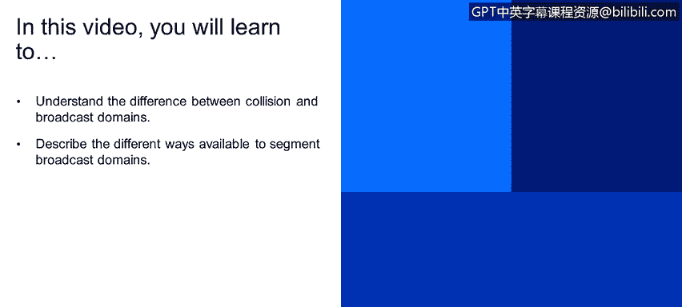
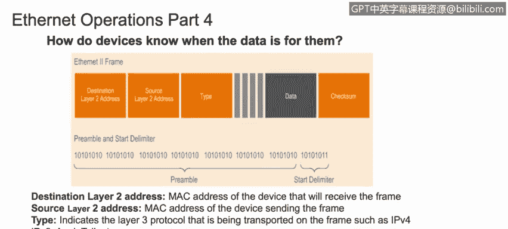
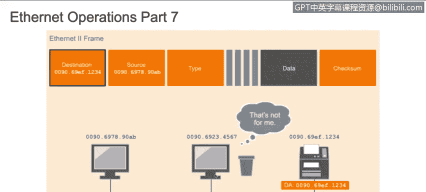
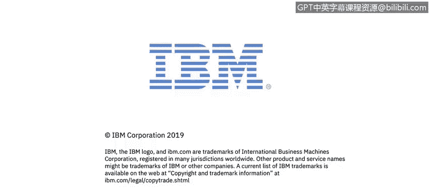

# IBM网络安全分析师专业证书课程4：《网络安全与数据库漏洞》｜network-security-database-vulnerabilities｜ - P67：8_02_ethernet-and-lan-ethernet-operations.en_subtitled - GPT中英字幕课程资源 - BV1RN411q7PY

That。In this video， you will learn to understand the difference between collision and broadcast domains。

Describe the different ways available to segment broadcast domains。

In order to connect to a local area network， we need to connect through a medium on layer1。

 the physical layer。 This could be wired using an ethernet cable， for example。

 or it could be a wireless connection。The frame or header of layer 2。

 the data link layer contains the source and destination Mac IP addresses。The protocol type。

 whether we are using IPV 4 or IPV 6， et cetera。 the data itself and the checkum。

 The checkum is a number that's calculated by an algorithm that looks at the data being transmitted after the frame is encapsulated。

 The receiving host recalculates the check sum on the received packet as a way of making sure that the packet is not changed in any way during transmission。

 If the packet is changed， It is dropped or a request is sent to transmitted again。

 depending upon the upper layer protocol being used。

All modern networks support full duplex communications。

 so computers can send and receive data at the same time。

 Some older networks did not support full duplex and only support it half duplex。

 which limits the computer to switching back and forth between sending data and receiving data to deal with half duplexing。

 The old networks used a protocol called carrier sense multiple access collision detection。

 This protocol would detect if it was O to transmit data。

 and it would detect when collisions occurred。 If there was a collision。

 It would simply wait for a random period of time and try again。

 The protocol is not needed in today's networks， since everything is full duplex。

 and we can send and receive packets simultaneously without collisions。

So how does a ni know if a packet is intended for its computer。

 The receiving computer takes the data and moves it back up the stack one layer at a time。

 layeryer 1 converts the electronic signals to digital bits and forwards the frame to layer 2。

 the data link layer。 layerer 2 checks to make sure the destination Mac address matches its own Mac address。

 And if it does， it strips off the layer 2 header and forwards the data as a packet to layer 3。

 The network layer。 layerer 3 checks to make sure the destination Ip address matches its IPp address。

 And if it does， it strips off the layer 3 header and sends the packet on up to layer 4。

 If either the destination Mac address or the destination Ip address do not match the receiving computer's Mac and I address。

 The packet will be discarded as not being intended for this system。

 Let's touch briefly on the Internet frame preamble。

The preamble is the first 8 Bs of an ethernet frame。

 The first seven Btes are just a series of alternating ones and zeros。

This is used as a buffer to separate adjacent ethernet frames。

 and it helps the network regulate the speed at which the data is sent。

The last bite of the preamble is called the start framed limititer， or S FD。

The S FD lets the receiving computer know that the preamble is over。

 and what follows is the actual frame contents。 This is an example of a Mac address。 Remember。

 this is a 48 B address divided into 6octeets。 The first threeoctetets make up the organizational unique identifier。

 This uniquely identifies the manufacturer of the Nick。

The remaining threeoctets are assigned by the manufacturer as the unique identifier for this specific card。

 combineb these two sets， and every network card ever made has unique Mac address to identify it。

 When a computer receives a frame。 the first thing it does is look at the destination address。

 If the destination address matches its own Mac address。

 It will pass it up to the next higher layer protocol。 If it does not match。 It will drop the frame。

 There are several types of communication that can go on in a network。

 Unicast is a one to one communication between only two computers。

Broadcast is when one computer sends information to all the computers on the network using the broadcast I P address。

 And then there's multicast。 This is a one to many configuration where endpoints are subscribed to a service to receive the messages sent by the one computer。

 This is useful when you want to send different messages to different groups of computers that are all on the same network。

