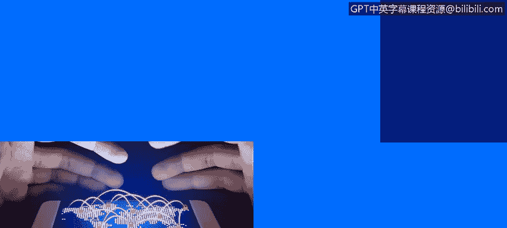
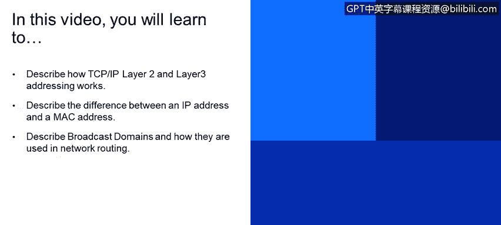
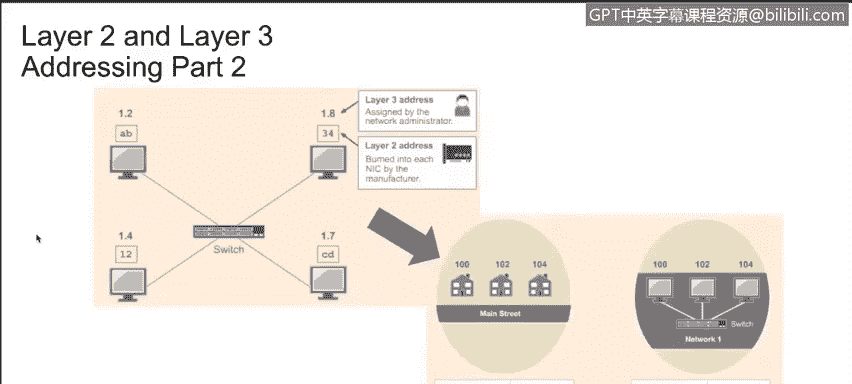
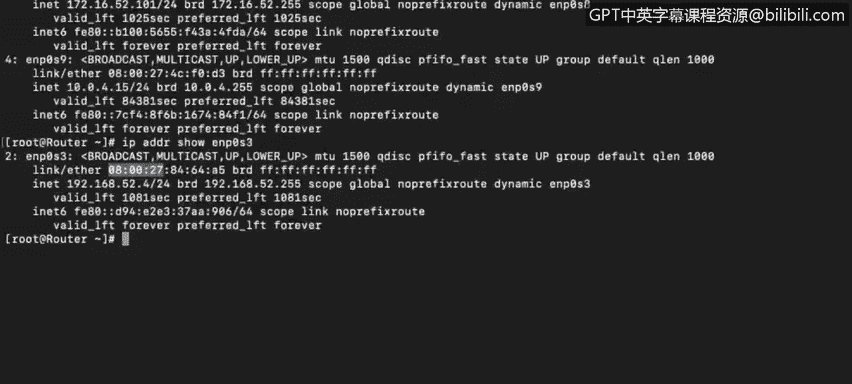
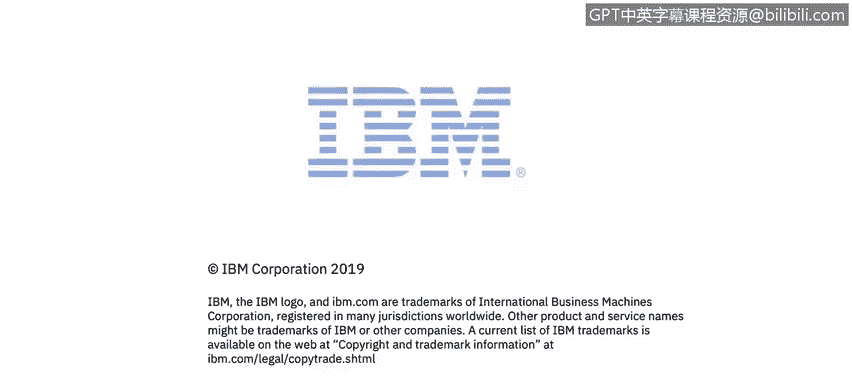

# IBM网络安全分析师专业证书课程4：《网络安全与数据库漏洞》｜network-security-database-vulnerabilities｜ - P70：11_02_layer-2-and-layer-3-network-addressing.en_subtitled - GPT中英字幕课程资源 - BV1RN411q7PY

In this video， you will learn to。Describe how TCPIP layerer2 and layer addressing works。

Describe the difference between an IP address and a Mac address。

Describe broadcasting domains and how they are used in network routing。

If you look inside your computer， you'll see a network interface of some sort。

 It may be a single chip or a whole network interface card。

 Your Nick could support a wired connection， a wireless connection， or both。

The Nick will always have a burned in address， which is also known as the Mac address or a physical address。

The Mac address is physically encoded on the card and cannot be changed。

 A student recently pointed to Mac spoofing and asked why I would say that a Mac address was burned in and could not be changed。

 Well， it's true that the Mac address is burned into a ni and cannot be changed。

 Many operating systems can be tricked or configured into representing the Mac address of their interfaces using a different address。

 This is known as Mac spoofing and can be used to bypass Mac address filtering that's set up on a firewall to protect assets by limiting access to only those machines that have been previously granted access。

 to be successful， the bad guy has to know the Mac address of a system that has access through the firewall first and then configure his system to communicate using the stolen Mac address。

The Mac is 48 Bs long for a string of 48 ones and zeros。

This address is divided into6octeets or six groups of8 bits each。

The first threeocteets are reserved to identify the manufacturer of the Nick and are called the organizationally unique identifier。

 or O U I。The last threeocteets are used by the manufacturer to identify each unique card。

With more than 300 million new devices connecting to the Internet each month。

 we might wonder if we risk running out of available Mac addresses， Well。

2 to the 48th power is about 281 trillion。 So at the current rate of consumption。

 we have just under a million months to go before we run into trouble with Mac addresses。

To see your computer's Mac address， open a terminal or command prompt window。

On Linux systems， run the IF Config command。On Windows systems， run I P config slash all。

 and the physical address is clearly listed among the many other parameters and addresses。

In this example， we'll use securecu Shell or SSH to connect to the router。I enter the password。

 and we see the information for all the interfaces。Remember。

 each individual network interface has its own address regardless of how many network interfaces are in a single device。

So looking more closely at this one， we can see the layer2 Mac address。

This is the physical address or Mac address of my system。

And this is the broadcast address that can be used to send a message to all the devices in this network segment。

Notice that the Mac address does not appear as six groups with8 ones and zeros in each group。

 but has been condensed by representing each binaryoctet by two hexadeciimmal or base 16 numbers instead to make them easier for us humans to work with。

The computer still sees the eight ones and zeros， but displays only two hex numbers for our benefit。

When a packet is sent from one computer to another。

 the packet header will contain both the layer 2 and the layer 3 address。

The packet is actually delivered to the layer 2 or Mac address。

 and the computer then verifies that the layer 3 or Ip address in the header matches its own assigned I P address。

 The system then checks to make sure the layer 2 Mac address in the packet header matches that of the system。

 And if it does， it will start processing the packet。 When we talk about broadcast domains。

 We are talking about the segment of the network that our computer is on。

Looking at the router we logged into， we can see that it has many network interfaces。

 We have the E NP 0， S 3， E NP 0 S 8 and E NP 0 S 9。

So this device is connected to three different networks。

 which means three different broadcast domains you will see what my local IP address is。

What the broadcast address is， if the packet is sent to the broadcast address。

 all the endpoints within that broadcast address will receive the packet。

 Broadcast domains can also be called virtual lands or V lands。

