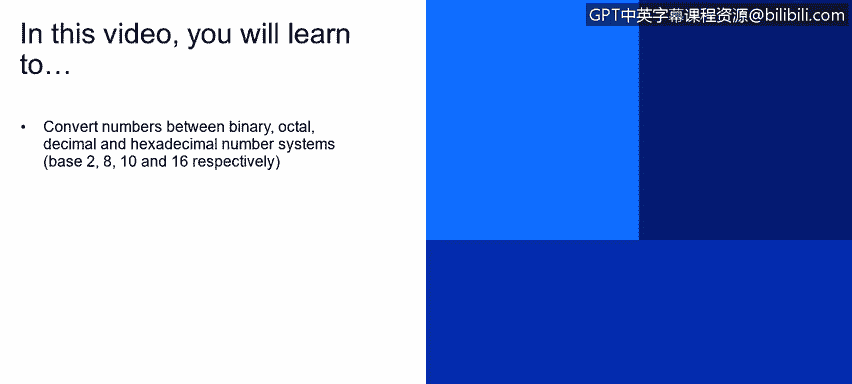

# IBM网络安全分析师专业证书课程4：《网络安全与数据库漏洞》｜network-security-database-vulnerabilities｜ - P76：17_02_ip-addressing-the-basics-of-binary.en_subtitled - GPT中英字幕课程资源 - BV1RN411q7PY

Yeah。In this video， you will learn to convert numbers between binary， octal。

 decimal and hexadecimal number systems。Base 2，8，10 and 16， respectively。

 this lesson is being presented by Ben Briggs and is based upon a lecture series developed by Moisees Mong。

 Let's talk about networking fundamentals， specifically I P addressing。

 This lesson will cover the basics of IV4 addressing and touch on IV 6。

 I'm sure you've all been exposed to base 2 or binary numbers in school。

 But I'll give you a quick overview。 since that was a long time ago for some of us。

We're used to thinking， talking and calculating in base 10 or decimal number system。

 Humans adopted the base 10 number system， most likely because we have 10 fingers and 10 toes。

 So it's easy to speculate that early counting was done on our ancestor's fingers。 Comps， however。

 only know two different states on and off。Or high voltage， low voltage or open gate closed gate。

 which we represent logically as  one or 0。 Comps can only differentiate between these two states。

 So this is how the decimal system works。We have digits for ones， tens and hundreds， thousands，100。

 et cetera。 each digit being worth 10 times as much as the preceding digit。

Each digit can hold 10 different values， ranging from 0 to 9。

 Remember that the word decimal means 10 in the binary system。 On the other hand。

 each digit or placeholder holds a different value。There are placeholders for ones， twos， fours，8s。

6s， etc。Each digit being worth two times as much as the preceding digit。In binary。

 each digit can hold only two different values， zero or 1。Remember that binary means two。

So converting from binary to decimal is easy。 Just add up all the values of the digits that contain a one and ignore those that contain zeroes。

In this example， we have an eight digit binary number， so there are eight placeholders。

So the decimal equivalent of this number would be 2 plus 8 plus 16 plus 64 plus 128 or 218。

Converting from decimal to binary is a little more awkward and it might remind you of the long division you learned in grade school。

 Of course， there are plenty of calculators and online tools that' will make these conversions for you。

 But here's how it's done。In this example， we have to convert 235 from decimal to binary。

Start by seeing what is the largest binary placeholder you can subtract from your decimal number。

 256 is too large， but you can subtract the next smaller placeholder 128。

 so put a one in the 128 place。And then subtract 128 from 235， and you're left with 107。

Check to see that you can subtract 64 from 107。 Yes you can， so add one to the 64 place。

And then subtract 64 from 127， and you're left with 43。Checking the next placeholder down。

 can we subtract 32 from 43？Yes， we can。 So we add one to the 32 placeholder and subtract it from 43。

 leaving us with 11。 Check the next placeholder down。 Can we subtract 16 from 11。No， we cannot。

 So we put a 0 in the 16 place and check the next placeholder down。 Can we subtract 8 from 11， Yes。

 we can。 So put a one in the8 placeholder and subtract 8 from 11。To leave you with three， as before。

 check the next placeholder down， can we subtract four from3？No。

 so we put a zero in the four placeholder and check the next placeholder down。

We can subtract 2 from3， So we add a one to the two placeholder and do the subtraction。 Now。

 we have one left， and the next placeholder down is the last one，1， We can subtract 1 from one。

 So we put a one in the placeholder and do the subtraction 1-1 is 0。 So we are done。

 So this will be the representation of 235 in binary。1，1，1，0，1，0，1，1。

 So that was a good introduction to converting between binary and decimal， But unfortunately。

 binary and decimal are not the only number systems you will run into when working with computers。

If you' are already comfortable with binary， ocyl， decimal and hexadeimmal systems。

 please feel free to skip the last five minutes of this video in binary base 2。

 Each digit can have two possible values，0 or1。We'll skip over base 4 since it's unlikely you'll run into that。

 But the same principles apply anyway。 Octal is base 8。 It's less common than binary。

 but you'll see it from time to time。 Otal can take on 8 possible values ranging from 0 to 7。

 decimal is base 10， and it can take on 10 possible values ranging from 0 to 9。

 Hexadeimmal called hex for short。 is base 16 and it can take on 16 possible values ranging from 0 to F After we run out of numbers。

 we start using letters。 So 10 through 15 are represented by A， B， C， D。

 E and F respectively for any number of system， not just these 4。

 The way to calculate how many different numbers can be represented by any given number of digits is simply to raise the base you're working with to the power of the number of digits available。

 Let's say we have four digits available in binary。We raise two because it's base 2。

To the fourth power。 And we get 16 different numbers that can be represented using these four digits。

Remembering that 0 counts as a possible number， that would give us a range of 0 to 1，1，1，1。

 or 0 through 15 in octal， raise the base 8 to the fourth power and get 4096 possible numbers。

 That would give us a range of 0 to 7，7，7，7。 That's 0 to 4095 in decimal。In decimal。

10 race to the fourth power is 10000， giving us a range of 0 to 9，9，9，9。 Finally， in Hex。

 our largest number would be 16 race to the fourth power or 65536 in decimal。

 That would give us a range of 0 to F， F， F， F。Or 0 to 65535 in decimal。

 It's easy to see that using a larger base makes for much more compact way of representing large numbers。

 For example，3 digits and hex F F F need 12 digits in binary， giving us 1，1，1，1，1，1，1，1，1，1，1，1。

 computer hardware and software at the machine code level is based on binary。

 So staying with a number system that's a power of2 makes it much easier to convert between these systems。

3 binary digits can translate directly into one octal digit。

 and four binary digits can be directly represented by a single hex digit in decimal。

 you see there is not this exact digit to digit conversion possible to convert from any base system to decimal。

 You can draw a table like the one we used previously。

 but substitute the right column header values for whichever base you're working with for binary。

 that would be 1，2，4，8， et cetera。 for octal， that would be 18，64，512， et cea。 for decimal。

 that would be 1，10，11000， et cetera。 And for hex， it would be 1，16，256 and 4096， et cetera。

 Notice that all of these column headers are the base raised to the power of 0，1，2，3， et cea。

 This works for any base you need to work with。 I hope this helps。

You may need to refer back to this section when covering the last video in this lesson where Hex is used for IPV6 addressing。

