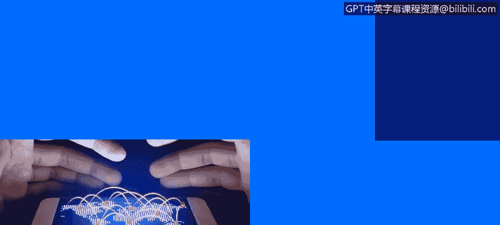
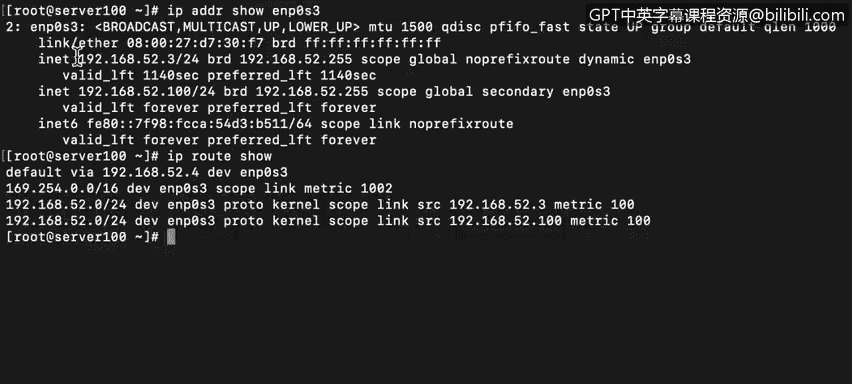
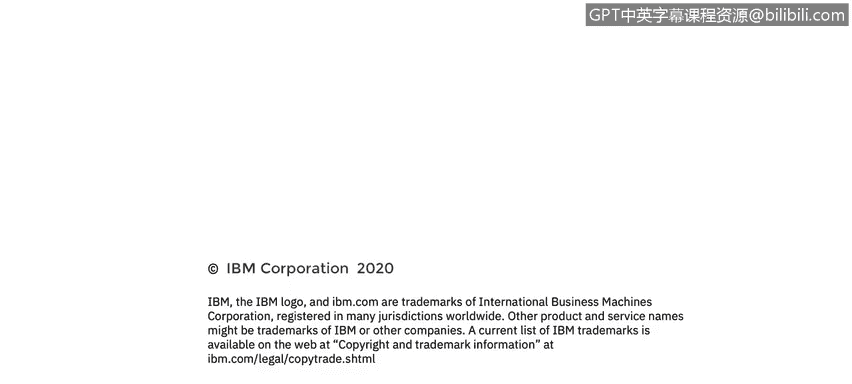

# IBM网络安全分析师专业证书课程4：《网络安全与数据库漏洞》｜network-security-database-vulnerabilities｜ - P78：19_04_ip-protocol-and-traffic-routing.en_subtitled - GPT中英字幕课程资源 - BV1RN411q7PY

Yeah。In this video， you will learn to。Describe how the IP protocol uses IP addresses to route traffic。

Describe the contents of the IP protocolcol header。

Describe how network masks work and why they are necessary。

The Internet protocol or IP protocol works with layer 3 devices which use the IP header to identify and process traffic。

 All routers inspect the destination address of each packet。

 but stateful firewall also inspect the source address so they can identify where the traffic is coming from。

 As we saw in the last video， IP addresses are represented by a quad dot notation。

 or a string of four numbers separated by dots， For example，10 dot 195 dot210 dot 10。As you can see。

 there are fourocteets or four groups of eight binary bits separated by dots。In decciimal form。

 an 8 digit binary number can take on a value from 0 to 255。

 Always a positive integer In binary form， the range is expressed as 0，0，0，0，0，0，0，0，2。1，1，1，1，1，1，1。

1。A routable protocol is a protocol that can be routed outside of the network it was originated in。

Normally this would be the internet。IP is a routable protocol， but not all I addresses are routable。

 For these reasons， it's very important that you're very comfortable with how IP addresses work。

 including the purpose of subnet masks and default gateways。

So this is an example of an IP protocol header。The version of the protocol。

 whether it's IPV 4 or IPV 6 is the first thing declared in the header。

 This makes sense if you think about it。 since the IV 4 and IPV6 headers are different。

 than the device doing the inspection would have to know how to interpret the header before it could make sense of it。

 T T L is time to live。When a packet is sent， a TTL value is set to limit the number of hops the packet can take before it's dropped。

Each time the packet is inspected by a level 3 device， the TTL is decreased by one。When it hits0。

 the router will drop the packet instead of forwarding it。

This is done to prevent packets with bad I addresses from bouncing all around the internet forever。

Leading to unmanageable congestion， this is an8 bit field。

 So we already know that it can contain values from 0 to 255。

 but the Internet Standards Committee recommends the T T L be set at 64 for most normal traffic。

 Note that T T L is measured in hops for the I P protocol。 but some protocols like DNS。

 It's measured in seconds。Another important field is the protocol。 Each protocol has an ID。

 For example， ICMP or Ping is protocolcol 1 TCP is Pro 6。

 and UDP has an I of 17 two very important fields are the source and destination IP addresses。

The source Ip address identifies the endpoint that is sending this packet， and obviously。

 the destination I address is where the packet is being sent to。 And finally。

 payload is the content of the message that's being sent。

Using wire shark to capture a few packets， first you see the frame。Then the layer2 data。

 the Mac addresses are at this level。And then there's layer 3。Which， in this case。

 is the Internet protocol version 4。This is the source IP address。

 this is the destination IP address， The protocol is ICMP。

The computer with the Ip address ending in dot 10，4 is trying to ping a computer at an address that ends in dot 1。

 So now let's talk about network masks。 The subnet mask is the assignment of bits to be used by the host a router to determine how the network and the subnet information is partitioned from the host information in the Ip address。

 You remember from the last video， the slash 24 at the end of the I address that indicated the first 24 Bs or 3octets。

Of that particular Ip address was the network portion。

 leaving the last 8 Bs or oneocte for the host address。

 The network mask is what accomplishes this division of an I address into a network in a host segment。

This complexity is necessary because different networks are configured to use different amounts of the IP address for the network and the host。

Recall the discussion of the Class A， class B， class C， and Class D network schemas。On the survey。

 you see the I address with a prefix of 24，24 means the first 24 Bs or3octeets are for the network portion。

 and the lastoctet is for the host portion。 And when we create a packet that has to go outside of our local network。

 itll be sent to the default gateway。So in this case。

 we need to communicate with a host outside of the network。

 so the packet will be sent to this address。This is the router that acts as our default gateway。

 The gateway will forward the packet on outside of our network segment。

So whenever we need to communicate with a system that's outside of our network segment。

 we only need to talk to our gateway， and it will manage the traffic going to points outside of our network or coming in from the outside。

 If we need to communicate with a host that's inside of our network。

 Any switch or hub can do that job。

But instead of sending the packet to the default gateway。

 our system will look in the Mac table to translate the IP address to a Mac address。

 so the packet will be forwarded directly to the local recipient。The broadcast IP address is。

 in a sense， the opposite of a network mask。In this case。

 the broadcast IP address will have all the Otets for the network portion of the original IP address。

With theoctets or bits for the host portion turned on are all set to one。

For this computer， the IP address is 192。168。52。3， and the broadcast address would therefore be 192。

168。52。255。

As you can see， all the bits of the host portion of the address are turned on。

