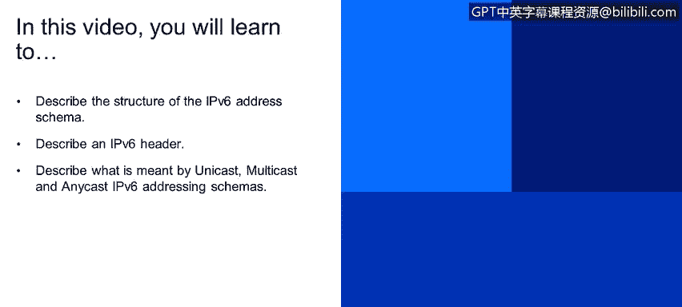
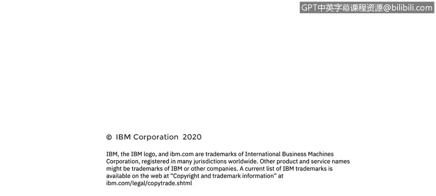

# IBM网络安全分析师专业证书课程4：《网络安全与数据库漏洞》｜network-security-database-vulnerabilities｜ - P79：20_05_introduction-to-the-ipv6-address-schema.en_subtitled - GPT中英字幕课程资源 - BV1RN411q7PY

In this video， you will learn to。Describe the structure of the IPV6 address schema。

Describe an IPV6 header。Describe what is meant by UniIcast， multicast。

 and anycast in IPV6 addressing schemes。

Let's talk about IPV6 we've covered extensively in the previous videos that IPV4 addresses were 32 Bs long。

 remember the discussions about the address being48 bitocts Since the world is running out of IP addresses using IPV4 protocol。

 the latest version of the IP protocol IPV6 extends the address length from 32 Bs to 128 bits。

 we're going to be dealing with hex numbers now so refer back to the first video in the lesson if you need a refresher。

An IPV6 address being 128 Bs long is four times longer than the 32 B IPV4 address。

 but that does not give us only  four times as many addresses in the first video in this lesson。

 we learned that  two to the 3 second power gives us just under 4。3 billion possible addresses， Well。

2 to the 128th power in decimal format is about 3。4 times 10 to the 28th power。

 which according to Wikipedia would be called 34octilian。 I'm getting a bit off topic again。

 but that's a very big number， like the number of atoms in an elephant big an IPV6 address is divided into 84 digit hexadecimal values。

 Each separated by a colon as shown here。 Each single hexademal digit can have 16 possible values。

 which makes it a four bit long binary。 So a group of4 hex numbers would be 16 Bs and there8 of these in the IPV6。

So8 times 16 brings us up to 128 bits。 There are a few rules to remember when representing an IPV6 address an IPV6 address is not case sensitive。

You don't need to specify leading zeros in the address。And you can use a double colon to represent。

Any number of consecutive zeroes。 So， for example， instead of writing0 colon 0 colon 0 colon 0 colon 0 colon 1。

We'll use Col， Col 1。Of course， to keep it interesting， there is one exception to this rule。

 You can only use the double colon replacement once in an IPV6 address。

 This is an example of an IPV4 header。 You should remember the version， time to live protocol。

 source IPp address and the destination Ip address。This is an example of an IPV6 header。

 It actually has fewer fields。 The first field， of course， is the version。

 Here is the source IP P address， But instead of being 32 Bs long， it's 1 28 Bs long。

 as is the destination address。There are three different types of addressing schemas allowed in IPV4 UniIcast。

 broadcast and multicast in UniIcast mode， one computer communicates with just one other system in broadcast mode。

 One computer communicates with all of the other systems on that same subnet。

 you may remember that the network portion of the broadcast address is the same as the network portion of every other computer on that subnet。

 but the host portion as all the bits turned on or set to one。

 This ensures that the packet will be sent to all of the endpoints on the subnet。

 Multicast is a one to many arrangement。 A group of systems can subscribe to a multicast address。

 So anything sent by that address will be received only by the systems that are subscribed to receive multicasts from that system in IPV6。

 things are a little different。 UniIcast and multicast are essentially the same but broadcast has been replaced by any cast and IPV6。

 Anycast。Addres is an address that's assigned to more than one interface。 Typ。

 the address belongs to different endpoints。 A packet that is sent to an any cast address is routed to the nearest interface that has that address。

 So that is the basics of the I protocol。 I hope this makes sense to you。

 And you can now see both the similarities and the differences between the IPV4 and IPV6 addressing。

 Thank you。

