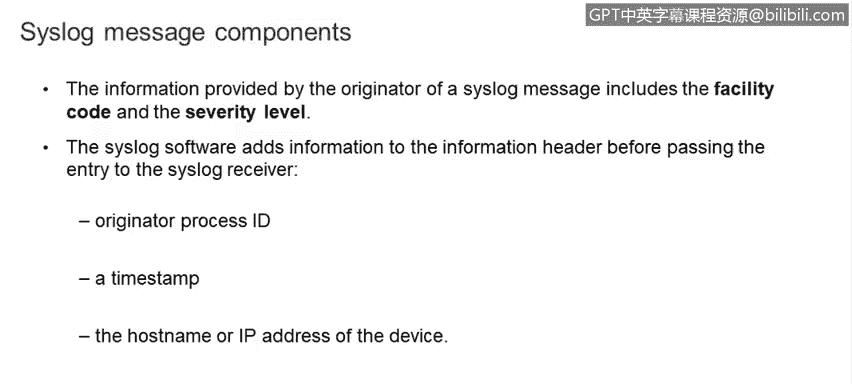
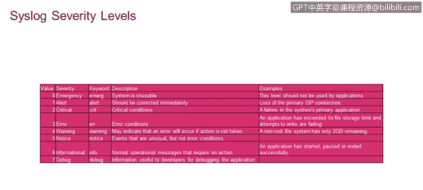

# IBM网络安全分析师专业证书课程4：《网络安全与数据库漏洞》｜network-security-database-vulnerabilities｜ - P83：24_02_syslog-message-logging-protocol.en_subtitled - GPT中英字幕课程资源 - BV1RN411q7PY

That。In this video， you will learn to describe the SsL protocol and the functions it provides。

Describe the three CisLg layers， CisLg content， CisL application， and CisLG transport。

Now， let's talk about the Sslog protocol。 Sslog is a standard protocol for messaging and logging。

 Every event on any piece of computer or network equipment generates a message that's stored in a local log file。

 Sslog is a protocol that provides a standard format and mechanism to forward all of these messages to a centralized cislog server。

 where system management and system auditing can take place。

 General information analysis for debugging and forensic investigations could also be performed using cislog data。

 Sslog has three layers。 Con， application and transport。

 Content is where the actual cislog message is contained application allows the cislog message to be routed。

 analyzed and stored and transport handles sending the cislog message across the network with cislog。

 we can talk about five different players， The originator。

 that is the entity like your local machine， where the event occurred and。

Original message was created。 The collector。 that is the cislog server that's collecting the messages。

 There may be a relay server that sits between the originator and the collector that merely forwards the messages on。

 there is the transport sender， which is usually the same as the originator。

 which prepares the message for transport using UDP， or if needed for highre using TCP。

 and finally there is the transport receiver， which is usually the same as the relay or。

 the collector， the transport receiver takes the message from the Pacific transport protocol and delivers it unwrapped to the cislog server。

 the process that originates the message always includes the process ID in the severity level。

But the Cislog client adds three pieces of information to the message header before forwarding it to the Cislog server。

The client adds the originator process I， a timest and the host name or Ip address of the device that originated the message。

 So a little more detail on facility codes。 the facility code identifies the process that originated the message。

 Cislog was originally implemented on BSD Unix， So the facility names reflect the Berkeley software distribution process names in demons。

 Cislog recognizes 23 facility codes。 If your are receiving messages from a Uniix system。

 consider using the user facility codes as your first choice。

 Note that facility codes 16 through 23 named local 0 through local 7 are not used by Unix。

 and are traditionally used by networking equipment like Cisco routers。

 which used local 6 or local 7。 The second cislog parameter to configure is the cislog severity level。

There are8 severity levels ranging from the most severe， which is severity level 0 or emergency。

 to the least severe level， which is 7 or debug computers and networking equipments can generate literally millions of log messages per minute。

 You do not want to flood your cislog server with millions and millions of routine messages that will make it difficult to analyze all of the incoming data and find actionable anomalies。

 For this reason， it's important to set the severity level on the originators so that only messages that are of that level or more severe are sent。

 For example， if you set the severity level to 3。 All messages with severity levels，0，1。

2 or3 would be sent。But no messages with severity levels of 4 through 7 would be sent。

 This is our packet capture of a cislog message。 Here is the originator。 and here is the collector。

 This could have been a relay， but in this case， it's the final collector。

 This identifies the facility and over here is a severity level。 Finally。

 the actual contents of the cisloggue message， including the time stamp。

