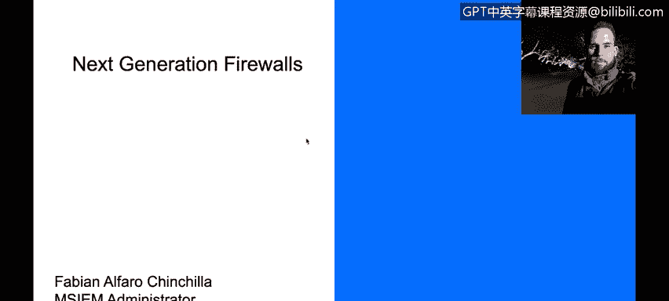
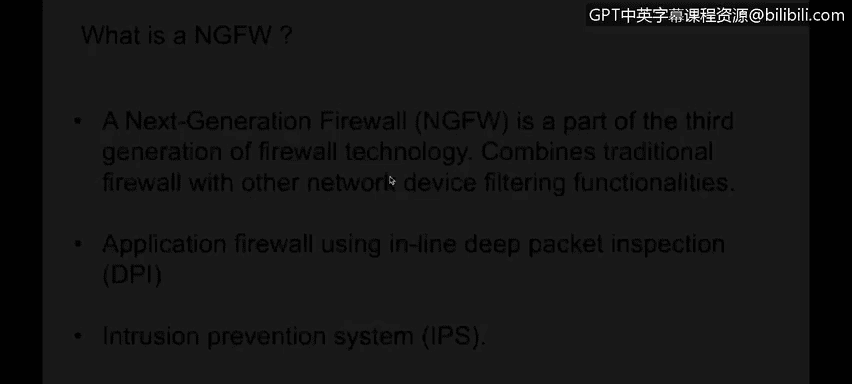

# IBM网络安全分析师专业证书课程4：《网络安全与数据库漏洞》｜network-security-database-vulnerabilities｜ - P86：27_01_next-generation-firewalls-overview.en_subtitled - GPT中英字幕课程资源 - BV1RN411q7PY

Yeah。In this video， you will learn to describe how the addition of network device filtering distinguishes a next generation firewall and GFW from a traditional firewall。

Describe how NGFWs can distinguish between business applications， non business applications。

 and attacks。Hello， welcome to this lesson。 My name is Fiano Fao。I'm part of the IVM security。

And today we're going to talk about next generation pars。

Basically a next generation firewall is part of the third generation of the firewall technology。

 we have seen how the technology has evolved from traditional firewalls to the application or deeppacking inspection firewalls that we're going to describe on this lesson。

The main difference between a traditional firewall and an next generation firewall is the word Session。

We're going to understand how sessions。Work and what is the advantage of having them。嗯。

Later on this on these lessons， next generation far decides。Performing the blocking decisions or。

Allowing or denying traffics to go through the network based on the IP address and the layer for or。

Transport layer hos。Basically， the next generation fire is able to inspect the packets further than that。

And it will inspect up to the application layer to perform the block in decisions when it's inspecting traffic also the next generation farwall is able to provide water services such as instruction prevention system or IPS。

 they are also able to inspect the traffic even if it's encrypted using SSL encryption or SSL inspection。

 for example， and we're going to describe and we're going to talk about them a little bit later in this session。

The main difference between a next generation firewall and a traditional firewall are the sessions。

 the sessions basically allow a firewall to permit。The traffic， the return in traffic。

 if it's part of a previous previously established session。 So， for example。

 if I need to connect to a what server from my PC。When the packet is going from my PC to the web server。

 the farwall will go ahead and inspect all traffic and it will determine if the traffic is allowed to go through the network or if it should be denied if the traffic is allowed to go through the network and to go through the farwall。

A session， a security session or a file session will be created and it will be started on a session table。

When the server is responding and is sending the traffic back to my computer。

 traffic if there was an a previously established session and if this traffic is part of the session that we created。

 it would be automatically allowed without needing to inspect all returning traffic。

That's the main difference between a next generation of firewall in a traditional firewall for traditional firewalls we'll have to have a brew configured to allow the traffic to flow from my PC to the server in another rule configured to permit the traffic from the server to my PC even if it's part of a previously established PCP session for example。

 so that's basically the main difference that's basically the main difference that we have between a next generation firewall in our traditional firewall。

