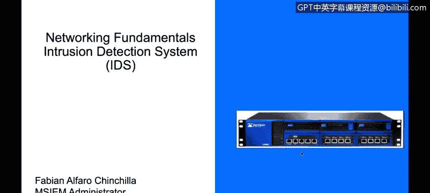
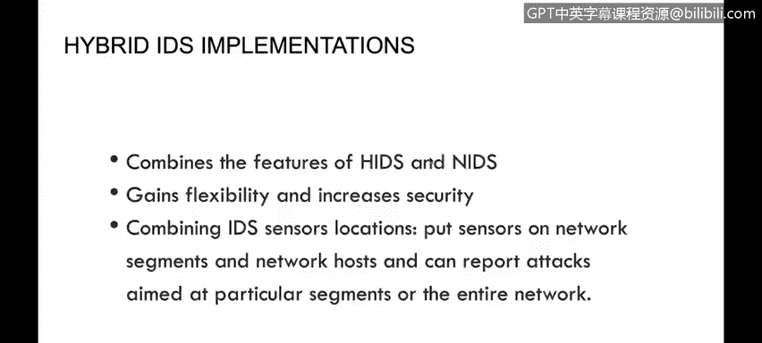
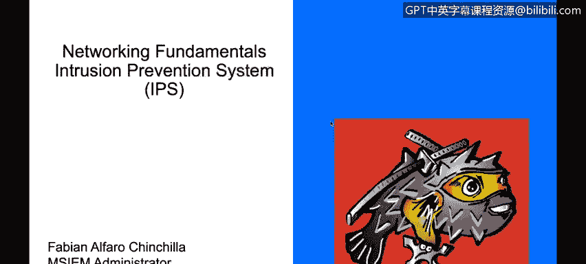
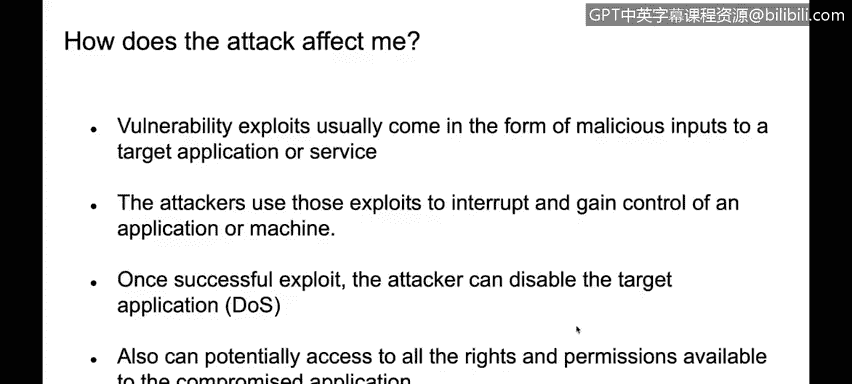

# IBM网络安全分析师专业证书课程4：《网络安全与数据库漏洞》｜network-security-database-vulnerabilities｜ - P89：30_04_intrusion-detection-and-intrusion-prevention-systems.en_subtitled - GPT中英字幕课程资源 - BV1RN411q7PY

Yes。In this video， you will learn to describe how intrusion detection systems， IDS work。

Describe what differentiates an intrusion prevention system， IPS from N IDS。

Now on the services section， we talked a little bit about ID intrusion detection prevention and right now we're going to see the difference between an intrusion detection system and an intrusion prevention system。

An nutrition detection system is basically a device that is able to analyze the content of each packet。

Up to the application layer， it basically compares the traffic。

Against threeifying database of signatures to determine network threats or viruses， for example。

 and detect those threats。The ideas or intrusion detection system is only able to detect that traffic and will send us an alert when a virus is found or something like that。

 the difference。Or we have actually two different types of ideas。

 we have signature based in anomaly based the signature base as I mentioned is able to compare the contents of the packet against set of predefined signatures and anomaly based basically monitors the network traffic it actually has a baseline of our network traffic if it sees a deviation of our baseline it will alert the administrator that something is going on or there's something anomas there so it can be inspected。

 but again it's only detecting so far the I could be host based or could be network based。

It could be installed on on a say end host， or it could be。

On the network analyzing network traffic so as an example。

 we have the IBM real secure server sensor and C ideas 4200 series。

Those are examples of Melbourne intrusion detection system。

So where are we going to have our idea system， basically the requirements for us to be able to have an ideas。

I that we need to have a pump board on the switch which is basically a port that will be used to send a copy of the traffic so for example。

 I can configure my switch to send me a copy of all traffic going through the switch like here through the interface or to the interface number two so everything that is going through the switch will be copied and sent over to port number two where my network based ID system is located。

Hybrid ideas implementation simply is a deployment where I'm able to combine a host intrusion detection system and a network based inion detection system。

 And we finally have the inion prevention system， which。

This is not only able to detect network threats it will only be able to prevent that traffic from going in so basically we have on an insertion prevention system we have an inline device I mean this device will take decisions will allow or deny traffic to go through the network it will it's not going to only detect us。

 but it's able to prevent that traffic from going through the network that's the main difference and we're going to see later on this session that basically with an IPPS we're able to not only detect traffic but we're all also able to prevent that traffic how do we do that we basically use the same detection technologies we can use signature based or anomaly base so for example in a signature based detection we inspect all traffic all the contents of the packet against a predefined database of signatures if our contents match an entry。

In our signature at database basically the IPS will be able to block that traffic。

 it won't be allowing that traffic to go through the firewall or through the IPS and in a statistical anomaly detection it's basically the same that we tued with the IbsS devices basically we are able to configure a baseline or establish a baseline and if the IPS determines that there is a deviation on that baseline it will go ahead and not only detect and report that anomaly but it can also block the traffic that is deviating from the baseline and that's basically what a next generation firewall is what t prevention system is。

In what our nutrition detection system is， thank you so much for taking the time。

