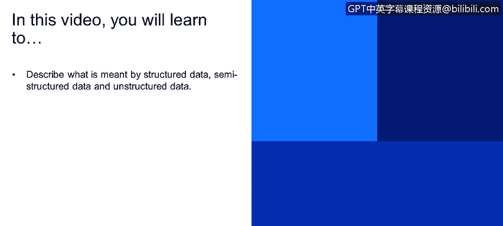

# IBM网络安全分析师专业证书课程4：《网络安全与数据库漏洞》｜network-security-database-vulnerabilities｜ - P94：35_04_data-model-types.en_subtitled - GPT中英字幕课程资源 - BV1RN411q7PY

Yes。In this video， you will learn to describe what is meant by structured data， semistructured data。

 and unstructured data。

So。Structured data， structured。Data as data has been organized into a format or repository typically a database。

 so it as elements that can made addressable for more effective processing and analysis。

Now that simply means that structured data is kind of a data repository that really has a way to organize all the different data so I can not only go to a specific piece of data that I can also search per data and the data structure and the repository makes it very easy for me to do that so I can without ever having seen it before I can understand the data structure。

 the data model of that structured data and then I can immediately go find whatever data that I need to now structure data typically has a database query language such as SQL structured query language which it would allow a database administrator or application that's connecting to the database to interact with the database it's worth mentioning that structured data contrast with unstructured and semistructured data。

The three can be considered to exist on a continuum。With unstructured data being least formatted。

And structured data being the most formatted。Another way to say that would be to say that。

They exist on a continuum， and structured data is the。

Easiest to understand and most organized and unstructured data would be the least organized and hardest to understand and find what you're looking for。

 Semistructured data。 The difference between structured data and unstructured data is unstructured data has not been organized into a format that makes it easier access and process。

 structured data is data has not been organized into a specialized repository such as a database。

 but that nevertheless is associated information such as metadata that makes it more amenable to processing than raw data。

 Strd data is basically the opposite of unstructured。

 It has been reformatted and its elements organized into a data structure so that elements can be addressed。

 organized and accessed into various combinations to make better use of the information。 However。

 structured data can turn into unstructured data。 If I was to take structured data from a bunch of different database。

And throw it into a new location。And all of those different structured data pieces of structured data from those different databases。

 if I don't take the time。To reformat it and organize it into a data structure so that I can understand what all of the different databases we're doing and how in the different commonalities such as customers。

 clients， products， etc。Then it becomes much harder for you to understand what data is in the database and to look for commonalities and really understand the data。

 Let's move on to unstructured data is information in many different forms that doesnt adhere to conventional data models and thus typically isn't a good fit for mainstream。

Relational databases。One of the most common types of unstructured data is simply text。

Unstructured text is generated and collected in a wide range of forms， including Word documents。

 email messages， text messages， PowerPoint， survey responses， transcripts。

 call center interactions post from blogs， social media sites。On or on on。

Other types of unstructured data include images， audio and video files。

Even though all of those different types of data are very different。

 they would all be classified as unstructured data。

