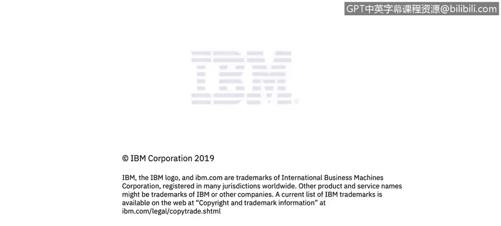

# IBM网络安全分析师专业证书课程4：《网络安全与数据库漏洞》｜network-security-database-vulnerabilities｜ - P98：39_03_structured-data-and-relational-databases.en_subtitled - GPT中英字幕课程资源 - BV1RN411q7PY

Yes。In this video， you will learn to describe a typical database access setup。

Here is an example of。How you would use a database in the wild。 So really just focus on this here。

 here is talking about a system for monitoring。So here you see a database client Joes connecting with a database client to a database to do something if he is using a database client。

 he's likely a database administrator， he's likely。Updating the database itself， the database。

 what would be called schema， the actual layout of the database。

 like maybe he's adding new customers， maybe he's adding a new product table or even new database in the database system that's typically kind of the day in day work for DBAs dramatic big shifts to data sources。

As well as just updating。Operating systems and databases themselves， new versions， and patching them。

 etc。All right， here's a on this side again。More real world example that most people would be familiar with。

 like Joe， Chris， Sarah logging into an application。

And that application really has a backend of the database that they don't really ever have to think about or even know it exists。

 for example， Gmail， backend of Gmail is a database。

 it's simply you log in and it displays all the information that's stored in the database in the background。

是不是？

