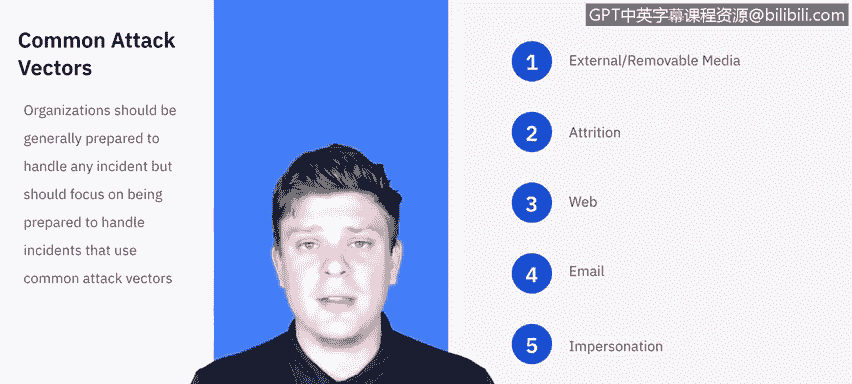

# IBM网络安全分析师专业证书课程5：《渗透测试、事件响应与取证》penetration-testing-incident-response-forensics - P10：9_什么是事件响应.zh - GPT中英字幕课程资源 - BV1Dr4y1d7EB

Welcome to What is incidentcident Rese brought to you by IBM。In this video。

 we'll be covering what an incident response is and why they're important。

We'll also be discussing the difference between an event and an incident and taking a high level look at the different phases of an incident response。

We'll wrap things up by talking about the different types of incident response teams and the different teams they need to coordinate with let's get started。

Before we can define what an incident response is， we need to distinguish between an event and an incident。

An event can be something as benign and unremarkable as typing on a keyboard or receiving an email。

A lot of times these unassuming events， though taken in context， can lead to an incident。

So for instance， a keystroke or a login or an email is not a big deal。

But if there were multiple tens， hundreds of these events within a small time frame that would cause some red flags。

 these red flags are picked up in intrusion detection systems or IS software。

That alert that they pick up can be considered an event until it's validated by the incident response team。

 at which point it becomes an incident。So now we know that an incident is an event that has become a threat。

 It's something that negatively affects the I systems and impacts the business。

 It's an unplanned interruption or reduction in quality of I services。

 So we know an event can become an incident， but not the other way around。

So now that we know the difference between an event and how it could become an incident。

 let's go ahead and define incident response。

Preventative activities based on the results of risk assessments can lower the number of incidents。

 but not all incidences can be prevented。An incident response is therefore necessary for rapidly detecting incidents。

 minimizing their loss and destruction， mitigating the weaknesses that were exploited and restoring I T services。

 So we know what an incident is。 And we know that we need to respond to these incidents。 But why。

So the benefits of having incident response is that it supports responding to incidents systematically so that appropriate actions are taken。

 it helps personnel to minimize loss or theft of information and disruption of services caused。

And ultimately， you can use the information gained in the incident handling to better prepare for any future incidents。

Let's talk a little bit about the types of incident response teams that exist。

Now there are many roles within an incident response team， but again。

 this is just a general overview。So teams can be coordinated in one of three ways。

 There's the central incident response team， which really think of it like。

A small company where all of its resources were centralized to one area。

 you would have a single instant response team for the entire organization。

Now that as opposed to a distributed incident response team。

 think of a very large company who may have its technical resources。Comp power distributed globally。

 so you might have an incident response team per geographic location or per country per site。

 depending on where the computing powers really centralize Now。

 even though they would be distributed amongst these different sites， countries locations。

It's important that they stay coordinated in their efforts because what one team finds is going to benefit another team。

 so it's still all the same same team just across a lot of different areas。Lastly。

 we have the coordinating team and this one we're not going to dive in。Really too much。

 but really you can think of it as an instant response team providing advice to other teams that they don't have any authority over。

 for example， you know， a department wide team may assist individual agencies teams。嗯。

And so that's really what we're looking at here。 we're looking at， you know。

 are these teams together supporting the entire organization。

 are the teams distributed across multiples， or we assisting you know other teams in their efforts。

 So you can think about incident response teams in that way。

 Indent response doesn't operate within a vacuum。 Each individual incident or threat may and likely will impact other areas of the organization。

Those individuals you will need to create working relationships with that way。

 in case they need to participate in the incident handling。

 you can have their cooperation beforehand as opposed to trying to seek it afterwards。

 listed here are some of the general areas that you should be seeking out to make those relationships with。

 First and foremost， management。 So management establishes the incident response policy in general and are held responsible for coordinating the incident response and report to all the various stakeholders。

 so that it should be one of the first things that you engage。Information assurance。

 so the information security staff members may need。

Maybe be needed during certain stages of incident handling if they have to alter any network security controls。

 any firewall rule sets， things like that。IT support。

Will likely be involved not only do they have the needed skills to assist。

 but usually have a better understanding of the technology they manage on a daily basis。

 This can come in handy， for instance， you know if we need to take appropriate actions with the affected system。

 like whether or not they can disconnect it or reboot or image or whatever they have to do。

The legal department， you know， legal experts should review the incident response plan policies and procedures to ensure their compliance with the law and federal guidance including the right to privacy。

 so if there was a threat or an incident that involved sensitive personal information。

 legal department will likely need to be involved there。Likewise， public affairs and media relations。

 So given the nature of the impact of the incident。

You may need to engage the media or if it got leaked out to the media。

 you need somebody to help co for that。Human resources， if an employee was involved。

 either an employee's information or if they were involved in the actual causation of an incident。

 they'll need to be engaged to help facilitate that。Business continuity planning， really。

 you can think of this like。Each business has so much going on and an incident could impact all those different areas of business。

 so you need to rope in whoever is the business continuity planning manager or whoevers in charge of the day to day operation so that they can understand how their services might be may or may not be impacted。

And finally， physical security and facilities management。

 so some incidents can occur through physical breaches of security and involve physical attacks。

So the incident response team may need to access those facilities。

 so establish relationship with those teams will be important。

While an organization may not be able to prepare for every single case scenario of a cybersecurity incident。

They should be able to handle the common vectors that attacks can come from。 So， for instance。

 you know， if there's an external removalmovable media。

 this is if a flash drive or external hard drive or Cd becomes present in the network or in the system that isn't authorized or is unfamiliar。

 we should be able to pick up on that。 if there is a nutrition attack。

 something like brute force password hacking， that's something we should be able to pick up on we should be able to detect any threats coming from the web coming from email an impersonation attack。

 So if an event happens under the guys of being from somebody else。

 and they alter the information and pass it on kind of like a man in the middle attack。

 those are that's a big deal。 also just a loss and theft of physical equipment is something that we need to have inventory of and audit regularly。

So these are the different common attack vectors。 This isn't an exhaustive list。

 but these are things that we need to be prepared to handle。

We'll be getting into all the things that you will eventually need to document for an incident response。

 That is a high level overview， we'll need to be able to answer these questions。

 These are framed more like if we had to talk to the media right now， what do we know。

 So that that's our filter。We need to know who attacked us。 Why， when did it happen。

 How did it happen， Did this process happen， Because we have poor security processes。

 How widespread is it。 What steps are we taken to determine what happens。

What happened and to prevent future occurrences？Was this？

What is the impact of the incident was any personally identifiable information exposed for the company。

 its employees or their customers， and what was the estimated cost of this？

So these are just general guidelines to fact check yourself saying。

 do we have the baseline information before we proceed。

TheLast thing I want to discuss in this video is actually what's going to launch us through the rest of this video series。

 What are the phases of an incident response。We're going to be taking you through the preparation。

 detection and analysis， containment， eradication and recovery， and then any post incident activity。

We're going to kick off the next video with preparation。Let's get started。

