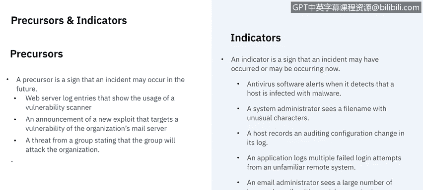
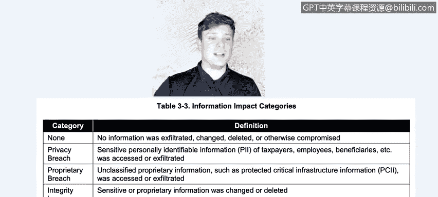

# IBM网络安全分析师专业证书课程5：《渗透测试、事件响应与取证》penetration-testing-incident-response-forensics - P12：11_事件响应检测分析.zh - GPT中英字幕课程资源 - BV1Dr4y1d7EB

Welcome to Incident Rese， detectionte and analysis brought to you by IBM。In this video。

 we're going to learn the differences between a precursor and an indicator and their common sources。

 We'll also discuss the different types of monitoring systems used for detection。

 We'll then learn about the importance of prioritization and documentation and will end with reviewing the possible communication channels needed after detection。

Let's get started。The first thing we need to break down in detection is really the precursors and the indicators。

 so a precursor is a sign that an incident may occur in the future。

 so you get a heads up as to something that's going to happen or as an indicator is a sign that something may have already occurred or is occurring now。

 it's something you notice in the present and say wow， something's either happening or has happened。

Examples of a precursor could be web server log entries that show the usage of a vulnerability scanner。

 so you say， hey， somebody's using a vulnerability scanner against us， something's going to happen。

 there could be an announcement of a new exploit that targets a vulnerability of an organization's mail server or it could be as bold as a threat from a group stating that said group will attack the organization。

Now， precursors are much， much less common as much as we would love a heads up for every time。

 you know， an incident was going to happen。Most things are actual indicators that we notice。

 things like antivirus software alerts when it detects that a host is infected with malware。

 a system administrator sees a file name with unusual characters。

 a host records and auditing configuration change in its log。

 an application logs multiple failed login attempts from an unfamiliar remote system。

 clearly somebody's trying to get in， an email administrator sees a large number of bounced emails with suspicious content。

 even a network administrator noticing an unusual deviation from typical network traffic flows。

So this is the difference between precursor and an indicator。

 something that is going to happen versus something is or has already happened。

Now let's take a second to go over some common sources， I know I provided you some examples。

 but let's go over common sources of a precursor in an indicator。

Sources can range anywhere from alerts， logs， publicly available information and people。

 things like alerts from intrusion detection or prevention software。

 the security information event management， software， antivirus， anti spam software， file。

 integrity checking software， thirdpart monitoring services。

 and we'll be going into different monitoring types of monitoring software in just a little bit。

 but know that they're a major source of our indicators。The logs。

 they can be from the operating system， service and application logs。

 network device logs or the network flow。🤢，Publicly available information。

 this is things that we find on news or maybe the National vulnerability database for people。

 I mean this could be people inside the organization saying hey， something's happening。

 I've noticed something that's happening and it's our due diligence to check in that it could be from other organizations for example it could be coming from support。

 it could be coming from you know maybe somebody's webage is being attacked and we have to you know deal with that。

So these are all different sources of precursors and indicators that come through。 Now I mentioned。

 you know， some of the alerts come from。Intrusion detection and prevention software and monitoring。

 I want to kind of break down the differences between the different types of monitoring softwares。

There are quite a few different types of monitoring systems and each of them are crucial for early detection。

Now， all of these aren't mutually exclusive， and they all do still require an incident response team to document and analyze the data。

So the first type of monitoring software going to be IS and IPS software。

 So that's intrusion detectioning。So that's intrusion detection systems and intrusion prevention systems。

 So both are part of the network infrastructure。 The main difference between them is that IDS is a monitoring system that just gathers the information whereas IPS is a control system so it will actively filter out any packets that are that don't。

Comply with the security policy。 So one just monitors and the other one actually performs action for preventing threats from happening。

Now DLP， the data loss prevention is a set of tools and processes used to ensure that sensitive data is not lost。

 misused or accessed by unauthorized users， especially you know。

 this really helps when data is being stored， moved。Actively accessed things like that。

All of this detection is around data。Now the security Information event management solution combines security event management。

 which carries out the analysis of event and La data in real time with security information management。

 so it's kind of a holistic view that deals with the log files directly to create an event or an alert of some sort。

So this again， is not all of the systems out there。

 These are just the broad categories that incident response teams can use。

 The next thing that we're going to be talking about is hugely。

 hugely important both in incident response and many other areas of cybersecurity。

 which is documentation Now， regardless of the monitoring system that you're using a thoroughly documented ticket is going to help not only the current event and incident but all future ones that may occur。

 So common things that we are going to need to capture。AndThe current status of the incident。

Did it already happen， Is it ongoing， Is it something that we know is going to happen。

 Give me a summary what's happening， how did it happened， What do we know so far。

 Any indicators related to the incident， how do we find out about it， what tipped us off。

Other incidents related to this incident， so was this isolated， was this in a series of incidents。

 things like that？Actions taken by all incident handlers on this。 So a big。

 basically an audit log of everybody who has touched it up to this point and then up into like a chain of custody。

 if possible。 So chain of custody is。A thoroughly， thoroughly documented。

Almost like keeping minutes of who's touched this for how long who's on it now so that since the incident actually happened。

 you can record who's been touching it'。Has eyes on it， things like that。

You'll need to know the impact assessment related to the incident and we're going to be talking about。

 you know prioritizing impacts here in a minute， but you'll need to document like is this a big deal or not。

 we'll need to know the contact information for any involved parties will need a list of evidence gathered during the incident investigation will need comments from all the incident handlers then obviously next steps to be taken。

Now before we can take proper next steps， we need to be able to prioritize what the impacts are and so let's talk about what some of those are so the first category of impacts is going to be the functional impacts of the incident now this is taken directly from the National Institute of Security and Technology。

So when we look at these， we see there could be no impact right so if there's no effects to the organization's ability to provide services to all of its users。

There's the low impact， so there's just a minimal effect。

 organization can still provide all critical services to some users。

 but has lost efficiency is just not as good。 The medium impact is。

 it's lost some service to a subset of users。And a high impact is we have completely lost the ability to provide any services to any users。

 so we go from none all the way to high for dysfunctional impact。

The next area of impact is going to be on the information。

 so if there's no impact for the information， none was exfiltrated， changed。

 deleted or otherwise compromised。 if there was a privacy breach， sensitive。

 personally identifiable information， PI of taxpayers， employees， beneficiaries， etc cetera。

Was access and exfiltrated？A proprietary breach is unclassified proprietary information such as protected critical infrastructure information that was accessed or infiltrated。

 and then there's the integrity loss so sensitive or proprietary information was changed or deleted。

 so this isn't necessarily a scale of like non to high。

 but these are the different types of categories of informational impact that can exist。

The last category of impacts is going to be the ability to recover from。

 So if this is just a regular recoverability effort。

 it's you know the time to recover is predictable with our existing resources saying yes。

 it'll take this long with this many people we got it covered supplemented。

 so time to recover is predictable， but we're going to need some more help to get this done。

 Exended is the time to recover is onprepredic we're not sure how long it's going to take to resolve this issue and we are going to need outside people to help。

And then there's just the non recoverables， so recover from this is not possible。

 so think of sensitive data was exfiltrated and posted publicly。

 and we need to launch an investigation。

Now that we've thoroughly documented the incident and determined what the impact is going to be on the organization。

 we need to alert everybody that is or could be involved。

 So this is includes but not limited to the chief information officer。

 local and head of information security， other incident response teams within the organization if there are different sites or countries。

 external incident response teams if appropriate， who's the system owner， do I need to involve HR。

 public affairs if this gets out in the media， legal department and law enforcement。

 even if possible。So a big part of incident response team is the coordination that happens and we talked in the first video of being able to establish those relationships with other teams within the organization and outside。

 and this is why， because now that we know the severity of the situation。

 we can alert all parties involved or that need to be involved to get the ball rolling on a resolution。

And that wraps up detection and analysis。 In our next video， we're going to begin containment。

 eradication and recovery。 See there。

