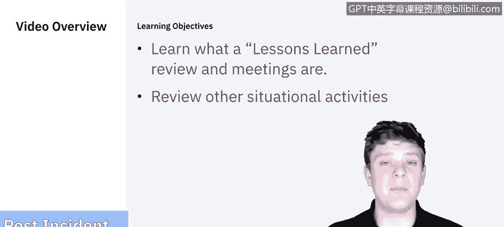
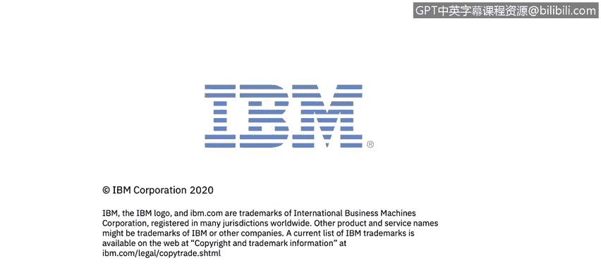

# IBM网络安全分析师专业证书课程5：《渗透测试、事件响应与取证》penetration-testing-incident-response-forensics - P14：13_事件后活动.zh - GPT中英字幕课程资源 - BV1Dr4y1d7EB

Welcome to Incident Response post incident activities brought to you by IBM。In this video。

 we'll be covering the post incident activities。 For the most part。

 this includes the lesson learned review and meetings。

 There will be some other situational activities that we'll cover as well。 Let's get started。

 The National Institute of Standards and Technology says that holding a lessons learned meeting with all involved parties after a major incident。

😊。

And optionally periodically after a lesser incidences as resources permit can be extremely helpful in improving security measures and the incident handling process itself。

Lessons learned ultimately is a retrospective that takes a look at what could have been done better to iterate on in the future。

Some of the hard hitting questions that you need to ask are exactly what happened at what times？

How well did staff and management perform in dealing with the incident。

 Were the documented procedures followed， Were they adequate， So if they were followed。

 were there still gaps where we need to address that in the documentation。

What information was needed sooner。 So as we were going through either containment。

 eradication or recovery， if we would have had some information sooner。

 could we have expedited the process or any steps or actions taken that might have inhibited the recovery。

What would the staff and management do differently the next time a similar incident occurs。

 So it's one thing to not be prepared or to feel like you could have done better with an incident。

 But if the same incident occurs again。There should be marked improvement on that。

How could information sharing with other organizations have been improved。

 so whether people you couldn't get a hold of or needed to collaborate with that could have been handled more efficiently。

 effectively， or in a more timely manner， what corrective actions can prevent similar incidents in the future。

 and what precursors or indicators could be watched for in the future to detect similar events？Now。

 these are just general questions that we can ask， but you'll need to ask specific questions。

 given the major incident or if there were trending issues across a bunch of smaller incidences。

 here's where you would flush that out。 Again， a key here is also documentation。

 taking anything that you find or discover and looping it back into the documentation so that the next time this occurs。

 we can all be ready。

Outside of lessons learned， there are a few different activities that can take place based on the situation。

 A pretty universal one is utilizing the data that you've collected。

So there are a lot of different things you can collect data on。

 everything from your response times to the data that was impacted to how long it took to resolution。

 how long it took to recover， every single step that you take can be measured。And in this。

 you need to decide which metric points are going to be most valuable for your organization and take a look at those to see the trends over time given similar incidences。

Another thing worth mentioning is evidence retention。

 so in all the information that you've gathered and all the forensics that you ran。

 these will need to be stored， archived and taken care of in a way that they could be used in the Court of law at any given time we talked a bit about using the chain of custody to make sure that everything is properly documented on when and how the evidence is being handled。

 but evidence retention does need to be in the plan。

This is also a great time to revisit your documentation throughout the entire process this goes everything from the incident response policy that you have drafted and put together。

 your incident handling documentation， your ticketing， your chain of custody。

 all of it is documentation throughout the entire process if there are any gaps identified now would be the time to address them。

