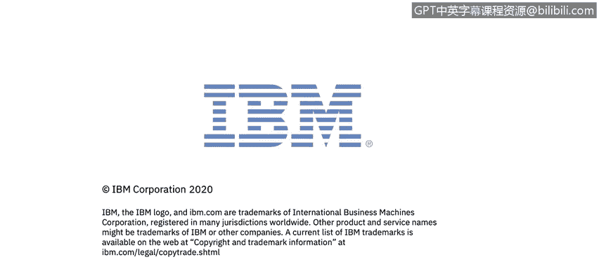

# IBM网络安全分析师专业证书课程5：《渗透测试、事件响应与取证》penetration-testing-incident-response-forensics - P18：17_模块概述.zh - GPT中英字幕课程资源 - BV1Dr4y1d7EB

Welcome to Penetration testing， Incident Resse and forensics brought to you by IBM in this series we're focusing on forensics。

In this video series， we'll be diving into what forensics are。

 we'll learn about the forensic process， chain of custody。

 and learn about using the data that we collected in data files， operating systems。

 applications and network traffic。Let's get started。

