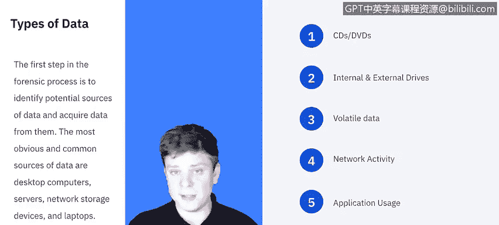

# IBM网络安全分析师专业证书课程5：《渗透测试、事件响应与取证》penetration-testing-incident-response-forensics - P19：18_什么是取证.zh - GPT中英字幕课程资源 - BV1Dr4y1d7EB

Welcome to what is Forensics brought to you by IBM。In this video。

 we'll be covering what is digital forensics。We'll dive into what types of data that forensics deal with。

And then we'll focus on the objectives and need for digital forensics in the cybersecurity industry。

Willll wrap up with reviewing the steps to the forensic process。

Let's get started。As always， we're going to start off with a definition of digital forensics。

 so digital forensics also known as computer and network forensics， have many definitions。

 but generally speaking it is considered to be the application of science to the identification。

 collection， examination and analysis of data while preserving the integrity of the information and maintaining a strict chain of custody for set data。

Throughout this entire series， we'll be talking about data a lot。

 so I think it's important we take a second to define what data really is。

The first step in the forensic process， which we will cover in much greater detail。

 is to identify potential sources of data and acquire data from them。

 the most obvious and common sources of data are desktop computers， servers。

 network storage devices and laptops。Now， in these。

You're going to find in the environment of wherever you're conducting your forensic analysis。

Inside the computers or servers， you might find Cs or DVDs， internal and external drives。

 these could be solid state drives， spinning disk drives through external。They could be flash drives。

 external hard drives， things like that。There's volatile data。

 which means data that only exists in this snapshot of time。

 so if we were to disconnect from the internet or restart the computer or close an application or pro and authentication。

 we change the state of what's on the computer， so volatile data means it's very time sensitive and we have to capture it now because we might not always have access to it。

Network activity， you can get that from the Internet service provider with a court order。

 you can look at logs to see what network activity existed。

 you can get data from that application usage applications often store previous sessions or safe projects or things like that So they contain just they're rich with data but then portable digital devices So this is just in the environment in the physical space are their cell phones are their audio recorders are there security cameras are there digital cameras there are so many things that can contain data that we need to be aware that it might not all be digital or it might not all be just on the computer we have to be aware of the surroundings as well So all of this is the world of data and so I know it's a very broad term in future videos will actually be breaking down how we use data from each of these sources but for now no this is what we mean when we say data。

According to the National Institute of Standards and Technology。

 the most popular use case for Forensics goes in criminal investigations and incident response。

 Anytime you look up any literature about forensics。

 it's usually closely tied to one of those two things。 However。

 the practice and techniques of forensics can actually be applied to many areas。

 Some of those include operational troubleshooting， log monitoring， data recovery， for data recovery。

 there are many tools that can recover data from loss systems。

Whether the data was lost intentionally or not， data acquisition， so sometimes the data is not lost。

 you know where it is， you just need to get to it， you know in the case of maybe workstations that were retired or being redistributed。

 maybe the employee left the company and wiped the computer and you need data back from it or just need access to it。

Things like due diligence， regulatory compliance， so existing and emerging regulations require many organizations to protect sensitive information and maintain certain records for audit purposes。

So regardless of this situation， there's going to be many applications for forensics。

Let's dive into what the objectives of forensics are and then break down those steps。

 When I asked IBM resident system information and event manager Raoul what the objectives of digital forensics were。

 This is what he had to say。

Any。Investigation in agency or any department of a company or police investigator will need a method to take away that the required information from the digital device in a documented matter。

 otherwise it will get destroyed by any good lawyer。

 so one of the main objectives is to document both the process to take the evidence and the evidence itself also our next objective would be to postulate what was the motive time if it was a crime or if it was an accident。

 both identify and postulate the motive of forensics also design this procedure to help everyone involved to be able to protect the evidence and protect the procedure。

 there is any step on the procedure to take away the evidence。

That is known the investigator or the forensics agent to be accused of evidence damppering。

 So that acquisition and duplication， depending on the countermeasure set on the computer。

 if it's a computer in a criminal case might be protected。So we need to be able to。

Warrant that this procedure will be。Completely secure。

 and the data will not be changed while we are copying it。

 So another objective will be to identify what is the necessary evidence as quick as possible processes are time sensitive。

 and you need to be able to determine where to search for evidence。 Our next objective。

 We have to write reports in a timely and very clearly manner。For anyone to be able to understand it。

We cannot not write reports that will be only understood by engineers and the last one。

 but it is superseded by a couple of objectives up and away would be to preserve the evidence I documented a chain of command of custody。

 sorry serving the chain of custody。NISist breaks down the four steps of the forensic process into collection。

 examination， analysis and reporting。We'll be breaking these down further in the next videos。

 but for now as an overview， the collection is being able to identify， label， record。

 and acquire data from all the possible sources while preserving the integrity of the data。

Examination will be the processing large amounts of the collected data to assess and extract data of particular interest。

An analysis， analyzing the results of the examination。

 using legally justifiable methods and techniques， and then finally reporting on the results of the analysis。

In the next video， we're going to work on collection and examination。We'll see you there。

