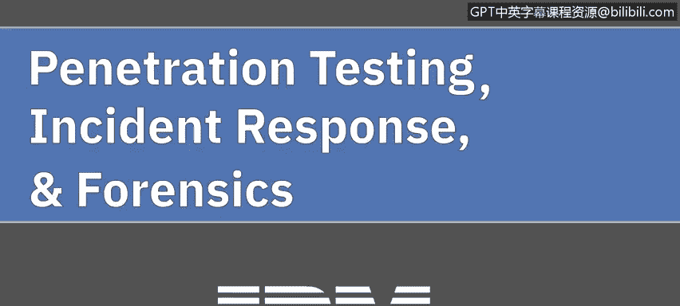

# IBM网络安全分析师专业证书课程5：《渗透测试、事件响应与取证》penetration-testing-incident-response-forensics - P1：0_渗透测试简介.zh - GPT中英字幕课程资源 - BV1Dr4y1d7EB

Welcome to penetration testing， incidentcident response and forensics brought to you by IBM。

We'll begin this course addressing penetration testing。 In this course。

 we'll discuss what penetration testing is。 We'll break down the different phases of a penetration attack。

 such as the planning， discovery， the attack itself， and the reporting。

We'll move on to discuss the different tools used when conducting a penetration test and we'll finish with the discussion on the ethical and legal ramifications of conducting a penetration test。

