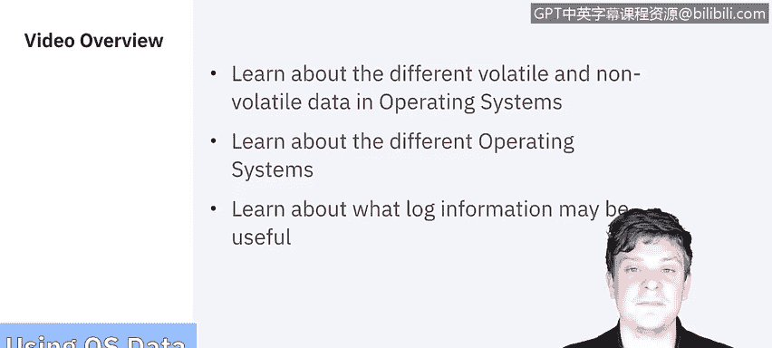

# IBM网络安全分析师专业证书课程5：《渗透测试、事件响应与取证》penetration-testing-incident-response-forensics - P23：22_操作系统数据.zh - GPT中英字幕课程资源 - BV1Dr4y1d7EB

Welcome to usinging data Operaing Systems brought to you by IBM。In this video。

 we'll learn about the different volatile and non volatile data in operating systems。

We'll learn about the different operating systems that exist today and learn about what log information may be useful to forensic analysis。

Let's get started。The National Institute of Standards and Technology explains that operating system data exists in both nonvolat and volatile states。

 Novol data refers to data that persists even after a computer is powered down。

 such as a file system stored on a hard drive。Volaatile data refers to data on a live system that is lost after a computer is powered down。

 such as current network connections to and from the system。

Some examples of volatile data are Slackspace， free space， network configuration connections。

 any running processes， any files that are opened at the time。

 the login sessions and the operating system time， all of these depend on being in the current session of the live system。

Examples of nonvol data would be the configuration files， any logs， application files， data files。

 swap and dumb files， any hibernation files or TM files that exist on the system these will be there regardless if the system is rebooted or not。

We always want to start with collecting the volatile data because we don't know how much longer we'll have access to it。

To my right， we have listed here a prioritized list of the things we should be grabbing for most important to I'll get it when I can The first thing is going to be all the network connections。

 so this will change if a computer changes power states and you might not get that information back。

Most operating systems， Windows Linux， and Mac OS and all variations of will have ways to list what network connections they have on there。

Login sessions， contents of memory， any open and running processes and open files。

 which should be pretty easy to get， though some third party applications。

 some forensic tools do make it easier to capture that whole process。

The network configuration itself and then what the operating system time is going to be now in this particular video we're not going over all the tools themselves。

 but we will be reviewing them before the final quiz。Let's move on to non volatile data。

For collecting nonvolat data， one of the things that we have an option for is shutting down the computer if needed。

 the things you have to consider are what your options are。

 normally it really boils down to two different methods。

 one is a natural shutdown usually with a power button or a command within the operating system。

The other is in the case of portable devices such as laptops， cell phones。

 things like that is removing the battery。The problem with hard shutdowns like that same goes for like desktops if you just pull the plug out of the wall is if they have spinning hard disks or if they're in the the process of reading and writing data。

 that data can become corrupted if not shut down properly so something to really keep in mind because the integrity of the data is always at the。

The forefront of every forensic expert's mind。Next we'll be collecting the actual file system data。

 which is pretty straightforward can be done with thumb drives， external hard drives。

 you can take an image if you need we did talk about in the video we made about collecting data from files。

 whether to use standard backups or imaging。For file system data that's really， it can go either way。

The users and groups listed will be a part of the operating system where you can get that data as well as the password hashes。

 or if they just have a document with a list of their passwords， go for it。Shared networks。

 so every system has the ability to reach out to other systems with permission。

 and so you can see what devices were networked to this system。

 which should allow you to gather some information and then logs。

 so every operating system has a native logging feature。

 there are many applications that forensic analysis analysts use that can help facilitate collecting those logs as well。

For collecting nonvolat data， one of the things that we have an option for is shutting down the computer if needed。

 the things you have to consider are what your options are。

 normally it really boils down to two different methods。

 one is a natural shutdown usually with a power button or a command within the operating system。

The other is in the case of portable devices such as laptops， cell phones。

 things like that is removing the battery。The problem with hard shutdowns like that same goes for like desktops if you just pull the plug out of the wall is if they have spinning hard disks or if they're in the the process of reading and writing data that data can become corrupted if not shut down properly so something to really keep in mind because the integrity of the data is always at the。

The forefront of every forensic expert's mind。Next we'll be collecting the actual file system data。

 which is pretty straightforward can be done with thumb drives， external hard drives。

 you can take an image if you need we did talk about in the video we made about collecting data from files。

 whether to use standard under backups or imaging。For file system data that's really。

 it can go either way。The users and groups listed will be a part of the operating system where you can get that data as well as the password hashes。

 or if they just have a document with a list of their passwords， go for it。Shared networks。

 so every system has the ability to reach out to other systems with permission。

 and so you can see what devices were networked to this system which should allow you to gather some information and then logs。

 so every operating system has a native logging feature。

 there are many applications that forensic analysis analysts use that can help facilitate collecting those logs as well。

And on the topic of logs， let's spend a minute to look at the different scenarios in which you might want to collect different log files。

The type of logs you should be collecting will largely be dependent on the incident that's under analysis in this case we have examples of in case of a network incident in cases of unauthorized access or in the case of a Trojan virus or warm attack。

In case of the network hack， you're going to want to collect the logs of all the network devices laying in the route of the hack device and the perimeter router the one provided by the Internet service provider。

 the Firewall rule base may also be required in this case。For unauthorized access。

 you'll want to save the web server logs， application server logs， the application logs themselves。

 the router or switch logs， firewall logs， database logs， and the intrusion detection system logs。

 etc， depending on what forensic tools or detection systems you're working with。And lastly。

 in the case of a Trojan virus or wormer attack， you want to save the antivirus logs apart from the actual vent logs pertaining to the antivirus。

When I asked system Information and event Manager at IBM， Raoul。

 what his thoughts were on the different operating systems， this is what he had to say。

Windows is a widely used OS designed by Microsoft， the file systems used by Windows include fat， XFt。

 and TFS and REEFS。Investigators can search out evidence by analyzing the follow important location for Windows。

 the recycling bin， the registry， Ts database， files， browser history， and print pooling。For MacOS。

 he mentioned that Mac OS is a UniX based operating system that contains a mock3 micro kernelnel and a free VSD based subsystem。

 its user interfaces Apple like where underlying architecture is very UniX like。

He also had a best practice that Mac OS offers a novel technique to create a forensic duplicate。

 so to do so you can put the perpetrartor's computer into target disk mode using this mode。

 the forensic examiner creates a forensic duplicate of the hard disk with the help of a firewi cable connection between the two PCs essentially if you reboot a Mac holding the letter T it boots it into essentially an external hard drive that when plugged into another system can just be duplicated。

For Linux， he said that it's an open source Uni like an elegantly designed operating system that is compatible with personal computers。

 supercomputers， servers， mobile devices， networks and laptops， unlike the other operating systems。

 Linux holds many file systems of the EXT family including 2，3 and4。

Linux can provide an empirical evidence if the Linux embedded machine is recovered from a crime scene。

 in this case， forensic investigators should analyze the following folders and directories。

The system 32 config file， this contains system configuration directory that holds separate configuration files for each application the VarR log is a director that contains application and security logs they're kept for about four to five weeks。

The home user folder。This director holds all the user data and configuration information。And last。

 the password directory， which has the user account information in it。

So this concludes the data that we can gather from operating systems。Up next is application data。

We'll see you there。

