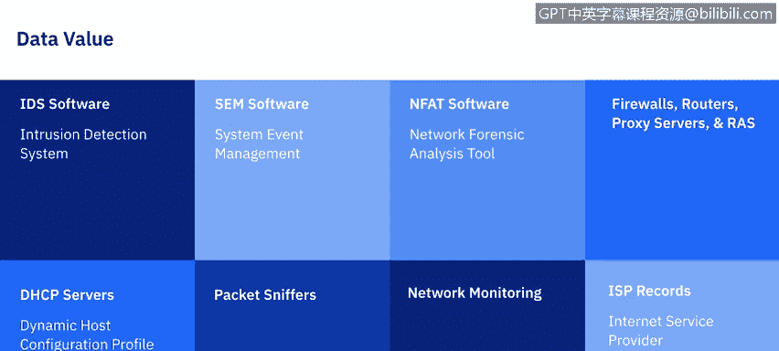

# IBM网络安全分析师专业证书课程5：《渗透测试、事件响应与取证》penetration-testing-incident-response-forensics - P25：24_网络数据.zh - GPT中英字幕课程资源 - BV1Dr4y1d7EB

Welcome to Using Data Network trafficic brought to you by IBM。

In this video we'll be reviewing the TCP IP basics and how it relates to forensics we'll also learn about the different sources of network traffic and how to examine and analyze it。

Let's get started。The National Institute of Standards and Technology says that analysts can use data from network traffic to reconstruct and analyze network based attacks and inappropriate network usage。

 as well as to troubleshoot various types of operational problems。

The term network traffic refers to the computer network communications that are carried over wired or wireless networks between hosts。

As we begin this video series into gathering network data。

 it's important to have an understanding of TCP I P and its meaning in forensics。

 The application layer enables applications to transfer data between an application server and a client。

The most common examples are HTDP， DNS， FTP， SMMTP， these are all things we've heard before。

 but these are a way that application service can communicate out。

Next is going to be the transport layer and most common when we talk about the transport layer we think of packets。

 so it's responsible for packaging data that could be transmitted between the hosts the two most common protocols used in the Trans layer are TCP。

 the transmission control protocol and UDP， the user datagram protocol In each case the packets will contain a source and destination port number which is useful for forensic analysts。

The IP layer， also known as the network layer， routes packets across networks。

 it's the fundamental network layerer protocol for TCPI。

Other commonly used protocols at the network layer are ICM， the Internet control messageage protocol。

 and the Internet group message protocol， the IGM。ICMP is a connectionless protocol that makes no attempt to guarantee that its error or status messages are delivered because it's not designed to transfer application data。

 it doesn't have ports instead it has message types which indicate the purpose of each ICMP message。

 for example， the ICMP message type， destination unreachable。

 has several possible message codes that indicate exactly what was unreachable network cost protocol。

 etc。IP addresses are also often used through a layer of indirect this is most commonly done through DNS or domain name services。

 so when people need to access a resource on a network such as a web server or email server like a website。

 they type they just type in the website's name like www。nISist。

gov rather than that service IP address one it it's a lot easier to remember NIS。

gov but also IP addresses can change the server name won't。And last， we have the hardware layer。

 also known as the data link layer。This layer handles communications on the physical network components。

 The best known data link layer protocol is the Ethernet。To tie this all together。

 I'd like to quote the article from the National Institute of Standards and Technology。

That each of the four layers of the TC PIP protocol suite contains important information。

 The Harper layer provides information about the physical components while other layers describe the logical aspects。

 For instance， events within a network， an analyst can map an IP address。

 which is from the I layer to the Mac address of a particular NIC。

 which is a physical identifier at a physical layer thereby identifying a host of interest。

 The combination of the I protocol number， which is the I layer field and the port numbers。

 transport layer fields， can tell an analyst which application was most likely being used or targeted。

We rely on all of the layers when analysts begin to examine data。

 they typically have limited information， most likely an IP address of interest。

 and perhaps protocol and port information。But now that we've covered the layers of network data。

 let's go into the main sources of network data and break those down。

The first source I'd like to talk about are firewalls and routers。

Network based devices such as firewalls and routers and host based devices such as personal firewalls。

 examine network traffic and permit or deny on a set of rules。

Firwalls and routers are usually configured to log basic information for most or all denied connection attempts and connectionless packets。

 Some log every single packet。Network based firewalls and routers that perform network address translation or NT Nat may contain additional valuable information or data regarding network traffic。

 Some firewalls also act as proxies， and in addition to providing nat and proxy services。

 firewalls and routers may perform other functions such as intrusion detection and VPN。

Next up are packet sniffers which are designed to monitor network traffic on wired or wireless networks and capture packets。

 normally a network interface controller NIC accepts only incoming packets that are specifically intended for it。

 but when the NC is put into promiscuous mode， it accepts all incoming packets that it sees。

 regardless of their intended designations。Most packet sniffniers are also protocol analyzers。

 which means that they can reassemble streams from individual packets and decode communications that use any of the hundreds or thousands of different protocols。

Intrusion detection systems， or IDS is something that we have covered in previous videos。

 network IDS is before packet sniffing and analyze network traffic to identify suspicious activity and record relevant information。

Remote access servers are devices such as VPN gateways and modem servers that facilitate connections between the networks。

 this often involves external systems connecting to internal systems through remote access server。

 but could also include internal systems connecting to external or internal systems。

In addition to remote access servers， organizations typically use multiple applications that are specifically designed to provide remote access to a particular host's operating system。

And although most remote access related logging occurs on the remote access server or the application server。

 in some cases， the client also logs that information so we should look for that as well。

Security Even management softwareft or SEM is capable of importing security event information from various network traffic related security event data sources。

 think IDS logs， firewall logs， and it correlates among all the different sources。

 it generally works by receiving copies of logs from all the different data sources over secure channels。

Putting them into a standard format and then identifying related events by matching IP addresses。

 timestamps and other characteristics。Network forensic analyst tools or NAT typically provide the same functionality as packet s sniffers。

 protocol analyzers and SE software into a single product。

 so whereas SE software concentrates on all the existing data sources。

 NFAT software focuses primarily on collecting and examining and analyzing all network traffic。

 it also provides a bunch of other additional features that you could research on your own。

Now that we know the different sources of data that we're looking for， not all data is created equal。

 so I do want to touch on the value of our data sources， starting with IDS software。

IBS data is important because it's often the starting point for examining suspicious activity。

Not only do IDSs typically attempt to identify malicious network traffic at all the TCIP layers。

 but they also log many data fields and sometimes draw packets that can be useful in validating events and correlating them with data sources。

SM software ideally can be extremely useful for forensics because it's automatically corlating events among several different data sources and then extracts the relevant information and presents it to the user。

The NFAT software is designed specifically to aid network traffic analysis。

 so it's always going to be valuable if it has monitored an event of interest。Firewalls， routers。

 proxy servers， remote access servers。By itself。These data sources usually of little data。

 analyzing data over a large period of time can indicate overall trends such as an increase in block connection attempts。

 etc， however， because these sources are typically record little information about each event。

 the data provides little insight as to the nature of the event itself。

The DHCP servers typically can be configured to log each IP address assignment to the associatedsoated Mac address along with the timestamp that's really helpful for analysts in identifying which host performed an activity using a particular IP address。

Packet s sniffs of all the network data traffic sources。

 This collects the most information on network activity。 The downside， however。

 is the huge value of irrelevant data as well millions or billion of packets and typically provide no indication as to which packet might actually contain the malicious activity。

twork monitoring network monitoring software is helpful in identifying significant deviations from normal traffic flows such as those caused by denial distributed denial of service attacks during which hundreds or thousands of systems launch simultaneous attacks against a particular host or networks。

And then the Internet service provider records， this information is primarily of value in tracing an attack back to its source。

 particularly when the attack uses Spofed IP addresses。

The last thing I want to talk about in terms of getting data from the network is possibly identifying who the attacker was。

Now， when analyzing most attacks， identifying the attacker is not an immediate primary concern。

Ensuring that the attack has stopped in recovering system data。Are always the main interests。

But things that can be done。Contacting the IP address owner can sometimes help identify who's responsible for an IP address。

 usually that takes some type of the escalation process。

Seeking out assistance from the Internet service provider。

 which does require a court order and is only really done in the most serious of tax。

Something that might be instinctual is when you have an IP address to try and p it or send data that way。

 really this is not recommended for organizations。You could also look at the history of the IP address to look for trends in suspicious activity。

 and last data packets could contain information about the I attacker's identity。

 but again our main goal。Isnt truly the hackCC is stopped in recovering system data。

Are always going to be our main interests。We'll see you in the next video。

