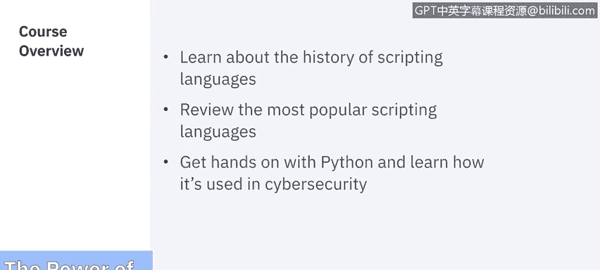

# IBM网络安全分析师专业证书课程5：《渗透测试、事件响应与取证》penetration-testing-incident-response-forensics - P26：25_模块概述.zh - GPT中英字幕课程资源 - BV1Dr4y1d7EB

Welcome to the power of scripting brought to you by IBM。In this course。

 we'll learn about the history of scripting and review the most popular scripting languages。

 We'll then get hands on with Python and learn how it's used in cybersecurity。 Let's get started。

