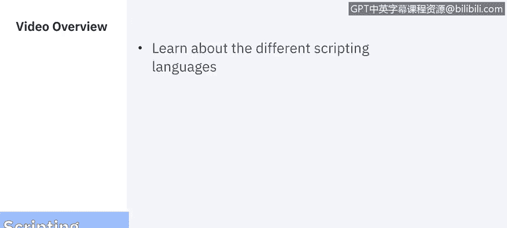
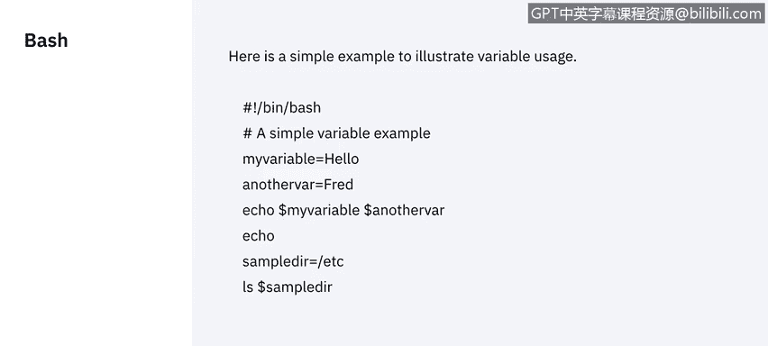
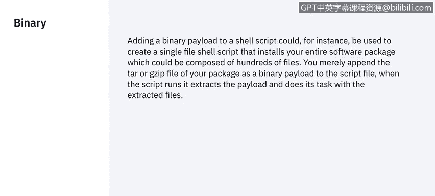
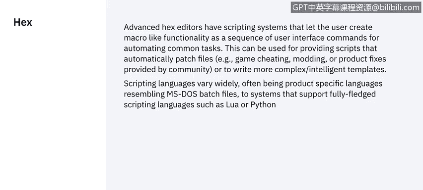

# IBM网络安全分析师专业证书课程5：《渗透测试、事件响应与取证》penetration-testing-incident-response-forensics - P29：28_脚本语言.zh - GPT中英字幕课程资源 - BV1Dr4y1d7EB

Welcome to scripting languages brought to you by IBM。In this video。

 Raoul from IBM Security will be taking us through the different scripting languages。

Okay， JavaScriptscript is an object oriented as script in language。

It was developed developed in 1995 by NAtSC Communications。Now。

Neetsscape communicationations was very close to some microsystems at that time。

 and some microcystemence was one of the biggest backers of the Java programming language。

Web pages at that time were very plain and even animated gifts。Were in development。

So to perform a series of behaviors that will allow pages to be more interactive。

And ascripting language had to be developed。So let'sscape Duke。

The Baguard and the spearheaded the creation of this descripting language。

Now JavaScript was designed to be run in almost every environment， it is lightweighted， is protected。

 it won't allow people to use or share resources with us the programming language does not allow any input output。

Such as networking storage。Between the server and the machine。Basically what it will run。

 it will run on the client machine。And keep it as。

We can call it that prison environment。Varariable on JavaScript can be defined using the bar。

Word or constant， we can also let name of the variable that will declare the variable。

 We can assign the variable with number or any kind of volume。We can use LED Y equals。IBM。

 and that will be the value inside of the particle。Or we can even declare our fullest string。

Let y equals helloor。Please check that Any text， any。Is the cl。

Between our brackets and the definition has to end with a semi column。 ba scripting。

 bash is a shell created for units。 A shell is basically the program that allows us。

To communicate with the operator system， F includes an inscripting interpreter。

That will allow us to create a small， single programs。To perform。A whole variety of functions。

If we want to create list of users in Uni， we can create a batch script that will create。T for you。

 an example， variables in。Flash are pretty simple。We just writing name of the variable。

The equal simple。And then， we assign a about。多钱。Afterwards。What do we do to。Reference a variable。

 We call it with a dollar sign symbol afterwards， inside of a script。

We can create as many variables we want。And then we just call it， called them。

Then we just call them inside of the script。Pearl is an inscriptive language。Creating in 198，1987 is。

Use for a scripting between client server。And。There is a lot of is today for her。

Especially in web pages。It creates very interesting functionality。And。

It rips JavaScript in followers。It's a little bit more complicated。发 the。Pl evangelist。而。

Very loyal to the。Language and。There is a lot of resources on the Internet。

If you want to learn about them。Just as flash， variables in firm do not need to be declared。

The difference is when were declaring a variable in， we have to。

Use the dollar sign to tell the interpreter that we are going to use apart。

power上。Windows did not use anscripted language until 2016。There is almost one。And good。

20 to 30 years。Do the other operative systems。So power She is basically。An interpreter。

That is run on。Gotnet。That will allow us to perform basic scripts in we。

We can perform file operations， we can perform event network operations primary code is what we call machine language is。

What the compiler will do to any programming language。Actually。

 a scripting in binary is no easy test and is done specifically。For certain tasks。

 binary scripting is used mostly in telecommunication and。In。Pinary encoding。

When we are we are writing Cs and DVDs or when we are cloning and storage system， the idea of binary。

Is there are only two estates，0 and one。And the space memory to restore this estate。

Is the smallest type。In computing is the bit。 So in transmission， in data transmission。

 the bit is the measure to calculate that the transmission bits。 So as you may see。

 this is not a language that you will be using most of the time。

The idea to add a binary payload into a She script。Would be to。Use a smaller packet。To overrite。

A library or a file in a program you either wrote or you are updating。But this is also。

This is also done by using Exasimal scripting， which is easier to read and write。

Which is where we're going right now。

Tex is scripting。Hexadeadeimmal scripting is mostly mathematic。

It's an easier way to read my chain language。And its used mostly when you're updating a software。

Overrideiding numbers is faster than over1。Then the crpt in the machine code we already compiled。

Make the change and recompile it。Most of her companies。Update your software。

By overriding the hex numbers in the files。It can be done else it can be used。就。Monitor some values。

 and get to know。Which are some changes。That the program is doing in memory。

And for troubleting and debuing。也。Very unlikely。That the average。

Computer engineer will be using hexadecimal code。Most of the time。

Unless you are a very specialized bugger。Or you have。Programmer， debugging app。Execution program。

 something like that。That's what I can tell about hex scripting。

