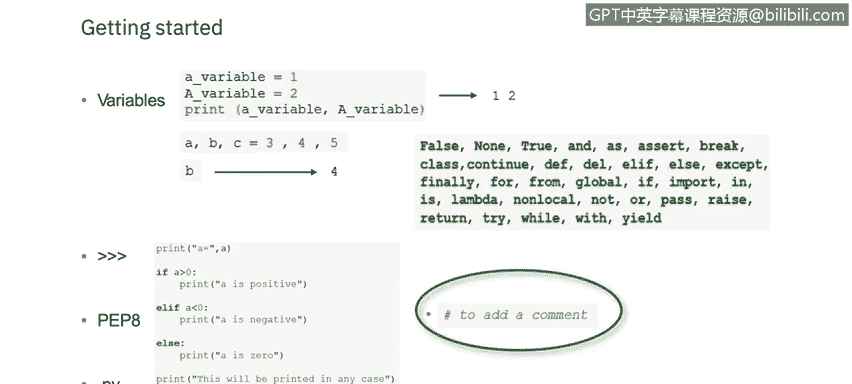
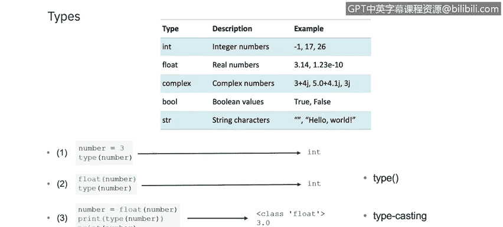
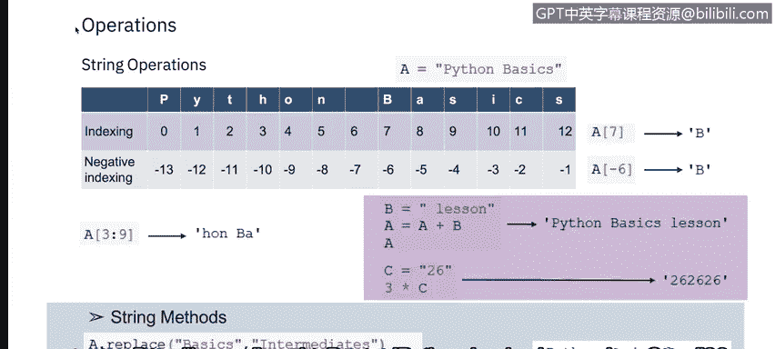
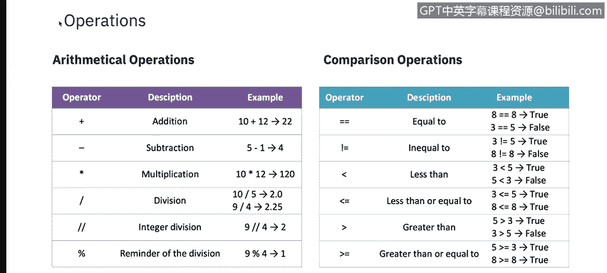
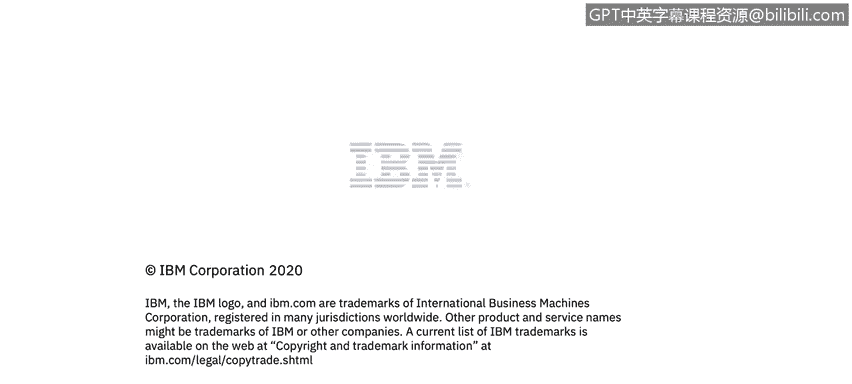

# IBM网络安全分析师专业证书课程5：《渗透测试、事件响应与取证》penetration-testing-incident-response-forensics - P31：30_Python入门.zh - GPT中英字幕课程资源 - BV1Dr4y1d7EB

Welcome to getting started with Python， brought to you by IBM。In this video。

 you will learn to describe the basic syntax of Python。

Let's get started looking at the Python syntax Python syntax can be executed by writing directly in the command line or by creating a Python file on the server using the dot PY file extension and running it in the command line。

Indentation refers to spaces at the beginning of a code line， where in other programming language。

 the indentation in code is for readability only The indentation in Python is very important。

 Python uses indentation to indicate a block of code。

The number of spaces is up to you as a programmer， but it has to be at least one。

Sometimes you must keep in mind that you have to use the same number as spaces in the same code block。

 Otherwise， Python will give you an error。 Now， let's talk about variables。

In Python variables are created when you assign a value to it。

 Va are containers for storing data value， and unlike other scripting languages。

 Python has no command for declaring a variable。 A variable is created the moment you first assign a value to it。

 In addition， variables do not need to be declared with any particular type and can even change type after they have been set。

 string variables can be declared either by using a single or double quotes。

When we talk about variable names， a variable can have a short name like X and Y。

 or a more descriptive name， like age， Car name， total volume。

 There are some rules for Python variables。 A variable name must start with a letter。

 or the underscore character。 A variable name cannot start with a number。

 A variable name can only contain alpha numeric characters and underscores。

 variableable names are case sensitive， such as a lowercase age or an upper case age are very different variables。

Python allows you to assign values to multiple variables in one line。

 and you can assign the same value to multiple variables in one line also。

The Python print statement is often used to output variables to combine both text and a variable Python uses the plus character。

Variables can store data of different types and different types can do different things。

In programming data type is an important concept， which we will discuss next。

A few other important in text concepts to talk about。On the screen here。

 you can see three greater than signs，3 greater than signs Signify example code。

For additional syntax， you can check out the P， E P 8 Python style guide。

 It's a set of rules for how to format your Python code to maximize its readability。

 Writing code to a specification helps to make large code bases with lots of writers。

 more uniform and predictable。 P E P is actually an acronym that stands for Python。 Enhance proposal。

😊，Now let's talk about a PY file。It is a programme file or script written in Python。

 It can be created and edited with a text editor， but requires a Python interpreter to run。

PY files are often used for programming， web servers and other administrative computer systems。

Finally， comments can be used to explain Python code。

 Commonments can be used to make the code more readable to prevent execution when testing code and starts with a hashtag so that Python will ignore them。

😊。

Let's now talk about types。Python is the following data types built in by default in these categories。

I N T for integer numbers， float for real numbers， complex for complex numbers。

 bull for Boolean values and stir S T R for string characters。😊。

Let's go a little deeper into a few of these data types。In Python。

 the data type is set when you assign a value to a variable。There are three numeric types in Python。

IN T for integer。 I T your integer is a whole number positive or negative without decimals of unlimited length。

Float or floating point number is a number positive or negative， containing one or more decimals。

Flow can also be scientific numbers with an E to indicate the power of 10。

Complex numbers are written with a J as the imaginary part。 Furthermoremore。

 you can convert from one type to another with the integer， left Peren， right paren， float。

 left Peren， right paren and complex methods。There may be times when you want to specify a type onto a variable。

 This can be done with casting。 Python is an object oriented language， and as such。

 it uses classes to do divine data types， including its primitive types。

Now， let's talk about Python strings。 Str literals in Python are surrounded by either single quotation marks or double quotation marks。

 Hello is the same with single quotes as it is with double quotes。

 You can display a string literal with the print function。😊。

Assigning a string to a variable is done with the variable name。

 followed by an equal sign and the string。Let's take a look at a few examples。

 A equals assigns the variable A， the value Python basics。

A list allows you to store an enumerated set of items in one place and access an item by its position or index。

 usingsing the index In this example， the seventh position is a value of B。Now。

 let's talk about negative indexing。 So instead of using indexes from 0 and above。

 we can use indexes from negative one and below assignment of the negative index in this example of negative 7 is B。

You can also use a slice of the index as represented in this example。A 3， colon 9。

 as you can see from the table above， that is equivalent to H， O N， space， capital B， A。

We can see a couple examples here of arithmetic operator examples。 So B equals lesson。

 then a plus B would be Python basics lesson。If C equals 26，3 times C would be 26，26，26。

 we also should review some string methods where a dot replace of basics or intermediates would result in a Python basics lesson。

Whereas a equals a dot replace basics or intermediates。

 the result would be Python intermediates lesson。 You can see different operators available on the next slide。

You'll see on this slide two different kinds of operations。

 Arithmetic operations are used with numeric values to perform common mathematical operation。

 in comparison operators are used to compare two values。

 There are other operators that are also available within Python。

 assignment operators are used to assign values to variables。

 logical operators are used to combine conditional statements。

 Ident operators are used to compare the objects， not if they are equal。

 but if they are actually the same object with the same memory location。😊。

Membership operators are used to test if a sequence is present in an object。And finally。

 bitwise operators are used to compare binary numbers。

