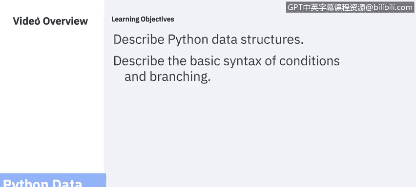
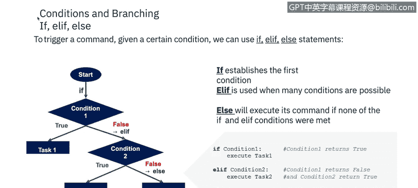
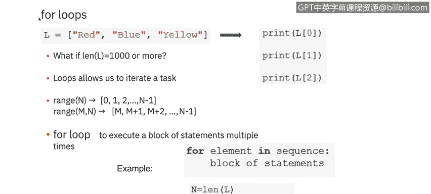
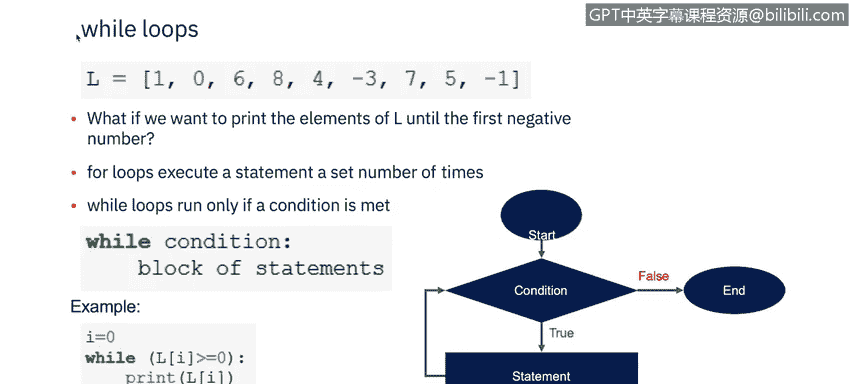

# IBM网络安全分析师专业证书课程5：《渗透测试、事件响应与取证》penetration-testing-incident-response-forensics - P32：31_数据结构.zh - GPT中英字幕课程资源 - BV1Dr4y1d7EB

Welcome to Python Data Strs brought to you by IBM。In this video。

 you will learn to describe Python data structures and describe the basic syntax of conditions and branching。

You can think of data structure as a way of organizing。

 storing data such that we can access and modify it efficiently。

 A tuple in Python is a heterogeneous container for items。 This would remind you of an array。

 But since Python does not support arrays， we have tus and lists。To declare a Python tuple。

 you must type a list of items separated by commas inside parentheses。 Then assign it to a variable。

 You should use a tuple when you don't want to change just an item in feature。

 because tuples are immutable。 Its within them， cannot change。 Ls， on the other hand， are mutable。

 They can change and are separated by commas inside brackets。Seets are mutable or immutable。

 depending not if it is a regular or frozen set accordingly。

A set does not hold duplicate values and is unordered。To perform operations on a set。

 Python provides us with a list of functions and methods。A dictionary uses the curly brackets。

 just like sets do， but store data as key value pairs instead of a single value， like a set。

 The keys must all be unique and are paired with the value by a colon。

 The pairs are separated by a comma。

Let's look at if。L， if and else， when you create a program。

 we always almost need to check the condition and change the behavior of program。

 depending on if the condition is true or false。 The simplest condition statement is if。

Let us establish the first condition。If it is true， it will perform the task number one。

 If it returns false， it will switch to another condition if it is present。

If we use the LF statement in our main condition， it stands for else if。

And checks for multiple conditions。 If condition 2 is present and true。

 it will perform task number 2， and if false， will execute theous condition for task 3。

Else is used when none of the previous conditions are met。

In this example， we can see we are always going to print Ho， and how are you。

We then have two different if statements。 If the variable name is Antonio， it will print。 Ho。

 it's Antonio。If the variable name is Martina， it will skip that line。

The second example shows an if than L scenario。 If a is greater than 0， it will print a is positive。

 If it checks a and it' less than 0， it will perform its L。 if condition and print a is negative。

 If a is exactly 0， which fulfills neither the if or L。 if conditions。

 It will output the else of a is 0。😊，Now， we can talk about how to reiterate a task if you want to print the element of a list。

 if it's just three items， it's easy enough to do print 0， print 1， print 2。

 But if it's more than 1000 items， what can you do。Loops are there to help with the repetitive tasks。

 In order to accomplish this， loops use the range function。It's a Python built in function。

 which returns a sequence following a specific pattern， most often sequential integers。

 which thus meets the requirement of providing a sequence for the for statement to iterate over。

The first loop we'll look at is the four loop。4 loops are traditionally used when you have a block of code。

 which you want to repeat a fixed number of times。The Python 4 statement iterates over the members of a sequence in order。

 executing the black each time。

While loops are different from four loops in that they only run if a condition is met in this example。

 we want to print the elements of L until the first negative number appears。

 The loop will continue to run while the condition is true。 As soon as the condition is false。

 the loop ends。

